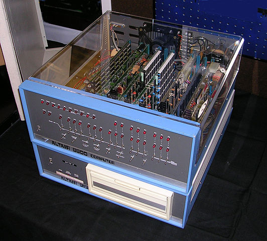

Title: Geschiedenis van Hacken - Deel 1
Date: 2015-09-18 18:00
Category: Basis
Tags: basis, geschiedenis
Slug: geschiedenis-van-hacken-deel-1
Authors: Sling
Summary: Eerste deel van een blik op de geschiedenis van hacken sinds de eerste digitale computers. Dit deel loopt van 1940 tot 1990.

We hebben in de [vorige tutorial](introductie-wat-is-hacken-is-deze-site-voor-mij.html) een definitie van hacken gezien en ook laten zien dat hacken eigenlijk niets te maken hoeft te hebben met computers. Je zou zelfs kunnen stellen dat er honderden jaren geleden al gehackt werd waren met hout en tandwielen. Zo ver terug in de tijd gaan we niet in deze tutorial, maar wel bekijken we de afgelopen 60 jaar vanuit het perspectief van een hacker, beginnend bij de opkomst van de digitale computer.

# 1940 - 1960

Voordat computers toegankelijk werden voor hobbyisten en de allereerste hackers, bestonden ze al een tijdje in een aantal verschillende vormen, voornamelijk gebruikt op universiteiten, grote bedrijven, in het leger en bij overheidsinstanties. Om dit stuk historie helemaal over te slaan zou zonde zijn, vandaar dat we er kort naar zullen kijken.

De eerste apparaten die lijken op de moderne computers werden begin jaren ’40 gebouwd, voornamelijk gestimuleerd door de tweede wereldoorlog. Zo werd de in 1941 door Duitsland gebouwde [Zuse Z3](https://nl.wikipedia.org/wiki/Z3_(computer)) gebruikt door de Duitse luchtmacht om berekeningen uit te voeren over bijvoorbeeld de vleugelelasticiteit van hun vliegtuigen. De Z3 was ’s werelds eerste volautomatische digitale programmeerbare computer, en las zijn instructies van externe tape die door een menselijke operator ingevoerd werd. De berekeningen werden gemaakt door +/- 2600 [relaisschakelingen](https://nl.wikipedia.org/wiki/Relais) en had de beschikking over 176 bytes aan geheugen voor opslag van data, wat een stuk moderner was dan bijvoorbeeld de Z1, die niet electronisch maar volledig mechanisch was (tandwielen etc.). In 1943 werd de originele Z3 bij een bombardement door de geallieerden vernietigd, maar gelukkig zijn er replica’s gemaakt die je nu nog in het museum kan bekijken.

 _Zuse Z3 replica (1941)_

In de rest van dit decennium werden in allerlei landen digitale computers gebouwd, en werden de relais langzaam vervangen door [electronenbuizen](https://nl.wikipedia.org/wiki/Elektronenbuis). Deze konden sneller schakelen en maakten complexere hardware-ontwerpen mogelijk. Een van de nadelen van deze buizen was echter dat ze erg warm werden, en hierdoor vaker defecten vertoonden. Je kunt je voorstellen dat deze computers, gebaseerd op vaak duizenden buizen, continu onderhoud nodig hadden en telkens opnieuw met berekeningen konden beginnen. De komst van de op silicium gebaseerde [transistors](https://nl.wikipedia.org/wiki/Transistor) maakte gelukkig snel een einde aan dit tijdperk, rond 1954 / 1955 werden de eerste op transistor-gebaseerde computers gemaakt, en in 1957 werd de eerste commerciële transistor-computer (de IBM 608) verkocht.

Omdat het aantal computers wat wereldwijd gebruikt werd zo beperkt was, was er eigenlijk nog geen sprake van een hackercultuur. Ook waren computers in dit tijdperk nog niet met elkaar verbonden middels netwerken maar bevonden zich in afgezonderde computerruimtes- en zalen, wat op afstand inbreken onmogelijk maakte.

# 1960 - 1970

In de jaren ’60 werden steeds meer overheidsinstellingen en grote bedrijven voorzien van computerruimtes om steeds krachtiger wordende computers te huisvesten. Gespecialiseerd personeel werd aangenomen om deze machines te bedienen, bijvoorbeeld om de rollen tape en ponskaarten in te voeren of om onderhoud te plegen aan de talloze individuele componenten.

Dit was ook de tijd waarin het gebruikelijk werd dat meerdere gebruikers tegelijk gebruik konden maken van een computersysteem, het zogenaamde [timesharing](https://nl.wikipedia.org/wiki/Tijdscharing_(informatica)). Dit delen van computers introduceerde ook de eerste problematiek rondom beveiliging van deze systemen, immers had iedere gebruiker zijn eigen bestanden en wilde de inhoud hiervan niet altijd met alle andere gebruikers van dit systeem delen.

Het duurde dan ook niet lang voordat de eerste problemen in deze beveiliging gevonden werden. In 1965 werd door William D. Mathews van de Amerikaanse universiteit MIT een [kwetsbaarheid](http://osvdb.org/show/osvdb/23257) gevonden in de Multics CTSS software, draaiend op een IBM 7090. Het resultaat van deze kwetsbaarheid was dat de inhoud van het bestand waarin alle wachtwoorden van de gebruikers stonden door iedereen te lezen was. Deze wachtwoorden werden nog niet versleuteld opgeslagen, iets wat mede door deze problemen meer aandacht kreeg. Meer informatie over Multics beveiliging kun je [hier](http://www.multicians.org/security.html) vinden.

 

_IBM 70790 (1961)_

Aan het einde van dit decennium werd de interesse van voornamelijk het leger steeds groter om de bestaande computers middels een netwerk aan elkaar te koppelen, om zo snel te kunnen communiceren. De ontwikkeling van het eerste grote computernetwerk begon in 1968 en had de naam ARPANET. Op 29 oktober 1969 werd het eerste bericht via dit netwerk verstuurd, een nieuw tijdperk begon.

# 1970 - 1980

Telefonie was een technologie die inmiddels in elk huishouden aanwezig was, maar de achterliggende centrales waren in de eerste helft van de 20e eeuw nog voornamelijk geschakeld door menselijke operators. In het begin van de jaren 60 werd de kern van dit telefonienetwerk langzaam maar zeker vervangen door automatische centrales, en in de jaren 70 was deze transformatie vrijwel voltooid. Op dat moment waren deze telefoniecentrales zo’n beetje de meest complexe computers die er bestonden, en dus een doelwit voor geinteresseerde hackers en hobbyisten. Het begrip _phreaken_ ontstond in deze tijd, het hacken van telefoniesystemen om ze beter te leren begrijpen en ze op een andere manier te gebruiken dan waarvoor ze bedoeld waren.

Een van de bekendste phreakers uit deze tijd was de Amerikaan John T. Draper, die samen met zijn vriend Joe Engressia in 1971 een manier vond om de telefooncentrales te manipuleren. Hij kon operator rechten krijgen op de telefoniecentrale door een toon met een specifieke frequentie (2600 Hertz) af te spelen in de microfoon van het telefoontoestel. Voor dit phreaken gebruikte Draper later vaak een _blue box_, een klein apparaat waarmee allerlei tonen gegenereerd konden worden, maar in dit geval was het gebruiken van een speelgoedfluitje uit een pak Captain Crunch cornflakes, wat precies op 2600 Hertz geluid maakte, voldoende. John T. Draper kreeg hierdoor de nickname Captain Crunch. Ook het getal 2600 zou later een symbolische betekenis krijgen in de hacker scene.

Computers waren ondertussen nog altijd apparaten waarvan men het nut niet in zag om thuis te hebben, ze waren te groot en te duur maar vooral nutteloos voor de gemiddelde consument. Hier begon verandering in te komen toen in 1975 de [MITS Altair 8800](https://nl.wikipedia.org/wiki/Altair_8800) werd ontwikkeld. Het was een bouwpakket wat men kon bestellen en thuis in elkaar kon zetten, gepresenteerd in een tijdschrift voor radio-amateurs (Popular Electronics). In de eerste maand werden er, tot verbazing van de ontwerpers, duizenden kits verkocht. De Altair 8800 kon door middel van de programmeertaal BASIC geprogrammeerd worden, een taal die al zo’n 10 jaar op universiteiten werd onderwezen aan studenten die geinteresseerd waren in computertechniek. De Homebrew Computer Club ontstond rond het verschijnen van de Altair computer en bracht hobbyisten bij elkaar om kennis en ervaringen uit te wisselen.

 

_Altair 8800 met floppy disk drive (1975)_

Twee van deze hobbyisten, Steve Jobs en Steve Wozniak, zouden later in dit decennium een historische samenwerking aangaan door de oprichting van het bedrijf Apple in 1976. Vooral Steve Wozniak is het beste te omschrijven als hacker, hij was verantwoordelijk voor het grootste deel van de techniek achter de eerste Apple computer, de [Apple I](https://nl.wikipedia.org/wiki/Apple_I) in 1976. Ook deze computer werd niet kant-en-klaar aan de klant geleverd, maar als een bouwpakket wat nog in elkaar gezet moest worden, en waarvoor men ook zelf een behuizing, televisie en toetsenbord moest verzorgen.

Een klein jaar later kwam Apple alweer met de opvolger, de [Apple II](https://nl.wikipedia.org/wiki/Apple_II), met kleuren graphics, floppy disk drive (in plaats van tapes) en erg belangrijk voor hackers: een open architectuur. Dit betekende dat mensen met kennis van electronica eenvoudig zelf konden bouwen aan deze computer. Aan het einde van de jaren 70 was het bedrijf uitgegroeid van de originele 3 personen tot een heus team van ontwerpers, techneuten en een productielijn.

# 1980 - 1990

In de jaren 80 worden er veel hackerclubs opgericht, met veel creatieve namen; Chaos Computer Club, The Warelords, Legion of Doom, Masters of Deception, Cult of the Dead Cow, KILOBAUD/PHIRM, etc. De redenen waarom deze clubs werden opgericht waren erg verschillend, en ook de samenstelling en grootte van de groepen was heel divers. Omdat de hackerscultuur steeds populairder werd bij de jeugd als manier om zich af te zetten tegen ‘het systeem’, ontstonden er groepen met erg jonge deelnemers die eigenlijk voornamelijk wilden relschoppen en zoveel mogelijk aandacht wilden krijgen. Dit soort groepen waren vaak snel opgerold door de politie of FBI, of vielen uiteen door interne problemen of leden die overliepen naar andere groepen.

Toen in 1983 de film [Wargames](http://www.imdb.com/title/tt0086567/) uitkwam, werd het begrip Hacker bij het grotere publiek bekend als iemand die op computers inbreekt. De film beschrijft het per ongeluk inbreken op een computer die in verbinding staat het het nucleaire arsenaal van de VS, om uiteindelijk in het Koude Oorlog tijdperk bijna de derde wereldoorlog te starten. Met deze bekendheid kreeg het onderwerp ook meer aandacht bij de overheden en bedrijven.

 _De film ‘Wargames’ (1983)_

[Emmanuel Goldstein](https://en.wikipedia.org/wiki/Eric_Corley) brengt in 1984 de eerste editie van het Amerikaanse tijdschrift 2600 uit, met hierin veel tips en achtergrondinformatie over phreaking en hacken op computers. Ook niet-technische onderwerpen zoals techno-anarchisme komen aan bod. De naam is afgeleid van het eerder genoemde Captain Crunch fluitje wat een toon van 2600 Hertz produceerde. Het tijdschrift komt op dit moment nog steeds 4 keer per jaar uit, op elke eerste vrijdag van januari, april, juli en oktober.

Iets wat in de jaren 80 ook opkomt in het hobby/hackerscircuit zijn de BBS netwerken. Dit waren computers die meestal bij enthousiaste computerhobbyisten thuis stonden en met een telefoonverbinding verbonden waren met het wereldwijde telefonienetwerk. Anderen konden inbellen op zo’n systeem en de informatie die hierop beschikbaar was (meestal teksten over electronica, radio, telefonie) opvragen en er zelf informatie of berichten op achterlaten. Dit wordt vaak beschouwd als een voorloper van het moderne consument-gerichte Internet. Toen de BBS-systemen groter werden in aantallen en aan elkaar gekoppeld werden, ontstonden er ook andere diensten zoals Echomail waarbij e-mails met bijlagen konden worden verstuurd, iets wat in die tijd (1986) erg modern was. Het [Fidonet](https://en.wikipedia.org/wiki/FidoNet)-netwerk, was een van de grootste Echomail netwerken en had op zijn hoogtepunt in de jaren ’90 ongeveer 32.000 ‘nodes’.

Het in 1969 gestarte ARPANET netwerk is ondertussen langzaam groter geworden en wordt in enkele wetenschappelijke artikelen al met _Internet_ aangeduid, mede dankzij de koppeling met een nieuw CSNET netwerk werden er vanaf 1981 een hoop universiteiten en onderzoekscentra op aangesloten. Vervolgens werd in 1982 een standaard uitgewerkt genaamd de Internet Protocol Suite (of TCP/IP), wat de groei verder stimuleerde. Rond 1985 wordt ARPANET opgesplitst in twee netwerken, Milnet voor het Amerikaanse leger (zou later uitgroeien tot het huidige [SIPRNet](https://en.wikipedia.org/wiki/SIPRNet)/[NIPRNet](https://en.wikipedia.org/wiki/NIPRNet) en [JWICS](https://en.wikipedia.org/wiki/Joint_Worldwide_Intelligence_Communications_System)) en NSFNet wat voor onderzoekers bedoeld was. Rond deze tijd was de snelheid tussen de ruim 5000 computers op dit NSFNet netwerk al maximaal 56 kilobit per seconde, het was echter nog een puur Amerikaanse aangelegenheid. Op 17 november 1988 werd het Nederlandse CWI [aangesloten op het NSFNet](http://tweakers.net/video/5479/polderpioniers-de-man-die-nederland-aansloot-op-het-internet.html), dit was de eerste Internet-aansluiting tussen het Amerikaanse continent en Europa. Omstreeks 1989 is het internet verder gegroeid naar zo’n 100.000 aangesloten computers wereldwijd.

Een ander belangrijk protocol wat in de jaren ’80 veel voor communicatie via computers werd gebruikt is UUCP. Via dit protocol kunnen bestanden, emails en nieuwsgroepen worden gedeeld tussen computers, het bestond lange tijd naast andere technologieëen zoals Fido(net) en Telex. Data wordt via UUCP uitgewisseld via point-to-point links, dat wil zeggen dat er geen centrale servers zijn, maar bijvoorbeeld een UUCP systeem bij een universiteit die in verbinding stond met andere systemen op specifieke faculteiten of afdelingen. Een UUCP-adres bestaat uit verschillende delen, gescheiden door een uitroepteken, en werd ook wel een _bang path_ genoemd. Berichten werden precies in de volgorde zoals beschreven in het bang path afgeleverd. Dit zag er ongeveer zo uit: `..!mcvax!neabbs!rop`, waarbij [mcvax](http://webcache.googleusercontent.com/search?q=cache:http://www.mcvax.org/) een bekende Digital VAX 11/780 server was bij het CWI, [neabbs](https://nl.wikipedia.org/wiki/NEABBS) een van de eerste BBS-systemen was in Nederland, en ten slotte [rop](https://nl.wikipedia.org/wiki/Rop_Gonggrijp) de naam van de mailbox van Rop Gongrijp (meer over hem iets verder in deze tutorial).

Er zitten veel voordelen aan het met elkaar verbinden van zoveel computers, maar uiteraard zit er ook een keerzijde aan. De opkomst van het Internet betekent ook een opkomst van computervirussen en andere malware. Er ontstaan groepen hackers die er een wedstrijd van maken om computerprogramma’s te schrijven die zich zo snel mogelijk over zoveel mogelijk computers verspreiden, via het Internet. Een deel van deze programma’s voerden instructies uit die de besmette computers beschadigden, door bijvoorbeeld delen van de harde schijf te wissen of het onmogelijk maakten om de computer te herstarten. Deze groep programmeur’s kun je ‘blackhats’ noemen, hackers die er op uit zijn om schade aan systemen toe te brengen in plaats van de kennis te gebruiken voor leerzame doeleinden.

Ten slotte gebeurt op hackergebied ook nog iets in ons eigen land aan het einde van dit decennium, het Nederlandse tijdschrift [Hack-Tic](http://www.hacktic.nl/) brengt zijn eerste nummer uit in 1989. Het tijdschrift zou in de jaren hierna ook populair worden buiten onze landsgrenzen en kreeg een flinke reputatie om zijn controversiele onderwerpen zoals ‘Hoe kopieer ik de gegevens van de magneetstrip op mijn bankpas?’, ‘Hoe ontcijfer ik mijn versleutelde televisiedecoder?’ en ‘Hoe kan ik gratis telefoongesprekken plegen?’. De redactie van het tijdschrift bestaat uit een aantal bekende namen zoals John D. (Draper) en Rop Gongrijp. Rop is een van de eerste ‘bekende’ Nederlandse hackers en werd rond deze tijd nog gezien als een bedreiging voor de maatschappij. Hij was iemand die al vroeg de potentie van het Internet inzag, en hoe het grote invloed zou gaan hebben op de samenleving. In ditzelfde jaar werd door onder andere Rop ook de [Galactic Hacker Party](https://nl.wikipedia.org/wiki/Galactic_Hacker_Party) georganiseerd in De Paradiso (Amsterdam), een bijeenkomst voor hackers die elke 4 jaar herhaald zou gaan worden.

 

_Eerste cover van ‘Hack-Tic’ (1989)_

___

Voor de recentere historie van hacken klik door naar de [volgende tutorial](geschiedenis-van-hacken-deel-2.html)!

*[MIT]: Massachusetts Institute of Technology
*[CTSS]: Compatible Time-Sharing System
*[ARPANET]: Advanced Research Projects Agency Network
*[BBS]: Bulletin Board System
*[CSNET]: Computer Science Network
*[NSFNet]: National Science Foundation Network
*[CWI]: Centrum Wiskunde en Informatica
*[UUCP]: Unix-to-Unix Copy