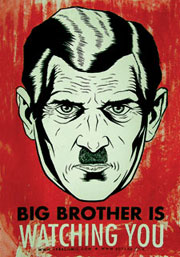

Title: Geschiedenis van Hacken - Deel 2
Date: 2015-09-18 18:00
Category: Basis
Tags: basis, geschiedenis
Slug: geschiedenis-van-hacken-deel-2
Authors: Sling
Summary: Tweede deel van een blik op de geschiedenis van hacken sinds de eerste digitale computers. Dit deel loopt van 1990 tot het heden.

Waar in de [vorige tutorial](geschiedenis-van-hacken-deel-1.html) over de eerste helft van de ‘Geschiedenis van Hacken’ de hackers nog op zoek moesten naar technologie, komt vanaf de jaren ’90 de technologie letterlijk de huiskamer in. Vrijwel elk Nederlands huishouden krijgt in dit decennium thuis een computer met (vaste) internetverbinding. Welke gevolgen dit allemaal had en heeft, lees je hieronder..

# 1990 – 2000

Een omslagpunt in de geschiedenis is 1990, toen in Engeland een wet genaamd de [Computer Misuse Act 1990](http://en.wikipedia.org/wiki/Computer_Misuse_Act_1990) werd doorgevoerd. Vanaf dat moment was er in Engeland een juridische basis waarmee computercriminaliteit kon worden veroordeeld. Er werd in deze wet onderscheid gemaakt tussen 3 strafbare feiten; het ongeautoriseerd toegang verschaffen tot computersystemen (in algemene zin), het ongeautoriseerd toegang verschaffen tot computersystemen met als doel verdere criminele handelingen te verrichten, en het ongeautoriseerd aanpassen van een computersysteem of de data hierop. Dergelijke wetten zouden in de komende jaren ook in andere landen ingevoerd worden, ook in Nederland kwam op 1 maart 1993 de Wet Computercriminaliteit tot stand.

In 1993 begonnen de allereerste internetproviders in Nederland met het aanbieden van internetverbindingen aan particulieren. Een van deze providers zou worden opgericht door 4 mensen waaronder Rop Gonggrijp. Van origine betrof het een groep ‘hackers’ of ‘techno-anarchisten’ die, zoals we eerder in deze geschiedenis zagen, oa. de Hack-tic magazines verzorgden en de Galactic Hacker Party organiseerden. Ze mochten in de eerste jaren van dit decennium gebruik maken van een internetverbinding van de Universiteit van Amsterdam. Na een hack-incident werd deze verbinding echter afgesloten en moest deze groep hackers het zonder internetverbinding stellen. Het was op dat moment niet mogelijk om als groep particulieren een verbinding te krijgen, dus het duurde niet lang voordat ze zelf een stichting opgericht hadden die toegang tot internet ging verzorgen voor particulieren. ‘Toegang voor iedereen’ - ofwel in het Engels: access for all - was de ideologie, [XS4ALL](https://www.xs4all.nl/over-xs4all/wie-wij-zijn/) de naam van de stichting. Op 1 mei 1993 konden de eerste ‘klanten’ zich aanmelden, en die avond waren de eerste 500 belangstellenden al binnen.

 _Stichting XS4ALL in 1993_

In juni 1993 werd in Las Vegas de allereerste [DEF CON](http://en.wikipedia.org/wiki/DEF_CON) georganiseerd. Het was een evenement waar voornamelijk Amerikanen die met hacken of computerbeveiliging te maken hadden, elkaar in het echt konden ontmoeten in plaats van via de (voorlopers van) het Internet. DEF CON zou uiteindelijk het grootste hack-evenement ter wereld worden en wordt tot op de dag van vandaag nog elk jaar georganiseerd.

Vier jaar na de Galactic Hacker Party (GHP) organiseert het magazine Hack-Tic in augustus 1993 een evenement genaamd [Hacking at the End of the Universe](https://nl.wikipedia.org/wiki/Hacking_at_the_End_of_the_Universe) (HEU). Ditmaal in de open lucht op een kampeerterrein in de Flevopolder, waar uiteindelijk ongeveer 500 mensen bijeen kwamen. Een belangrijk onderwerp was natuurlijk de net ingevoerde Wet Computercriminaliteit, die veel besproken werd. Ook de eerste Nederlandse hacker die op grond van deze wet gearresteerd was nam deel aan een publiek debat tijdens dit evenement. Opmerkelijk feit over dit evenement was dat een politiemedewerker van de ‘Centrale Recherche Informatiedienst’ graag wilde deelnemen aan het evenement, maar van zijn werkgever uiteindelijk geen toestemming kreeg.

Het internet zelf begon in 1993 ook te transformeren. De eerste versie van HTML (een opmaaktaal waarmee websites worden gemaakt) werd dit jaar als standaard vastgelegd, en de eerste browser die HTML kon omzetten in een voor mensen leesbaar geheel genaamd 'Mosaic' werd uitgebracht. Er was een groeiend aantal webservers die pagina’s beschikbaar maakten met informatie en links naar andere pagina’s, allemaal gestructureerd door middel van HTML. Zo ontstond een steeds groter web van met elkaar verbonden stukjes informatie, het [World Wide Web](http://nl.wikipedia.org/wiki/Wereldwijd_web).

Naarmate er meer mensen deelnemen aan het Internet op bulletin boards, e-mails, nieuwsgroepen en andere communicatiemethodes, wordt het belangrijker dat er een soort afspraken gemaakt worden om het een beetje overzichtelijk te houden. Net zoals je in de analoge wereld een etiquette hebt met gedragsregels waar mensen zich aan proberen te houden, heeft het Internet dit ook nodig. In 1995 wordt een eerste opzet gepresenteerd voor de [Netiquette](http://www.ietf.org/rfc/rfc1855.txt) waarin beschreven staat hoe men zich op het prille Internet zou moeten gedragen. Het richt zich verder niet op beveiliging, maar op zaken zoals E-mail: ‘Stuur geen kettingbrieven door via e-mail’, ‘Gebruik niet alleen hoofdletters want dan lijkt het alsof je schreeuwt’, ‘Als je een ondertekening toevoegt, beperk deze dan tot 4 regels’ etcetera. Ook richtlijnen voor beheerders worden erin opgenomen.

In 1995 komt de film [Hackers](http://nl.wikipedia.org/wiki/Hackers) uit, waarin een groep jongeren in ‘cyberspace’ samen enkele hacks uitvoeren en in het vizier komen van de autoriteiten. De technische details in de film zijn erg onrealistisch, maar toch krijgt de film een echte cultstatus en zou iedereen die zichzelf hacker noemt hem een keertje gezien moeten hebben. Ook is dit weer een goed voorbeeld van hoe de populaire media het begrip hacker neerzetten als een puisterige puber die inbreekt bij een overheidsnetwerk.

 _Beeld uit de film ‘Hackers’ (1995)_

Over de grens, in Duitsland, wordt in de herfst van 1995 door een groep van 17 hackers [C-base](http://en.wikipedia.org/wiki/C-base) opgericht. Het zou de eerste echte ‘hackerspace’ worden in de wereld, waar hobbyisten en technofreaks bij elkaar kwamen om samen te hacken, knutselen, discussiëren en ervaringen en kennis te delen. Wat er precies onder een hackerspace wordt verstaan zullen we verder bekijken in een aparte tutorial hierover.

Inmiddels zijn we weer vier jaar verder na Hacking at the End of the Universe, en dus was het weer tijd voor een groots Nederlands Hack-Tic evenement. In 1997 vindt in Almere [Hacking in Progress](http://nl.wikipedia.org/wiki/Hacking_in_Progress) plaats, met ergens tussen de 1500 en 2500 deelnemers. Om een idee te geven; een groot kampeerterrein met meer dan duizend computers, in kleine tentjes aan elkaar verbonden met een wirwar van kabels, dit was iets wat nog niet eerder op deze grote schaal was gedaan in Nederland. Een belangrijk onderwerp waarover gesproken werd tijdens het evenement was de opkomst van mobiele telefonie en de beveiliging hiervan. Omdat op dit moment in de Verenigde Staten ook een evenement van hackersmagazine 2600 werd georganiseerd (‘Beyond HOPE’) leek het beide organisaties een mooie uitdaging om een videolink tot stand te brengen. Een technisch hoogstandje, wat in 1997 nog alles behalve vanzelfsprekend was.

Aan het einde van de jaren 90 komt computerbeveiliging en de risico’s van het internet steeds meer in de spotlight te staan. Kabelinternet en ADSL zijn sterk in opkomst en steeds meer computers lopen 24/7 gevaar via het Internet. Het kost de nieuwe generaties hackers thuis geen telefoontikken meer om de hele dag online te zijn, wat een grote toestroom aan nieuwe mensen in de hacker scene betekent. Er worden honderden securitypatches uitgebracht voor populaire software zoals Windows 98, en in de VS worden grootse initiatieven gelanceerd om computerbeveiliging een hoge prioriteit te geven binnen de overheid en het bedrijfsleven. Security wordt een booming business!

In 1999 wordt op DEF CON 7 door een van de oudste hackergroepen CULT OF THE DEAD COW een programma gepresenteerd waar voornamelijk hackers met kwade bedoelingen en weinig kennis veel gebruik van zouden gaan maken: [Back Orifice 2000](http://en.wikipedia.org/wiki/Back_Orifice_2000). Met dit programma is het mogelijk om alle op dat moment gangbare versies van Microsoft Windows op afstand over te nemen (een RAT of Remote Administration Tool dus). Er worden diverse plug-ins voor gemaakt, voor bijvoorbeeld keylogging, het aan elkaar verbinden van geïnfecteerde computers, het op afstand bekijken van de desktop, registry en bestandssysteemtoegang, etcetera. De makers van het programma waren ervan overtuigd dat het in principe geen malware was, omdat het ook voor legitieme doeleinden zoals beheer op afstand of stille installatie/uitrol van software zou werken. Toch werd het door alle antivirus bedrijven als malware bestempeld.

# 2000 - 2010

Sinds het instorten van de WTC torens op 9/11 begint privacy steeds meer het onderspit te delven voor veiligheid en antiterrorisme, wat zich vooral uit in technologische middelen zoals censuur op het Internet en het onderscheppen van communicatie door overheden. Een groot deel van de hackergemeenschap ziet deze trend al vroeg ontstaan en zijn bang voor de gevolgen hiervan, ze weten immers zelf wat er kan gebeuren als iemand zijn identiteit wordt vervalst of als er teveel informatie over een persoon bekend wordt bij publieke instanties of op het hele Internet. De verregaande digitalisering betekent dat het steeds gemakkelijker wordt om informatie te delen tussen individuen maar ook tussen bedrijven en overheden. Centralisatie van gegevens in massale databanken betekent dat 1 lek veel meer gevolgen kan hebben dan voorheen. Er begint een soort ‘plicht’ te ontstaan voor hackers om alle andere mensen die niet thuis zijn in deze wereld wegwijs te maken in privacy en veiligheid.

 _Iedereen is terrorist?_

Op het technologiefront was er een belangrijke ontwikkeling in 2002, waarin het [Tor](https://www.torproject.org/)-netwerk zijn opkomst maakte. Hoe deze technologie precies werkt zullen we in een andere tutorial verder bekijken, maar in het kort is het een anoniem netwerk van computers wat via het Internet communiceert. Het is een uitkomst voor mensen die in landen wonen waar de vrijheid om te zeggen wat je wilt wordt beperkt door censuur van de overheid, maar de keerzijde is uiteraard ook dat criminelen het netwerk kunnen gebruiken voor communicatie die ze liever niet delen met de politie of overheid.

Ook blijven de 4-jaarlijkse Nederlandse hacker-evenementen plaatsvinden, zo is er in 2001 [Hackers at Large](http://nl.wikipedia.org/wiki/Hackers_at_Large) met bijna 3000 deelnemers en een uplink met een capaciteit van maar liefst 1 Gbps, in 2005 [What the Hack(http://nl.wikipedia.org/wiki/What_the_Hack) (wat overigens bijna verboden werd in verband met ‘risico’s voor de openbare orde’) en in 2009 [Hacking at Random](http://nl.wikipedia.org/wiki/Hacking_at_Random) waar onder andere Julian Assange aanwezig was en werd georganiseerd door een groep nieuwe organisatoren.

Sociale netwerken zijn flink aan het groeien in deze jaren en vrijwel iedereen is te vinden op Hyves, MySpace, Facebook en vele andere varianten hierop. Men deelt graag zoveel mogelijk informatie met elkaar, maar loopt ook veel risico als andere mensen het gemunt hebben op hun persoonlijke gegevens of simpelweg zich toegang willen verschaffen tot iemands account, bijvoorbeeld door gebruik te maken van social engineering (meer hierover in een andere tutorial). Ook hier is het weer de taak aan de meest ervaren mensen op het gebied van technologie en beveiliging – hackers – om de gebruikers van deze netwerken te wijzen op de gevaren ervan en aan te tonen dat ze voorzichtig moeten zijn met wat ze delen.

Een van de belangrijkste onderdelen van een democratie zoals we die in Nederland hebben is het stemmen door burgers, voor de nationale, provinciale en gemeentelijke verkiezingen. Al sinds het begin van de jaren ’90 gebeurde dit met elektronische [stemcomputers](http://nl.wikipedia.org/wiki/Stemcomputer). Deze ‘computers’ worden natuurlijk beveiligd om te voorkomen dat mensen bijvoorbeeld meer dan 1 keer kunnen stemmen, of om te voorkomen dat derden kunnen achterhalen op welke partij iemand gestemd heeft. Maar net als alle andere beveiligingen zitten er ook in de stemcomputers zwakke plekken en kwetsbaarheden. In 2006 en 2007 worden deze problemen extra in de aandacht van de media gebracht en deze leidden uiteindelijk tot het op grote schaal terugvallen naar papieren stembiljetten in de jaren hierna. Vooral de actiegroep [Wij vertrouwen stemcomputers niet](http://nl.wikipedia.org/wiki/Wij_vertrouwen_stemcomputers_niet), een initiatief van Rop Gonggrijp, was hierin een belangrijke factor.

In 2006 wordt de website [Wikileaks](https://wikileaks.org/) gelanceerd, door onder andere Julian Assange. Het is een website waar iedereen, maar voornamelijk journalisten en media, anoniem geheime of anderszins niet-publieke informatie kan vrijgeven zonder hiervoor als bron te worden opgegeven. Klokkenluiders kunnen vanaf nu middels deze website misstanden laten zien aan de hele wereld en in de jaren na de lancering gebeurt dit op steeds grotere schaal. De naam komt natuurlijk van ‘wiki’ en ‘leaks’, dit omdat het in de beginjaren gebruik maakte van een wiki-structuur om lekken te publiceren, tegenwoordig wordt het niet meer als een wiki gebruikt. Door het gebruik maken van onder andere Tor kan de anonimiteit worden gewaarborgd. Wikileaks is vooral een belangrijke schakel in de strijd tegen censuur en de invloeden van overheden op de media, omdat gebleken is dat zelfs de populaire media niet altijd meer te vertrouwen zijn.

Ondertussen was de overheid begonnen met een plan voor vervangen van het analoge trein- en buskaartje door een OV-chipkaart. Dit zou een standaard pasje worden, net als een creditcard of een Pinpas maar met iets meer elektronica aan boord, onder andere een chip waar (versleuteld) een saldo en eventueel meer informatie op zou staan. Een van de chips die hiervoor gebruikt zou gaan worden was de door NXP (voorheen onderdeel van Philips) ontwikkelde [Mifare Classic](http://en.wikipedia.org/wiki/MIFARE#Security_of_MIFARE_Classic.2C_MIFARE_DESFire_and_MIFARE_Ultralight). Tijdens een conferentie van de Chaos Computer Club in 2007 werd door Karsten Nohl in een [presentatie](https://www.youtube.com/watch?v=QJyxUvMGLr0) uitgelegd dat de beveiliging van deze chip vrijwel helemaal gekraakt was. De precieze details werden toen echter nog niet vrijgegeven. Enkele maanden later, op 7 maart 2008, werd een soortgelijk lek ook [gevonden](http://www.ru.nl/ds/research/rfid/press_release/) en gereproduceerd in de eerste versie van de OV-chipkaart door onderzoekers en studenten van de Radboud Universiteit in Nijmegen. Ze konden zelf het saldo aanpassen en andere persoonlijke informatie uitlezen en bewerken. Het kostte de onderzoekers erg veel moeite om deze informatie publiekelijk bekend te mogen maken, maar het verscheen uiteindelijk in diverse grote media en de overheid besloot uiteindelijk over te stappen op een veiligere Mifare chip. De rechter bepaalde later voor het eerst dat de onderzoekers niet schuldig waren aan vernieling of computervredebreuk etc., omdat er een maatschappelijk belang mee was gediend om dit in de publiciteit te brengen. Die uitspraak wordt nu gezien als een belangrijk juridisch mijlpaal.

Malware groeit net zo hard mee met de technologische vooruitgang en halverwege dit decennium vindt een ware opmars plaats van het fenomeen [botnets](http://nl.wikipedia.org/wiki/Botnet). Grote groepen van geïnfecteerde computers, ‘bots’, die bestuurd worden vanuit een of meerdere ‘controllers’ om taken uit te voeren zoals het versturen van spam of het aanvallen van een website of netwerk. In 2009 wordt een botnet ontdekt genoemd [BredoLab](http://en.wikipedia.org/wiki/BredoLab) met meer dan 30 miljoen bots, ontstaan vanuit Armenië. Het grootste deel van dit botnet zou later in 2010 door de Nederlandse politie worden opgerold.

Nadat eerder in Duitsland de hackerspace C-Base opgericht werd, worden kort na het evenement Hacking at Random in 2009 ook in ons eigen land twee hackerspaces gestart; [Randomdata](http://www.randomdata.nl/) in Utrecht en [RevSpace](https://revspace.nl/) in Den Haag. Meer over deze en andere Nederlandse hackerspaces in een latere tutorial.

# 2010 en verder..

Virussen, trojans en malware in het algemeen wordt meestal geschreven door niet-professionele programmeurs en met weinig elegante code snel in elkaar geflanst. In juni 2010 wordt echter een virus ontdekt door VirusBlokAda, een antivirus bedrijf in Belarus, wat er bijzonder complex en professioneel uitziet. Het gaat om een stuk malware met de naam [Stuxnet](http://nl.wikipedia.org/wiki/Stuxnet) wat Windows-computers aanvalt en vervolgens probeert om SCADA-apparatuur van Siemens die aan deze Windows-computers verbonden is, aan te vallen. Het wordt iets te technisch om dit in detail uit te leggen, maar SCADA is in feite een standaard in de industriële meet- en regeltechniek en wordt in fabrieken, energiecentrales, etcetera gebruikt. Er worden opvallend veel computers in Iran mee besmet (meer dan 60% van alle Iraanse computers) en doet eigenlijk geen schade aan de Windows-systemen zelf. Na grondige analyse door diverse bedrijven blijkt dat het heel specifiek gemaakt is om een Iraans type uranium-verrijkingsinstallatie te beschadigen (een van de onderdelen van het Iraanse nucleaire programma). Er worden door Stuxnet kleine afwijkingen ingebouwd in de aansturing van de centrifuges die uranium verrijken om zo beschadigingen aan te brengen, en tegelijkertijd worden de sensors die dit normaal gesproken zouden detecteren, voor de gek gehouden. De informatie die een virusbouwer hiervoor gehad zou moeten hebben is maar bij een hele selecte club mensen bekend, en er wordt over het algemeen aangenomen dat de Verenigde Staten of Israël achter dit stuk malware zit, met als doel de Iraanse productie van verrijkt uranium te verhinderen.

 _Doelwit van Stuxnet: Iraanse uranium-centrifuges_

Om vertrouwelijke gegevens via het web te versturen wordt SSL gebruikt, te herkennen in je browser als het (groene) slotje in de adresbalk bijvoorbeeld bij het internetbankieren. Voordat de browser de verbinding vertrouwt, moet de server die je de pagina aanlevert zich eerst kunnen identificeren als de enige echte internetbankierenserver, wat gebeurt met een certificaat wat uitgegeven is door een certificaatautoriteit. In 2011 vond een hack plaats bij de Nederlandse certificaatautoriteit [DigiNotar](http://nl.wikipedia.org/wiki/DigiNotar), waarbij de hacker zichzelf een *.google.com certificaat verschafte en zo zich op het internet kon voordoen als bijvoorbeeld Gmail, en de inloggegevens van onwetende Gmail-gebruikers kon afluisteren. Erg kwalijk natuurlijk, maar nog veel erger: DigiNotar was ook verantwoordelijk voor de PKIoverheid-certificaten die onder andere voor [DigiD](https://www.digid.nl/) werden gebruikt. Na onderzoek door beveiligingsbedrijf Fox-IT bleek dat er meer dan 500 nepcertificaten opgedoken waren naar aanleiding van deze hack, en dat er meer dan 300.000 Gmail-gebruikers het slachtoffer geworden waren van een nepcertificaat. DigiNotar is vrijwel direct failliet verklaard en alle certificaten zijn direct ingetrokken door alle grote webbrowserfabrikanten.

Malware wordt tot nu toe gezien als iets kwaadaardigs wat alleen door ‘cybercriminelen’ wordt gebruikt om schade aan te richten, informatie te ontfutselen of andere vervelende dingen mee te doen. Dat de overheid hier ook actief in is, is iets waar nog niet iedereen bij stil stond. Toch kregen in 2011 de mensen van de Computer Chaos Club (CCC) in Duitsland hun handen op een stuk malware wat door de Duitse overheid gemaakt was en ingezet werd als afluistertechniek, naast bijvoorbeeld telefoontaps. De trojan werd de [Staatstrojaner](http://en.wikipedia.org/wiki/Chaos_Computer_Club#Staatstrojaner) of ‘Bundestrojaner’ genoemd. Het kon op afstand de computer van het doelwit besturen, screenshots maken, gegevens ophalen en plaatsen en eigenlijk alles doen wat ze maar zouden willen. De CCC vond dat dit tegen de wet in ging en bracht het groots onder de aandacht van de media. Uiteindelijk werd door het ministerie van binnenlandse zaken een statement gegeven dat de Bundestrojaner niet door de BKA (de Duitse FBI) werd gebruikt. Er werd echter niet ontkend dat de Duitse nationale politie de software gebruikte. Een ander probleem was dat er problemen waren met de beveiliging van de verbinding tussen de beheerder van de trojan en de geïnfecteerde computer, waardoor derden de malware ook konden misbruiken. Ook werd de afgeluisterde data via een Amerikaanse proxy vergaard, wat betekende dat dit buiten de jurisdictie van de Duitse politie bewaard kon worden.

[Anonymous](http://nl.wikipedia.org/wiki/Anonymous_(groep)) bestond al een aantal jaren als losse activistengroep die zich vooral op het Internet begaven, maar in 2011 besloten enkele leden die zich met Anonymous associeerden zich in een aparte hacking group genaamd [LulzSec](http://nl.wikipedia.org/wiki/LulzSec) te verenigen. Ze richtten zich op grote websites zoals Fox.com, PBS, Sony, en haalden zelfs de website van de CIA voor enkele uren neer. De motivatie voor deze aanvallen was voornamelijk ‘for the lulz’, wat vrij vertaald lol trappen betekent. Wel probeerden ze met de meesten aanvallen te laten zien hoe slecht het gesteld was met de beveiliging van hun doelen, en wilden hiermee andere bedrijven waarschuwen. Een van de leden van de groep werd vrij snel gearresteerd door de FBI en werkte direct erna met de FBI mee als informant, waardoor nog meer leden werden opgepakt. De groep is kort hierna uit de hacker scene verdwenen.

Kwaadaardige hackers gedragen zich steeds professioneler en organiseren zich op een vergelijkbare manier als de georganiseerde misdaad dit ook doet. De politie en overheid kunnen niet achterblijven en richten ook organisaties in om weerstand te bieden tegen deze nieuwe vormen van criminaliteit. Vanuit de politie ontstaat binnen de Dienst Nationale Recherche in 2011 het THTC en in 2012 wordt het NCSC opgericht, wat onder het Ministerie van Veiligheid en Justitie valt, maar geen onderdeel uitmaakt van de politie. Dit betekent dat opsporing en vervolging niet door het NCSC gedaan mag worden, maar wel door het THTC. Het NCSC daarentegen heeft meer mogelijkheden wat betreft samenwerking met private partijen en heeft vooral een centrale en coördinerende rol bij cyber-incidenten. In 2013 wordt door het NCSC een leidraad voor [Responsible Disclosure](https://www.ncsc.nl/binaries/nl/actueel/nieuwsberichten/leidraad-responsible-disclosure/2/Responsible%2BDisclosure.pdf) uitgebracht, die het bedrijven makkelijker moet maken om samen te werken met goedaardige (ethische) hackers. Meer over responsible disclosure in een andere tutorial.

Op 5 juni 2013 verscheen er een bericht in de media dat Edward Snowden, een consultant ingehuurd door de Amerikaanse inlichtingendienst NSA, een document in handen had gekregen waaruit bleek dat meer dan 120.000 Verizon klanten (een Amerikaanse internetprovider) afgeluisterd waren door de NSA met behulp van een geheime uitspraak door een Amerikaanse rechter. Dit bleek de eerste van [miljoenen gelekte documenten](http://en.wikipedia.org/wiki/Global_surveillance_disclosures_(2013%E2%80%93present)) te worden waar Snowden zijn handen op wist te krijgen, vanuit zijn positie als systeembeheerder voor de NSA. Hij kon gebruik maken van accounts van andere medewerkers om zo beperkingen en beveiliging te omzeilen. Het wordt een vrij lang stuk tekst om hier alle resultaten van Snowden’s acties te noemen, maar er is hierdoor in de media veel aandacht gekomen voor spionage op burgers en afluisterpraktijken zonder gerechtelijke inspraak, waardoor mensen zich bewuster zijn geworden van hun privacy.

 _Logo van het NSA project ‘PRISM’_

Tijdens de zomer van 2013 vindt weer een evenement in de serie van 4-jaarlijkse Nederlandse hackerevents plaats, [Observe, Hack, Make](http://nl.wikipedia.org/wiki/Observe._Hack._Make.). Julian Assange had net als tijdens Hacking at Random een talk op het programma staan over Wikileaks en de ethische en maatschappelijke kwesties hieromheen, echter dit keer via Skype vanuit de ambassade van Ecuador in Londen in plaats van in levende lijve. Een terugkerend onderwerp waren de diverse afluisterschandalen bij onder andere de NSA en andere overheden, en manieren om privacy te blijven kunnen waarborgen wanneer de overheid niet meer te vertrouwen is met al deze informatie. Ook was er aandacht voor het maken van een wettelijk kader voor ethical hacking en responsible disclosure. Er waren ongeveer 3000 bezoekers op OHM, het evenement was helemaal uitverkocht.

De meest recente editie van deze evenementen was [Still Hacking Anyway (SHA2017)](https://nl.wikipedia.org/wiki/Still_Hacking_Anyway) waar weer meer dan 3000 bezoekers op afkwamen. Het evenement verscheen vooral in de pers doordat op aanraden van de burgermeester de lokale brandweer een communicatiewagen op het terrein plaatste, en waar vervolgens geprobeerd mocht worden de beveiligingsmaatregelen te breken. Legaal een brandweerwagen hacken dus!

---

In deze en de vorige tutorial hebben we een heleboel onderwerpen aangesneden, vaak te kort om er diep op in te gaan, maar een duidelijke trend is te zien van een hobbymatige hacker scene naar een professionele scene waar overheden en blackhat groepen tegen elkaar opboksen in steeds serieuzere conflicten en waarbij de technologische middelen steeds meer invloed hebben op het dagelijks leven van de gemiddelde burger. Verontrustender is de trend van de laatste jaren waarin blijkt dat de technologie die door de idealistische hackers uit de jaren ’80 en ’90 is opgebouwd om vrij informatie te kunnen delen, tegenwoordig op grote schaal ingezet worden om op onschuldige burgers te spioneren en om de informatie die men vrijwillig afstaat tegen hen te gebruiken voor commerciële of politieke belangen.

De verantwoordelijkheid komt uiteindelijk weer terug bij ons, hackers, om het Internet terug te winnen en de onwetende burger te beschermen tegen deze ontwikkelingen. Er zijn grofweg twee oplossingen; educatie en training van iedereen om zich te realiseren welke gevaren ze lopen, en/of het op grote schaal inzetten van betrouwbare versleuteling zodat de inhoud van onze communicatie niet meer zomaar voor het oprapen ligt. Eigenlijk zijn beide oplossingen tegelijk nodig, en hiervoor komt de hacker scene handen te kort. Gelukkig kun JIJ ons gaan helpen, met een beetje hulp van hackenkunjeleren.nl!

# Meer bronnen over dit onderwerp

- [Youtube: Ralph Langner: Cracking Stuxnet, a 21st-century cyber weapon (Engels)](https://www.youtube.com/watch?v=CS01Hmjv1pQ)

*[NSA]: National Security Agency
*[THTC]: Team High Tech Crime
*[NCSC]: Nationaal Cyber Security Centrum