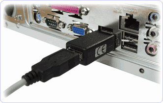
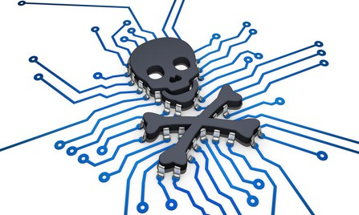
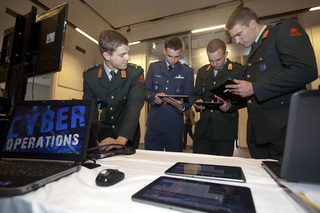

Title: Hackers en Justitie, of: ‘Hoe blijf ik uit de gevangenis?’
Date: 2015-10-21 18:00
Category: Algemeen
Tags: basis, justitie, wetten, politie
Slug: hackers-en-justitie-of-hoe-blijf-ik-uit-de-gevangenis
Authors: Sling
Summary: Een introductie tot hoe de Nederlandse wet bepaalde handelingen die met hacken te maken hebben strafbaar maakt en welke straffen er op staan.

Wanneer je je bezig houdt met hacken en je langzaam maar zeker een onderdeel wordt van de hackercommunity, dan bevind je je steeds vaker in een schaduwgebied. Waar ligt bij hacken nou precies de grens tussen legaal en illegaal, en wat zijn de zaken waar je voor moet uitkijken? Dit blijkt soms best onduidelijk te zijn, vooral als je je bedenkt dat elk land er zijn eigen regels en wetten op nahoudt en dat deze, net als de technologie, regelmatig in beweging zijn. Deze tutorial is gemaakt om je enig houvast te bieden en een paar strafbare onderwerpen te laten zien die je zeker zou moeten weten als je iets met computerbeveiliging doet. Ook bekijken we welke organisaties bij de bestrijding van cybercrime in Nederland betrokken zijn.

Om de tutorial niet te uitgebreid te maken beperken we ons tot de Nederlandse wet en laten we de andere landen even uit het verhaal. Ook is dit geen complete verzameling met alle strafbare feiten die iets met hacken te maken zouden kunnen hebben, dat zou simpelweg veel te lang en ook oninteressant worden. Onderaan de tutorial vind je, zoals gewoonlijk, links naar websites met meer informatie over dit onderwerp.

**Let op**: de informatie in deze tutorial is uiteraard niet bindend, ik ben geen jurist (IANAL) en ook is het goed mogelijk dat er fouten of verouderde gegevens vermeld zijn. Als je denkt in de problemen te zijn gekomen, raadpleeg dan altijd een advocaat.

# Huidige wetgeving in Nederland

Welke wetten zijn er nou eigenlijk die op ons, hackers, van invloed? Sinds 1993 bestaat er in Nederland een _Wet Computercriminaliteit_, in 2006 is een flinke uitbereiding hierop genoemd _Wet Computercriminaliteit II_ aangenomen door de overheid, en sinds 2007 is ook het internationale _Cybercrimeverdrag_ in werking getreden in Nederland. Het is waarschijnlijk goed om te weten dat door het aannemen van het internationale Cybercrimeverdrag je als Nederlander ook strafbaar bent als je de in onze wetten vastgelegde strafbare feiten in het buitenland pleegt.

De belangrijkste voorbeelden van handelingen die strafbaar zijn en die met hacken te maken kunnen hebben, zullen we nu doorlopen.

## Computervredebreuk

De belangrijkste term in deze tutorial is _computervredebreuk_. Dit betekent "Het zich ongeoorloofd toegang verschaffen tot een computersysteem" en is een hele brede definitie. In de kern komt het er op neer dat je jezelf geen toegang mag geven tot een computer of netwerk waar je eigenlijk geen toestemming voor hebt. Het is hierbij niet direct van belang of er een beveiliging actief is, ook zonder beveiliging mag je alleen gebruik maken van een computer waar je expliciet toestemming voor hebt gekregen. De manier waarop een systeem betreden wordt staat niet specifiek in de wet, en kan dus heel breed geïnterpreteerd worden.

Je zal je misschien afvragen, als er niet eens een beveiliging actief hoeft te zijn, ben ik dan ook strafbaar als ik met mijn mobieltje verbinding maak met een onbeveiligd draadloos netwerk wat niet van mij is? Het antwoord hierop is gelukkig: Nee. Het moet namelijk wel op de een of andere manier duidelijk zijn dat dat je je op verboden terrein begeeft. Als het SSID van zo’n onbeveiligd netwerk daarentegen ‘Verboden toegang’ of ‘Privé-netwerk’ heet, dan had je kunnen weten dat je geen verbinding mocht maken en ben je dus wel strafbaar.

Er worden grofweg 4 categorieën strafbare feiten onder de noemer computervredebreuk in de wet bepaald:

- Doorbreken van een beveiliging: bijvoorbeeld als je een proces laat crashen wat er normaliter voor zorgt dat de gegevens op een systeem afgeschermd zijn, of bijvoorbeeld een _SQL-injection_ aanval uitvoert waardoor de gebruikersauthenticatie omzeild wordt
- Een technische ingreep: door het laten overflowen van een buffer, expres uitvoeren van een bug, of op een andere manier het systeem zover krijgen dat het je onterecht toegang verleent tot bepaalde gegevens
- Valse signalen of een valse sleutel: wanneer je iemand zijn wachtwoord afkijkt of raadt door bijvoorbeeld een _brute force_ aanval, ook _IP-spoofing_ valt hieronder
- Het aannemen van een valse hoedanigheid: hieronder kunnen zaken zoals _social engineering_ en _phishing_ worden verstaan.

## Kopiëren of aftappen van gegevens

Wat ook strafbaar is, is het opzettelijk en met een technisch hulpmiddel aftappen of opnemen van gegevens die niet voor jou bedoeld zijn. Dit is technisch gezien vaak best eenvoudig, door bijvoorbeeld een antenne of schotel te gebruiken, of ergens een keylogger of netwerkkabel aan te sluiten.

 _Een USB-keylogger_

Met ‘aftappen of opnemen van gegevens’ wordt bedoelt dat je een kopie maakt van langskomend dataverkeer. Dat kan live verkeer zijn wat via een bedrade of draadloze verbinding verstuurd wordt, maar dit omvat ook bijvoorbeeld een cache die ergens halverwege de verbinding wordt bijgehouden, bijvoorbeeld bij je provider of binnen een bedrijfsnetwerk.

Het bijzinnetje ‘met een technisch hulpmiddel’ is ook van belang. Als je simpelweg naast iemand zit die aan het telefoneren is, en je kan het gesprek luid en duidelijk horen omdat er hard wordt gepraat, dan ben je uiteraard niet strafbaar. Wel ben je strafbaar, als je een stukje verderop gaat zitten en dit met een richtmicrofoon afluistert en eventueel ook nog opneemt op een gegevensdrager. Ook hulpmiddelen zoals verstopte opnameapparatuur of keyloggers (hardwarematig of softwarematig) vallen hieronder.

Door criminelen worden vaak gegevens ‘gestolen’ na het plegen van computervredebreuk om zich toegang te verschaffen tot een systeem. Wanneer er in zo’n situatie vertrouwelijke gegevens worden afgetapt dan kan hier maximaal 4 jaar cel voor worden gegeven door een rechter.

Wat goed is om hier op te merken, is dat het wel moet gaan om een gesprek tussen twee andere personen dan jijzelf, dus waarin jij geen deelnemer bent. Wanneer je een gesprek opneemt van jezelf met een andere gesprekspartner, dan is dit niet strafbaar. Ook mag je een gesprek tussen anderen dan jijzelf opnemen als je dit kenbaar hebt gemaakt en er geen bezwaar is gemaakt door de betrokken personen.

Ook het vervaardigen of verkopen van apparatuur of software die gemaakt is om anderen af te luisteren is strafbaar, hierop staat maximaal 1 jaar cel of een boete van € 16750.

## Gegevens verwijderen of aanpassen

Wanneer je opzettelijk opgeslagen of verwerkte gegevens vernielt of onbruikbaar/ontoegankelijk maakt, dan kan dit je een celstraf van maximaal 4 jaar opleveren. Dit kan onderdeel zijn van computervredebreuk maar wordt als een apart strafbaar feit gezien. Het komt vaak voor bij strafzaken waarbij een systeem gehacked is en er bijvoorbeeld logbestanden zijn verwijderd om sporen te wissen. Ook het toevoegen van andere gegevens aan een systeem telt als vernieling, net als het defacen van een website.

Een bijzonder geval is _ransomware_ of in het Nederlands _gijzelsoftware_. Dit is een programma wat gegevens op een systeem onbereikbaar maakt, meestal door versleuteling, en aan de gebruiker van deze gegevens een boodschap toont met daarin bijvoorbeeld “Stort € 10.000 op bankrekeningnummer 4456456 als je weer toegang wil krijgen tot je bestanden”. Ook dit valt onder het ‘ontoegankelijk maken van gegevens’ en is dus strafbaar.

## Systemen uitschakelen of onbruikbaar maken

Ook het opzettelijk vernielen, beschadigen of onbruikbaar maken van een computer- of communicatiesysteem is strafbaar. Je kan hiervoor een jaar celstraf of een geldboete van € 16.750 krijgen. Dit kan digitaal gebeuren maar ook fysiek door de hardware van een systeem kapot te maken (vandalisme).

Nog vervelender wordt het als je bijvoorbeeld het netwerk van een internetprovider overhoop haalt, de maximumstraf voor vernieling van een openbaar telecommunicatienetwerk is namelijk een jaar celstraf of een boete van € 67.000. Wanneer er door deze vernieling ook nog eens goederen of diensten in gevaar worden gebracht loopt de celstraf op tot zes jaar, als er mensen in levensgevaar worden gebracht tot negen jaar, en als er daadwerkelijk mensen om het leven komen kun je voor maximaal 15 jaar de cel in. In de laatste gevallen kun je denken aan het verstoren van de netwerken die gebruikt worden door politie, brandweer en ambulances, of fabrieken met gevaarlijke apparatuur en ziekenhuizen die van de communicatienetwerken afhankelijk zijn.

## Virussen en andere malware

Het verspreiden of ter beschikking stellen van programma’s die bestemd zijn om schade aan te richten in een geautomatiseerd werk is strafbaar. Je kan hier maximaal 4 jaar cel voor krijgen. Onder dergelijke programma’s vallen bijvoorbeeld computerwormen, virussen, trojans, rootkits, backdoors, spyware, ransomware, hoaxes, etc. Programma’s die zichzelf verspreiden maar verder geen schade aanrichten of andere strafbare zaken verrichten of vergemakkelijken zijn niet strafbaar.

Een computerworm is een vrij algemene term die wordt gebruikt voor kwaadaardige programma’s die zichzelf kunnen verspreiden, bijvoorbeeld door zichzelf rond te mailen of te kopieren naar andere computers. Wanneer zo’n worm schade aanbrengt aan een systeem, of het makkelijker maakt om computervredebreuk te plegen, dan is de maker en/of de verspreider van de worm strafbaar. In tegenstelling tot een worm kan een virus zichzelf niet verspreiden naar andere systemen. Ook het maken en verspreiden van virussen is strafbaar.

## Denial of Service (DoS)

Het uitvoeren van een denial of service aanval, gedefiniëerd als ‘Het belemmeren van de toegang tot of het gebruik van een systeem door daaraan gegevens aan te bieden’ is strafbaar in Nederland. Je kan er maximaal 1 jaar cel of een geldboete van € 16.750 voor krijgen. Hierbij moet wel aan te tonen zijn dat het uitvoeren van de aanval opzettelijk gebeurt. Als een website down gaat doordat teveel mensen er naartoe surfen, bijvoorbeeld door een nieuwsbrief of reclame op TV, dan zijn alle mensen die de site proberen te bezoeken natuurlijk niet strafbaar volgens deze wet. Wel ben je strafbaar als je tools zoals [LOIC](http://sourceforge.net/projects/loic/) inzet tegen een systeem wat niet van jou is, omdat deze tool specifiek bedoeld is om een systeem onbereikbaar te maken.

Behalve een server kunnen nog meer delen van een geautomatiseerd systeem doelwit zijn van een denial of service, bijvoorbeeld een mailbox die bestookt wordt met mail (een mailbom), een gedeelde netwerkschijf die expres volgezet wordt waardoor anderen hem niet kunnen gebruiken, een netwerkverbinding die dichtslibt door teveel verkeer, etc.

# Recente ontwikkelingen

Wetten over computerbeveiliging en het Internet zijn een bijzonder fenomeen binnen justitie. De meeste juristen zijn gewend dat wetten soms al meer dan 100 jaar ongeveer dezelfde inhoud hebben, sommige onderdelen van onze huidige wet zijn zelfs al bijna 200 jaar oud. Het Internet en het idee van ‘hacken’ vanuit een goedaardig en/of kwaadaardig oogpunt zijn hele nieuwe begrippen waar rechters en advocaten over het algemeen erg weinig ervaring mee hebben, en de hoeveelheid wetten en regels hierover is dus ook schaars. Dat betekent dat er in rechtzaken waar het over een IT-gerelateerd delict gaat, vaker wordt gekeken naar eerdere uitspraken (ook wel jurisprudentie genoemd) dan naar de paar wetten die hierover vastgelegd zijn. Het is een vakgebied wat zich de komende tientallen jaren verder zal moeten ontwikkelen, net zoals de IT zich zelf ook verder ontwikkelt.

Op het moment van schrijven (oktober 2015) ligt er een wetsvoorstel klaar ‘Wet Computercriminaliteit III’ waar flink wat controversie over is, vooral over een ‘decryptiebevel’ en ‘terughackvoorstel’ wat hierin vastgelegd wordt. Halverwege 2012 is er nog een ander interessant onderwerp aangedragen vanuit Europese regelgevingen, het netneutraliteit-principe. Beide onderwerpen zullen we in iets meer detail bekijken.

## Netneutraliteit

Al het verkeer op het Internet wordt door providers en internetexchanges naar het juiste adres gestuurd (gerouteerd). Technisch gezien hebben deze organisaties de mogelijkheid om bepaalde typen verkeer of gebruikers voorrang te geven op de rest, of zelfs verkeer helemaal niet te behandelen wat aan bepaalde voorwaarden voldoet. Dit kan onder andere gedaan worden met ‘traffic shaping‘ of ‘QoS‘.

Dit kan helpen om misbruik te voorkomen, zodat 1 kwaadwillend persoon niet meer de mogelijkheid heeft om het netwerk voor de rest van de gebruikers onderuit te halen, maar in de praktijk moet dit eigenlijk opgelost worden door een goed ontworpen en geconfigureerd netwerk, en niet door maatregelen zoals traffic shaping. Om te voorkomen dat providers en exchanges deze middelen toch inzetten is er in mei 2012 door de Eerste Kamer een wet vastgelegd die stelt dat providers op geen enkele wijze iemand de mogelijkheid tot het internetgebruik mogen ontnemen of belemmeren, en dat providers toegang moeten verlenen tot alle beschikbare data op het Internet. Dit wordt ‘netneutraliteit’ genoemd, al het verkeer op het Internet is gelijkwaardig en moet met dezelfde prioriteit behandeld worden.

Helaas is het buiten Nederland slechter gesteld met de netneutraliteit, alleen in Chili is een vergelijkbare wet ingevoerd, de rest van de wereld moet het nog zonder deze wetten doen. Dat betekent dat providers en andere instanties, inclusief overheden, de mogelijkheid hebben om bepaalde delen van het Internet af te schermen of groepen mensen geen of maar gedeeltelijke toegang te geven tot alle informatie.

## Decryptiebevel

In het wetsvoorstel [Wet Computercriminaliteit III](http://www.rijksoverheid.nl/bestanden/documenten-en-publicaties/kamerstukken/2013/05/02/memorie-van-toelichting-wetsvoorstel-versterking-aanpak-computercriminaliteit/memorie-van-toelichting-wetsvoorstel-voor-versterking-aanpak-computercriminaliteit.pdf) wat door Minister Opstelten aangedragen wordt staat het volgende:

> In geval van verdenking van een terroristisch misdrijf of het [vervaardigen danwel verspreiden van kinderporno], kan de officier van justitie, indien het onderzoek dit dringend vordert, aan de verdachte het bevel richten toegang te verschaffen tot een geautomatiseerd werk of delen daarvan, tot een gegevensdrager of tot versleutelde gegevens.

De laatste woorden zijn hetgeen waar het meeste om te doen is; justitie kan – als deze wet doorgevoerd wordt – iemand verplichten een decryptiesleutel te leveren voor door hem/haar versleutelde data. Als iemand hier niet aan meewerkt, kan er een celstraf van 3 jaar worden opgelegd. Weliswaar alleen in specifieke gevallen, en ook daar alleen in zaken waar weinig ander bewijsmateriaal voorhanden is, maar de vraag is of het überhaupt wettig is om zo’n bevel te kunnen geven. Er is namelijk in het Europese Verdrag van de Rechten van de Mens een principe in de wet vastgelegd wat stelt dat verdachten niet aan hun eigen vervolging hoeven mee te werken, iets waar dit bevel volledig tegenin gaat. Op dit moment wordt er nog onderzoek gedaan naar de wettigheid van dit voorstel, en is het dus gelukkig nog niet zeker dat dit voorstel ook een wet wordt.

## Terughackvoorstel

Een ander onderdeel van het nieuwe wetsvoorstel van Opstelten is het ‘terughacken’ door justitie. Als het aan hem ligt, dan krijgt de politie veel meer bevoegdheden om kwaadaardige hackers en andere cybercriminelen aan te pakken. Denk daarbij aan het inbreken op servers in binnen- of buitenland die gebruikt worden voor cyberaanvallen. Het inbreken op servers waarvan bekend is dat ze niet in Nederland staan, moet wel in overleg met de lokale autoriteiten. Het doel van zo’n inbraak kan informatie zijn, of het platleggen van systemen zodat ze niet meer gebruikt kunnen worden door criminelen.

Ook wil Opstelten dat de politie de bevoegdheid moet krijgen om communicatie via de computer af te tappen of te observeren, na goedkeuring van een rechter. Dit mag ook gebeuren door software op computer te installeren die communicatie afluistert voordat het versleuteld wordt en via het Internet wordt verzonden, zoals Skype.

Aan de ene kant kan dit flink wat risico’s met zich meebrengen, stel bijvoorbeeld dat de malware die hiervoor wordt ingezet in handen komt van kwaad willenden en daarmee onschuldige mensen aanvallen. Maar veel andere opties zijn er vaak niet als er sprake is van cybercrime en er een acute aanval of dreiging is die weggenomen moet worden. De vraag is wel of er genoeg kennis bij de politie aanwezig is om dit soort maatregelen goed te kunnen uitvoeren.

# Handhaving door de overheid

De meeste delicten die we hierboven beschreven hebben, zullen door de reguliere politie worden behandeld. Er zijn binnen de overheid ook nog enkele organisaties die zich met de grotere en/of georganiseerde computercriminaliteit bezighouden; zowel ministeriëel, binnen de politie van vanuit de inlichtingendiensten.

## Ministerie van Justitie: Nationaal Cyber Security Centrum

Als onderdeel van de afdeling Nationaal Coördinator Terrorismebestrijding en Veiligheid (NCTV) binnen het Ministerie van Justitie is het Nationaal Cyber Security Centrum (NCSC) het centrale meld- en informatiepunt voor ICT-dreidingen, veiligheidsincidenten en cybercrime binnen de overheid. Het NCSC bestaat sinds 1 januari 2012 en is gehuisvest in Den Haag, de +/- 80 medewerkers zitten in het nieuwe gebouw van de ministeries van Binnenlandse Zaken, Veiligheid en Justitie.

## Ministerie van Binnenlandse Zaken, Veiligheid en Justitie

Het NCSC is vooral een coordinerende partij die de overheid, wetenschap en het (internationale) bedrijfsleven bij elkaar brengt. Ze bieden ondersteuning aan kritische onderdelen van de maatschappij zoals energiecentrales, telecommunicatie (denk aan bijvoorbeeld de infrastructuur voor het noodnummer 112 of de nationale rampenzender op tv en radio) en de financiële sector (de infrastructuur die ervoor zorgt dat je geld uit de muur kan trekken of overboekingen kan doen naar andere rekeningen).

 _Ministerie van Binnenlandse Zaken, Veiligheid en Justitie_

De afdeling "Monitoring en Response" bestaat uit securityspecialisten die over digitaal Nederland waken en hulp bieden in crisissituaties. Binnen deze afdeling zijn 3 teams; incidentafhandeling, analyses en een groep die werkt aan de ontwikkeling van een partnernetwerk. Deze afdeling verzorgt ook een waakdienst, die 24 uur per dag en 365 dagen per jaar bemand wordt door minimaal 2 personen, en op de hoogte blijft van actuele dreigingen, malwareuitbraken en trends. Ze maken hierbij gebruik van een zelfgemaakte monitoringstool ‘Taranis’ die uit diverse bronnen informatie binnenkrijgt, en ook komen meldingen binnen via het web, e-mail, telefoon, Jabber, IRC, etcetera.

De afdeling "Expertise en Advies" bestaat ook uit ongeveer 15 personen heeft een consultancy rol richting alle belanghebbenden en ‘klanten’ van het NCSC. Ze schrijven publicaties, factsheets, whitepapers, trendrapporten en geven presentaties en adviesen aan diverse bedrijven en onderdelen van de overheid. Ze werken nauw samen met bijvoorbeeld het Ministerie van Defensie, de AIVD, Politie, grote IT-bedrijven zoals Microsoft en producenten van Anti-Virus producten.

Naast deze twee afdelingen is er nog een afdeling die ontwikkeling en projecten uitvoert, en een afdeling die het operationeel management uitvoert. Voor meer informatie over het NCSC kun je het beste op hun website kijken.

## Politie: Team High Tech Crime

Binnen de Dienst Landelijke Recherche is de afdeling Team High Tech Crime (THTC) actief. Deze bestaat op dit moment uit twee opsporingsteams en een algemeen team, waarin zowel tactische rechercheurs met een politieachtergrond als digitale rechercheurs met een technische achtergrond werken. De afdeling begon met 15 agenten, was halverwege 2014 flink gegroeid naar zo’n 90 fte, en is op dit moment (oktober 2015) 120 man sterk. De afdeling is werkzaam in Breda en Driebergen-Rijsenburg.

thtcHet THTC wordt ingezet bij complexe en nieuwe vormen van cybercrime die door reguliere agenten niet kunnen worden bestreden en daarnaast ook bijzondere misdrijven zoals kinderporno. Ze voeren zelfstandig onderzoeken uit en zijn ook aanwezig bij invallen en onderzoeken op de plaats delict om digitaal bewijsmateriaal veilig te stellen. Omdat cybercrime vaak internationale grenzen overschrijdt, werken de mensen van het THTC veel samen met buitenlandse organisaties zoals Interpol, Europol en de FBI. Van hun Amerikaanse collega’s hebben ze recentelijk ook training gekregen over het ‘undercover’ werken op internet, waarbij ze zich op internet voordoen als koper voor bijvoorbeeld creditcardgegevens of als geldwitwassers.

Het THTC werft nu al enkele jaren nieuwe collega’s via de jaarlijkse cybercrimechallenge, die in samenwerking met partners zoals Tweakers.net, Certified Secure en QCSEC worden samengesteld. De laatste keren bestond dit uit twee aparte deel-challenges; een digitaal pad en een tactisch pad, wat de splitsing binnen het team van tactische en digitale aspecten goed laat zien.

## Inlichtingendiensten: Joint Sigint Cyber Unit

De Joint Sigint Cyber Unit (JSCU) is in juni 2014 opgericht. Eerder bestonden er bij de militaire en algemene inlichtingen en veiligheidsdienst (MIVD en AIVD) aparte teams die zich bezighielden met cybercrime, maar deze zijn nu samengevoegd in het nieuwe onderdeel JSCU. Dit zorgt ervoor dat alle bestaande kennis en middelen tot de beschikking staan van zowel militaire als algemene inlichtingendiensten. Ook de eerdere Nationale Sigint Organisatie is hiermee samengevoegd. De JSCU wordt aangestuurd door zowel de AIVD als de MIVD en zal uiteindelijk bestaan uit zo’n 350 mensen, en is gehuisvest in het kantoor van de AIVD in Zoetermeer.

 _Algemene Inlichtingen en Veiligheidsdienst_

De kernactiviteiten van de JSCU is het afluisteren van radio- en satellietverkeer en het afweren van aanvallen tegen computernetwerken. Ook onderzoeken ze dreigingen, aanvallen en spionage van computernetwerken om deze indien mogelijk te voorkomen. Ze werken nauw samen met andere onderdelen van de nationale inlichtingendiensten en bijvoorbeeld het NCSC, maar ook met de diensten van NAVO-, VN- en EU-bondgenoten zoals de BND in Duitsland, de GCHQ in de UK en de CIA/NSA in de Verenigde Staten.

Het afluisteren gebeurt op basis van signalen die op twee militaire afluisterstations in Nederland opgevangen worden, de grootste daarvan staat in Burum (Friesland) en het tweede station in Eibergen (Gelderland). Deze vielen eerst onder de Nationale Sigint Organisatie maar zijn nu onderdeel van de JSCU geworden.

## Ministerie van Defensie: Defensie Cyber Commando

Het Defensie Cyber Commando (DCC) is sinds 25 september 2014 een nieuw krijgsonderdeel van de Koninklijke Landmacht. Deze eenheid heeft in zijn takenpakket naast beveiliging van militaire netwerken en het verkrijgen van inlichtingen ook het uitvoeren van aanvallen op vijandelijke computernetwerken. Er is bij de oprichting ongeveer 60 man personeel voor dit onderdeel aangesteld.

Een subonderdeel van deze eenheid is het Defensie Computer Emergency Response Team ofwel DefCERT, die zich puur bezighouden met de beveiliging van de netwerken die door defensie en de verschillende legeronderdelen gebruikt worden. Een ander onderdeel is het Defensie Cyber Expertise Centrum waar men hun best doet om de kennis over cyberoperaties te verbeteren, op dat vlak wordt ook samengewerkt het het TNO. Het DCC werkt in zijn algemeenheid veel samen met andere organisaties zoals het eerdergenoemde NCSC maar op het gebied van inlichtingen uiteraard ook met de AIVD en MIVD, en verder diverse andere initiatieven op het gebied van ‘Cyber’.

# Ethical Hacking, Responsible Disclosure

Er zijn dus een hoop regels, wetten en instanties die zich in Nederland bezighouden met het voorkomen van cybercriminaliteit. Hoe zit het dan eigenlijk met mensen die ergens een veiligheidsrisico willen aantonen en hiervoor zich in de huid van een kwaadwillende hacker moeten verplaatsen? Ben je alleen strafbaar als je slechte bedoelingen hebt?

Om deze vraag te beantwoorden is in 2013 een leidraad ‘Responsible Disclosure’ opgesteld door minister Opstelten. Hierin staat dat je in principe vrijuit gaat als je bij je activiteiten geen veranderingen hebt aangebracht in het systeem, geen gegevens hebt gedownload en het lek direct hebt gemeld bij het bedrijf zonder meteen de media op te zoeken. Natuurlijk zijn deze regels nogal vaag, als je bijvoorbeeld een commando uitvoert wat een reactie terugstuurt, ben je dan ook al informatie aan het downloaden?

De leidraad is beschikbaar gemaakt voor bedrijven om te hanteren als basis voor hun eigen beleid, maar is zeker geen wet waar zwart op wit staat dat ethical hacking toegestaan is. Dit lijkt ook onmogelijk, gezien het vage karakter van ‘ethical hacking’ en het grijze gebied waarin het zich bevindt. Uiteindelijk zal een rechter een oordeel moeten vellen over je bedoelingen als hacker, en zul je moeten kunnen uitleggen dat elke handeling die je uitgevoerd hebt, niet kwaadaardig bedoeld was.

# Meer bronnen over dit onderwerp:

- [Computercriminaliteit en wetgeving in Nederland (Wikipedia)](http://nl.wikipedia.org/wiki/Computercriminaliteit#Nederland)
- [Website van Arnout Engelfriet, een bekende Nederlandse ICT-jurist](http://www.iusmentis.com/)
- [Team High Tech Crime van de Nationale Politie](https://www.kombijdepolitie.nl/SoortenWerk/Pages/HighTechCrime.aspx)
