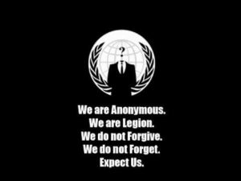
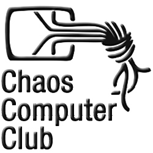
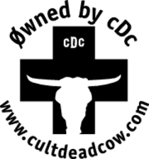
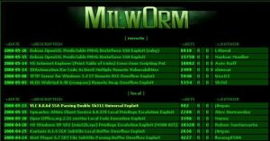

Title: Hacktivisme
Date: 2017-11-19 18:00
Category: Algemeen
Tags: hacktivisme, anonymous
Slug: hacktivisme
Authors: Jantje2000
Summary: Type hier een korte samenvatting in 1 zin.

[Wraakactie van Turkse hackers treft Nederlandse bedrijven](http://nos.nl/artikel/2162995-wraakactie-van-turkse-hackers-treft-nederlandse-bedrijven.html)

[WADA aangevallen door Russische hackers](http://nos.nl/artikel/2131887-wada-aangevallen-door-russische-hackers.html)

[Hackers lekken gegevens Froome, Wiggins en Kvitova](http://nos.nl/artikel/2132261-hackers-lekken-gegevens-froome-wiggins-en-kvitova.html)

[Hacker zet persoonlijke gegevens Democraten online](http://nos.nl/artikel/2125476-hacker-zet-persoonlijke-gegevens-democraten-online.html)

`Hacken + Activisme = Hacktivisme`

Je hebt het misschien niet altijd in de gaten, maar hacktivisme komt de laatste tijd regelmatig in het nieuws. Het lijkt soms alsof (politieke) problemen enkel nog door middel van hacktivisme opgelost kunnen worden, terwijl maar weinig mensen herkennen dat het om hacktivisme gaat. Hacktivisme is een vorm van activisme, zoals de naam al doet vermoeden. Bij traditioneel activisme zoals Greenpeace of plaatselijke actiegroepen met spandoeken gaat het om fysieke acties die meestal door mensen op lokatie worden uitgevoerd. Hacktivisme wordt daarentegen vooral op afstand gedaan via het Internet, waarbij technische handelingen worden verricht om de aandacht te trekken, of dit onder hacken valt mag je zelf weten. Hacktivisme kan allerlei motieven en redenen hebben, en op oneindig veel manieren uitgevoerd worden. Ethiek en hacktivisme gaan hand in hand, vaak is een hacktivist ervan overtuigd dat hij/zij het juiste doet, terwijl het ‘doelwit’ van een dergelijke actie het hier vanzelfsprekend meestal niet mee eens is. Welke kant gelijk heeft is niet altijd makkelijk te bepalen, als er überhaupt al gesproken kan worden van gelijk hebben.

Een van de meest voorkomende manieren van hacktivisme is het defacen van websites, wat betekent dat de inhoud van een website wordt aangepast nadat er toegang tot de server of de bestanden is verkregen. Hiermee kan een hacktivist een boodschap verspreiden via een site die niet van hemzelf is.  Een andere manier om dit te bereiken is DNS hijacking, waarmee mensen worden omgeleid van een legitieme website naar de website van de hacktivist. Als er geen boodschap verspreid hoeft te worden maar een doelwit simpelweg offline moet zodat deze onbereikbaar is voor bezoekers, dan kan een (D)DoS aanval uitgevoerd worden. Terwijl dit vroeger een gespecialiseerde klus was, komt dit steeds meer binnen handbereik van iedere scriptkiddie door het bestaan van online “stressers”. Dit zijn websites waar je een doelwit opgeeft in de vorm van een IP of hostname, waarna de stresser ervoor zal zorgen dat er een heleboel verkeer naar gestuurd wordt. Voor korte tijd of met beperkte ‘kracht’ is zo’n stresser vaak gratis. Met de komst van dit soort tools betekent het dat er voor een effectieve hacktivisme-actie eigenlijk weinig tot geen technische kennis meer nodig is.

# Hackgroepen

Veel hacktivisten verzamelen zich in groepen. Zo bestaan er onder andere de groepen 2600, de Chaos Computer Club, Cult of the Dead Cow, Milw0rm, LulzSec en de los-vaste groepering Anonymous. Hieronder vind je een korte samenvatting van deze groepen. Wat je je moet realiseren is dat hacktivisme is iets wat al enkele decennia bestaat. Hacken is namelijk het gebruiken van ‘iets’ waar dat niet direct voor bedoeld is. Vroeger bijvoorbeeld in de jaren 50 stond men op de barricade als er iets was waar men tegen wilde ageren. Zo werkten bijvoorbeeld de provo’s en de hippies. Het internet hacktivisme bestaat echter nog niet zo heel lang. Anonymous bestaat bijvoorbeeld sinds 2003, Chaos Computer Club bestaat al sinds 1981, Cult of the Dead Cow bestaat ook al zo’n 30 jaar. Deze groepen doen niet alleen aan hacken, maar over het algemeen zijn het ook gewoon clubjes die samen kennis delen. Door CCC wordt er bijvoorbeeld ieder jaar een kamp en een event georganiseerd. Verder zenden zij iedere maand eenmalig een talkshow uit op Chaosradio.

## Anonymous

Anonymous zal waarschijnlijk één van de bekendste, zo niet de bekendste hackgroep zijn. Hun slogan is “We do not forget, we do not forgive, expect us.” Dit maakt gelijk duidelijk waar ze voor staan. Ze pakken vrijwel alles aan waar ze het niet mee eens zijn. Veelal proberen ze de vrijheid op het internet te beschermen. Toch zijn hun acties niet enkel op gebeurtenissen op het internet gefocust. Zo hebben ze na de aanslagen op Charlie Hebdo al een oorlog verklaard aan de IS en dit hebben ze op 17 juli, na de aanslagen in Nice, nogmaals gedaan. Anonymous is vooral bekend geworden door de reeks DDoS aanvallen die ze doen op de websites en netwerken van bekende overheden. Zelf hebben ze zichzelf ooit zo beschreven:

“Anonymous is not an organisation, or a group of people. It most certainly is not a group of hackers. Anonymous is an online living consciousness compromised of different individuals with at times coinciding ideals and goals. Anonymous is decentralized and as such is free.”

Met andere woorden: Iedereen is anonymous. Anonymous is niet een bepaalde groep met leden en leiding. Je kunt jezelf dus ook niet echt aansluiten bij Anonymous. Misschien werden ze juist wel zo succesvol, doordat eigenlijk iedereen Anonymous is. Ze komen regelmatig in het nieuws, bijvoorbeeld toen in 2010 toen Airplex Software websites met illegale software werd ingehuurd, waarna er een operatie op gang kwam waarbij vele websites werden geDDoS’t.

## Chaos Computer Club

De Chaos Computer Club (CCC) is een van oorsprong Duitse computerclub. Ze zijn met 5500 leden (2016) het grootste hackerscollectief in Europa, bestaan al sinds begin jaren ’80 en zijn beroemd geworden met hun Btx-Hack en NASA-hack. CCC omschrijft hun club zelf als volgt: “Een gemeenschap van levende wezens, onafhankelijk van leeftijd, geslacht, ras of maatschappelijke oriëntatie, die gedijt over de grenzen van de vrijheid van informatie.”. Ieder jaar van 27 t/m 30 december organiseren ze een groot hacker congres. Hier is de voertaal vrijwel altijd Engels, daarnaast wordt vanzelfsprekend een hoop Duits gebruikt. Naast het jaarlijkse congress organiseert CCC ook eens per vier jaar een hackercamp en diverse jaarlijkse kleinere congressen zoals de GPN, SigInt en Easterhegg.

## Cult of the Dead Cow

Cult of the Dead Cow wordt ook wel cDc genoemd. Cdc communication is de moederorganisatie, waaronder Cult of the Dead Cow valt. Onder cDc Communication vallen ook de organisaties Ninja Strike Force en Hacktivismo. Hacktivismo is gewijd aan de bevordering van de mensenrechten op het internet. Cdc heeft ook een aantal programma’s vrijgegeven. Dit zijn onder andere beveiligingprogramma’s, maar hier zouden ook hacktools bijzitten.

## Milw0rm

Milw0rm was een site waar white-hat hackers hun exploits konden plaatsen hoe mensen bepaalde websites konden hacken. Je zou denken: “Dan ben je toch geen white-hat meer?” Dit klopt, maar dit zouden ze dan ook niet zomaar doen. Het gebeurt regelmatig dat als hackers een lek vinden zij dan geen gehoor krijgen van de producent, of dat die er niets aan doet. Op deze site kunnen deze hackers dan hun exploits zetten, zodat producenten dan gedwongen worden om de software te beveiligen, omdat anders andere mensen die software kunnen binnendringen. Tegenwoordig heet deze website geen milw0rm meer, maar tegenwoordig is dit de website https://www.exploit-db.com/.

De hacktivisten groep van Milw0rm is behoorlijk onbekend, maar voor wie ze bekend zijn komt dit vooral door een hack op Bhabha Atomic Research Centre (BARC). Dit was het instituut van India waar nuclaire onderzoeken werden gedaan. Maar er staan nog meer hacks op hun naam. Zo heeft de hacker JF ooit MTV gehackt, waarna er op iedere pagina het logo van hem stond. Bovendien was er een pagina waar op stond: JF was here.

## LulzSec

De naam zegt eigenlijk gelijk al iets over de hackinggroep. Lulz is namelijk afgeleid van LOL (Lauging Out Loudly). Sec is de security. Hun motto is: “De wereldleiders met hoge-kwaliteits vermaak, op jouw kosten.” Toch zijn ze niet per se bezig qua een bepaalde moraal, aangezien ze bijvoorbeeld ook games platleggen. Zo hebben ze het PlayStation Network (PSN) platgelegd, omdat zij vonden dat Sony de privacy van consumenten teveel aanvielen, maar ze hebben ook de wachtwoorden gehackt van Fox Broadcasting Company. Bij de wachtwoorden zaten veel zwakke wachtwoorden, waardoor het bedrijf qua beveiliging slecht in de belangstelling komt te staan.

# Hackersgroepen in Nederland

Dit waren allemaal hackersgroepen, hoewel dit ze niet allemaal zijn. In Nederland speelde zich ook iets dergelijks af. Een vriendengroep die Hippies from Hell heette wordt vaak geassocieerd met hackers, hoewel daar maar enkele hackers tussen zaten. De initiatiefnemer van deze groep was onder andere Rop Gongrijp. Hij heeft in 1989 het blad HackTic uitgebracht. Deze magazines zijn nog altijd te lezen, aangezien op de website [www.hacktic.nl](http://www.hacktic.nl/) de magazines gearchiveerd zijn. De film Hippies from Hell is er mede aan schuldig dat deze vriendengroep wordt geassocieerd met hackers. Deze film ging over mensen uit deze vriendengroep, maar eigenlijk vertegenwoordigt de film maar een aantal mensen uit de groep en de meesten niet. Wel bevat het blad HackTic veel over hacken, maar dit was niet op initiatief van de vriendengroep, maar op initiatief van Rop Gonggrijp. Eigenlijk heeft de vriendengroep zelf niet per se een “hack” karakter.

Rop Gongrijp, een lid van Hippies From Hell wordt als één van de eerste hackers. Hij was zoals eerder verteld de oprichter van het blad Hack-tic. Hieruit vloeide een ISP voort, waarbij ze onder de naam van Hack-tic internet verkochten, via een aantal inbelmodems. Toen dit beter ging lopen besloten ze dit niet meer onder de naam van Hack-tic te doen, maar hebben ze XS4ALL opgericht.
