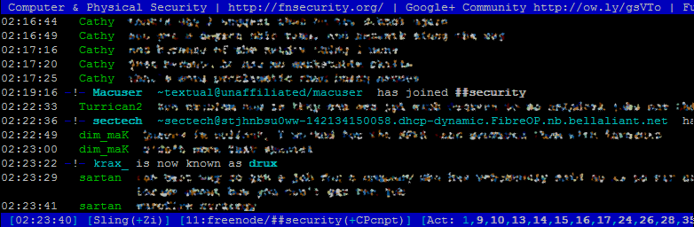
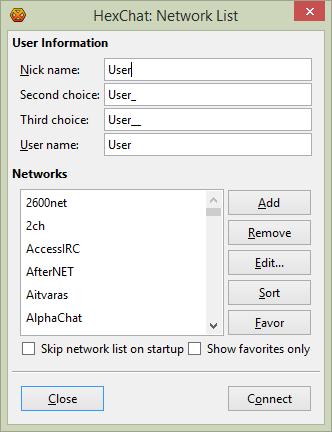
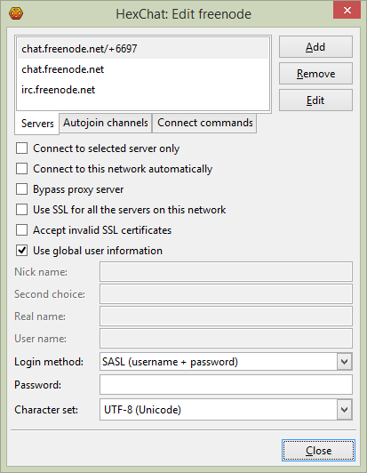
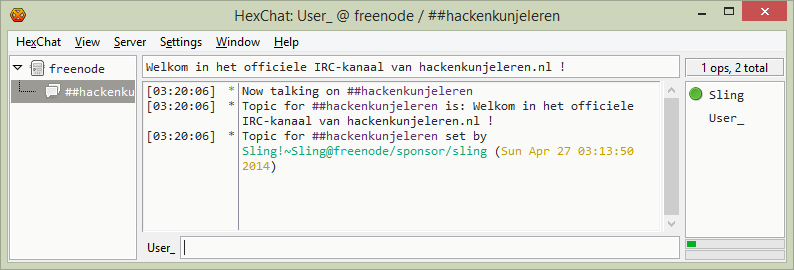
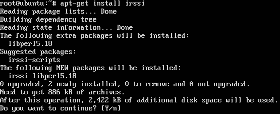
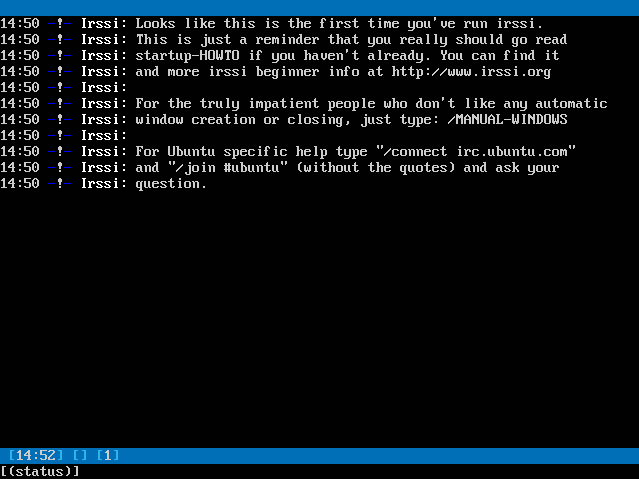
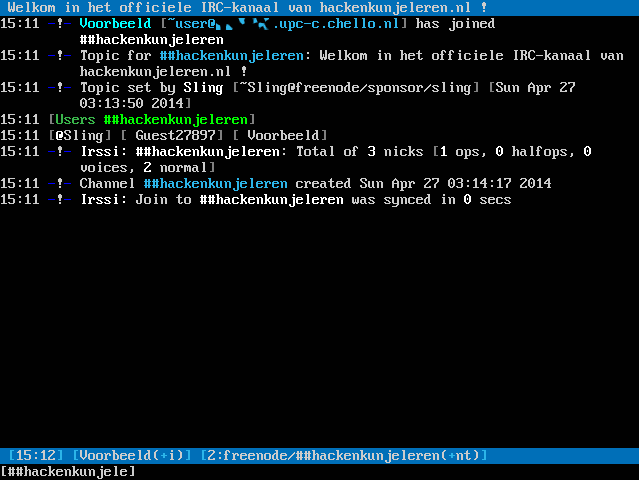
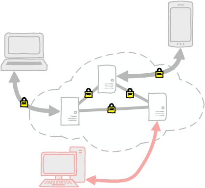

Title: Introductie tot IRC
Date: 2015-10-18 18:00
Category: Basis
Tags: introductie, basis, irc, chatten
Slug: introductie-tot-irc
Authors: Sling
Summary: Met deze tutorial kan iedereen aan de slag op IRC, en leer je de eerste beginselen en commando's.

Als je wel eens hebt gechat op internet via een chatbox op een website, via MSN Messenger, Skype, ICQ of iets vergelijkbaars, dan zal IRC niet heel erg veel nieuws voor je worden. [IRC](http://nl.wikipedia.org/wiki/Internet_Relay_Chat) is namelijk ook een manier om te chatten met andere mensen over de hele wereld. Vanwege de opbouw en werking van IRC is het een van de door hackers meest gebruikte en meest directe vormen van communicatie. Hierdoor vindt veel communicatie plaats op IRC, en hebben vrijwel alle hackersgroepen en community’s hier een thuisbasis. Na deze tutorial ben je bekend met de belangrijkste zaken omtrent IRC en hoef je niks meer te missen!

# Wat is IRC?

IRC staat voor Internet Relay Chat, een [protocol](http://nl.wikipedia.org/wiki/Protocol) voor communicatie tussen computers wat al sinds 1988 bestaat en wat vooral in technische gemeenschappen nog veel gebruikt wordt. Veel chat-applicaties op websites en in spellen zijn ooit gebaseerd op IRC, of maken er nog steeds gebruik van. Hoe dit protocol precies werkt is voor nu nog niet heel erg belangrijk, we zullen ons in deze tutorial vooral richten op het gebruik ervan.

IRC-verkeer loopt van een IRC client – een programma wat op je eigen computer draait – naar een IRC netwerk en vervolgens vanuit dit IRC netwerk weer naar een heleboel andere IRC clients verspreid over de hele wereld. Zo’n IRC netwerk bestaat uit 1 of meer IRC servers die met elkaar in verbinding staan, en waar IRC clients verbinding mee kunnen maken. Er zijn een heleboel grote IRC netwerken, zoals Freenode, Quakenet, IRCnet, EFnet, Undernet et cetera, met op elk moment tienduizenden verbonden clients (gebruikers) en tientallen servers. Meer over deze netwerken een stukje verder in deze tutorial.

Iedere gebruiker kan per netwerk een eigen nickname kiezen, een zelf bedachte naam die uniek is op het hele netwerk. Als je straks verbinding maakt met een groot netwerk zul je misschien merken dat de eerste paar namen die je graag zou willen hebben al in gebruik zijn door andere mensen, dus zul je iets anders unieks moeten kiezen. Je nickname hoeft niks met je echte naam te maken te hebben, je bent tot op zekere hoogte anoniem.



Je kan als je verbonden bent met een server een privé-bericht sturen naar 1 andere gebruiker, in IRC termen ook wel een query genoemd, maar leuker is het natuurlijk om met een groep mensen tegelijk te praten. Dit gebeurt in een kanaal (of channel in het Engels). Er zijn op de grotere netwerken duizenden tot tienduizenden kanalen waar je binnen kan komen en vervolgens kan meepraten over allerlei onderwerpen. De meeste kanalen zijn bedoeld om over een specifiek onderwerp te praten, zoals ‘Ubuntu’ of ‘cryptografie’, maar er zijn ook kanalen die geen vast onderwerp hebben en bedoeld zijn voor wat willekeurig geklets, of kanalen die bedoeld zijn om nieuwe gebruikers op weg te helpen op een IRC-netwerk.

# IRC Clients

Om IRC te kunnen gebruiken, heb je allereerst een IRC client nodig waarmee je verbinding kan leggen met een IRC server. Omdat IRC een open protocol is – dus een standaard waarvan de precieze specificaties voor iedereen te bekijken zijn – zijn er een heleboel verschillende clients ontwikkeld, voor allerlei besturingssystemen en doelgroepen. (Dit in tegenstelling tot bijvoorbeeld Skype, waar je verplicht bent om de Microsoft client te gebruiken, en simpelweg pech hebt als deze er voor jouw OS niet is). Ik heb ervoor gekozen om twee veelgebruikte clients toe te lichten in deze tutorial; Hexchat en irssi.

## Hexchat

Hexchat is een IRC client met een grafische interface, en is beschikbaar voor Windows, Linux en OSX. Het is open source software, dus geen ‘trial’ of ‘pro’ versies en ook geen reclame of spyware zoals in veel andere ‘gratis’ software. Als je op dit moment alleen Windows gebruikt en niet beschikt over een eigen Linux server dan raad ik je aan om voorlopig Hexchat te gebruiken voor IRC. Je kan Hexchat hier downloaden: [hexchat.github.io](https://hexchat.github.io/downloads.html).

De installatie van Hexchat is niet erg bijzonder en gaat net zoals elk ander programma. Op Windows kan je de volgende foutmelding zien na de installatie bij het starten van Hexchat:


Je mist in dit geval een library waar HexChat op gebouwd is; “Visual C++ Redistributable for Visual Studio 2012 Update 4”. De pagina waar je deze update kan downloaden opent zich als het goed is al in een browser dus je hoeft deze alleen nog maar even te installeren en je kunt Hexchat starten. Mocht je toch problemen ondervinden, dan raad ik je aan om Google te raadplegen, deze tutorial gaat hier verder niet op andere mogelijke issues in.

Zodra je HexChat start verschijnt er een klein venster waar een aantal opties ingesteld kunnen worden en waar je een verbinding kan maken met een IRC netwerk. We zullen hier nu enkele zaken instellen en bekijken, je kan dit venster later altijd weer opnieuw oproepen als je iets wil aanpassen.



Stel allereerst je nickname in (wees creatief als je er nog geen hebt, maar gebruik bij voorkeur geen rare tekens, bedenk iets unieks en hou het zo kort mogelijk). In de twee velden hierna kun je alternatieven opgeven mochten je eerste en tweede keus al bezet zijn op het netwerk waarmee je verbinding legt, standaard worden er underscores toegevoegd wat vrij standaard is als alternatieve nickname. Het vierde veld ‘User name’ kun je voor nu hetzelfde als je nickname laten staan.

Het tweede deel van dit venster biedt je de mogelijkheid om verbinding te leggen met een IRC netwerk, aan de linkerkant staat een lijst netwerken, dit zijn doorgaans drukkere netwerken waar al een hoop gebruikers op zitten met een hoop publieke kanalen waar je aan de discussie kan deelnemen. Je kan er eventueel ook nog zelf netwerken aan toevoegen, mocht je verbinding willen maken met een server of netwerk die nog niet in de lijst staat.

Selecteer nu ‘Freenode’ in de lijst en klik op ‘Edit…’. Je krijgt dan het volgende venster te zien:



We willen HexChat nu zo instellen dat wanneer je het programma start, je direct verbinding maakt met het Freenode netwerk en het kanaal ‘##hackenkunjeleren’ binnengaat. (IRC kanalen beginnen overigens altijd met een ‘#’, op Freenode wordt er vervolgens onderscheid gemaakt tussen officiele open-source projecten met ‘#’, bijvoorbeeld #nginx, en niet-officiele projecten of algemene kanalen met ‘##’, zoals ##security)

Om dit voor elkaar te krijgen moeten we een aantal handelingen uitvoeren. Ga eerst naar het tabblad ‘Autojoin channels’, klik op Add en type de naam van het kanaal ##hackenkunjeleren, inclusief de #-tekens. Druk op enter en het kanaal is toegevoegd aan de lijst. Vink nu ‘Connect to this network automatically’ aan en klik onderaan op Close. Vanaf nu zal Hexchat bij het opstarten automatisch in ons ingestelde kanaal uitkomen. Deze handelingen kun je uiteraard doen voor zoveel channels en networks als je wilt.

Tijd om verbinding te maken! Selecteer nog een keer ‘Freenode’ en klik onderaan op ‘Connect’ (of herstart Hexchat, de verbinding zou door onze configuratie automatisch moeten gaan). Na een korte verbindingstijd zou je een scherm moeten zien wat er ongeveer zo uit ziet:



Je kan nu direct beginnen te praten met de hele wereld! Het valt je waarschijnlijk op dat het scherm verdeeld is in een aantal secties, links vind je een lijst met de netwerken en kanalen waarmee je verbonden bent (op dit moment maar 1 netwerk en 1 kanaal), helemaal rechts een lijst met gebruikers die zich op dit moment in hetzelfde kanaal als jij bevinden, en in het midden een welkomstboodschap van het kanaal en hetgeen wat jij of anderen in het kanaal gezegd hebben.

Midden bovenin staat het ‘topic’ van het huidige kanaal, een vaak door de eigenaar van een kanaal ingestelde boodschap die mensen te zien krijgen als ze informatie opvragen over het kanaal en het kanaal binnentreden. Helemaal bovenin is een menubalk te vinden waar je onder andere de netwerklijst weer kan openen, en een hoop andere instellingen kan aanpassen, kijk hier gerust even rond. Wat er verder mogelijk is met Hexchat en IRC in het algemeen zullen we in het volgende hoofdstuk bespreken.

## Irssi

Irssi is een textbased client, zonder grafische interface. Dit betekent dat je het gewoon op een server kan draaien zonder dat je een desktopomgeving nodig hebt, maar ook dat het misschien wat lastiger te bedienen is voor gebruikers die alleen grafische interfaces gewend zijn. Irssi is echter onder techneuten en hackers wel een van de meest gebruikte clients, omdat het erg flexibel is en ook bij een groot aantal netwerken en kanalen nog overzichtelijk blijft. Irssi is beschikbaar voor Windows, Linux, OSX en Solaris, en is net zoals Hexchat open source software. Als je al wat ervaring hebt met IRC maar nog geen gebruik maakt van Irssi, dan raad ik je sterk aan om het toch te proberen, je zal er geen spijt van krijgen! Je kan Irssi hier downloaden: [www.irssi.org](https://irssi.org/download/#binaries), of gewoon als pakket (met je package manager aptitude, yum, pacman, portage, etc) installeren.

We zullen in dit voorbeeld de installatie en configuratie van irssi uitvoeren op een verse Ubuntu 14.04 installatie. Hoe je Ubuntu installeert kun je in een andere tutorial in meer detail leren. We beginnen met `sudo apt-get install irssi`:



Na enkele seconden is de installatie klaar en kunnen we irssi starten. We doen dit natuurlijk niet als root maar als normale (unprivileged, dus zonder sudo) gebruiker! Type hiervoor simpelweg `irssi` op je shell. Het volgende scherm is te zien:



De blauwe balk helemaal bovenin is waar we straks het ‘topic’ van een channel zullen zien staan, het vak midden in het scherm is waar alle tekstuitvoer te zien is, in dit geval alleen nog maar een welkomstboodschap van irssi, en onderin zien we twee horizontale balken. De onderste balk is waar je kunt typen, en waar je tevens de naam van het ‘venster’ ziet staan waar je je op dit moment in bevindt. Op dit moment is dit “status”, het zogenaamde statusvenster van irssi. De blauwe balk direct boven de onderste zwarte balk is nu nog vrijwel leeg, er is alleen een klok te zien en het getal 1. Dit getal is het nummer van het venster waar we nu in zitten, het statusvenster.

Laten we verbinding maken met het Freenode netwerk met `/connect chat.freenode.net` en hierna een nickname kiezen met `/nick Voorbeeld` (kies iets creatiefs). De eerder bijna-lege blauwe balk onderin is nu gevuld met meer informatie:


Je ziet dat je zelfgekozen nickname hier nu te zien is, deze kun je per netwerk apart instellen. Ook zien we nu dat het window ‘1’ een extra beschrijving heeft gekregen, namelijk ‘freenode’. Dit betekent dat we nu het statusvenster van onze verbinding met Freenode bekijken. Als je met meerdere netwerken verbonden bent, dan kun je tussen de statusvensters van elk netwerk wisselen met Ctrl+X, allemaal in het eerste irssi-venster ‘1’. Op het einde van de regel is de ‘Lag’ ofwel latency te zien, in dit geval hebben we ongeveer 2 seconden vertraging tussen het Freenode netwerk en onze client. Zolang dit niet meer dan enkele seconden is zul je er weinig van merken, maar als je hier een groter getal ziet staan heb je misschien netwerkproblemen of gaat er wat mis op het IRC netwerk waarmee je verbonden bent.

We zullen nu ten slotte het kanaal ##hackenkunjeleren binnentreden met `/join ##hackenkunjeleren`. Ons scherm ziet er nu zo uit:



Je kan nu direct beginnen te chatten, en andere mensen zullen je berichten ook in hun venster zien verschijnen. De bovenste blauwe balk bevat nu het ‘topic’ van het kanaal, een vaak door de eigenaar van een kanaal ingestelde boodschap die mensen te zien krijgen als ze informatie opvragen over het kanaal en het kanaal binnentreden. Je ziet dat er geen deel van het scherm gereserveerd is voor een lijst van de mensen in een kanaal, maar je ziet dit lijstje wel zodra je een kanaal binnen gaat (in dit voorbeeld zijn dit drie gebruikers, `[@Sling] [ Guest27897] [ Voorbeeld]`).

Ook zien we nu `[2:freenode/##hackenkunjeleren(+nt)]` in onze balk onderin staan. De ‘2’ betekent dat irssi nu een tweede venster heeft gemaakt voor dit kanaal (in het eerste venster ‘1’ staat nog steeds ons statusvenster). Ook zie je in dit stukje tekst welk kanaal en welk netwerk je precies voor je hebt. Ten slotte staat er ‘+nt’ wat de channelmodes voor dit kanaal zijn. Wat dat precies is zullen we verderop in de tutorial toelichten.

Als we nu nog een ander kanaal willen toevoegen dan type je simpelweg weer `/join #kanaal` en irssi zal een derde window voor je openen. Je kan altijd wisselen naar een bepaald venster, wil je bijvoorbeeld het statusvenster bekijken dan type je `/win 1`. Ook kun je met Alt en de pijltjestoetsen naar links en rechts door de kanalen ‘scrollen’.

We hebben nu irssi draaiend, verbonden met een netwerk en deelgenomen aan een kanaal, laten we in de volgende hoofdstukken kijken wat er verder nog meer mogelijk is!

# De basics

Allereerst, er is ontzettend veel mogelijk met IRC, en ik kan onmogelijk alles in deze tutorial beschrijven. Ik zal daarom slechts de belangrijkste en handigste zaken in dit hoofdstuk toelichten zodat je voorlopig uit de voeten kunt met deze kennis. Als je zelf een kanaal (of zelfs een eigen IRC server of netwerk) wil gaan starten dan zul je nog meer commando’s en kennis nodig hebben en raad ik je aan om wat meer howto’s en tutorials op het Internet hierover te bekijken.

## Hulp krijgen via IRC

Net zoals je op straat niet zomaar met een willekeurig iemand een gesprek begint, is het op IRC ook niet netjes om zomaar een query of private message te sturen. Zodra je een kanaal binnen gaat om een vraag te stellen en er reageert niet direct iemand, ga dan niet queries sturen naar mensen die toevallig in dat kanaal zitten, maar wacht geduldig af. In sommige kanalen is het erg druk en zul je de tekst voorbij zien scrollen, maar in andere kanalen komen misschien maar enkele vragen per dag voor en kun je het beste dus je vraag goed stellen en wachten op een antwoord. Hoe je zo’n vraag het beste kan stellen zullen we in de volgende tutorial uitgebreid bekijken. Het is natuurlijk prettig dat wanneer er eindelijk iemand je vraag leest, hij of zij ook direct een antwoord kan geven, zonder weer een wedervraag te moeten stellen omdat je iets vergeten bent te melden, et cetera. Veel meer informatie over dit onderwerp in [een andere tutorial](slimme-vragen-stellen-hoe-hou-je-je-medehackers-te-vriend.html).

## Services

Omdat IRC eigenlijk best ‘kaal’ is draaien er op IRC servers ‘services’ die enkele zaken faciliteren die het gebruik van IRC wat prettiger maken. Een voorbeeld van zo’n service is ‘NickServ’. Stel dat je eindelijk een leuke nickname gekozen hebt die vrij is, en je wil een dag later weer opnieuw verbinding maken maar komt er dan achter dat iemand anders jouw nickname uitgekozen heeft! Dit is niet alleen erg vervelend omdat je weer iets nieuws moet kiezen, maar het is ook lastig als andere mensen jou proberen te bereiken onder je oude nickname en ineens iemand anders te spreken krijgen. Om dit te voorkomen kun je gebruik maken van NickServ. Deze service zorgt ervoor dat je je nickname kan registreren met een eigen wachtwoord, zodat je altijd de beschikking hebt over je eigen nickname.

Op freenode, waar we in het vorige hoofdstuk mee verbonden waren, draait ook NickServ. Probeer nu eens het volgende commando uit om hier meer informatie over te krijgen, en registreer je zelfgekozen nickname: `/query nickserv help register`

Andere services zijn ChanServ, waarmee je een kanaal kan registreren, MemoServ waarmee je berichten kan achterlaten voor gebruikers die niet online zijn, en OperServ wat gebruikt wordt door de beheerders van een IRC server of netwerk. Op sommige netwerken worden zelfgebouwde services gebruikt, maar de meeste netwerken gebruiken open source pakketten die deze services aanbieden, die dus vrijwel identiek werken ongeacht op welk netwerk ze draaien. Om meer over een service te weten te komen is het sturen van ‘help’ een goed begin: `/query memoserv help`.

## IRC Commando's

We hebben in de vorige kopjes al o.a. het commando `/join` gezien, er zijn uiteraard nog een hoop andere commando’s die je kunt invoeren om snel functies van IRC te kunnen gebruiken. Bij een grafische interface zijn ze vaak verborgen achter knoppen of menu’s, maar ik adviseer je om zoveel mogelijk gebruik te maken van deze commando’s zodat je weet wat er op de achtergrond gebeurd, en niet afhankelijk wordt van een grafische interface.

Commando                   | Uitleg
-------------------------- | --------------------------
`/join #kanaal`            | Ga kanaal binnen
`/part #kanaal`            | Verlaat kanaal
`/partall`                 | Verlaat alle kanalen
`/quit`                    | Sluit je IRC-client af
`/disconnect`              | Verbreek verbinding met de IRC-server
`/connect irc.netwerk.com` | Maak verbinding met de IRC-server irc.netwerk.com
`/me leert over IRC!`      | Stuur een actie in plaats van een normaal bericht
`/msg Piet Hoi!`           | Stuur Piet het privébericht "Hoi!"
`/query Piet Hoi!`         | Hetzelfde als /msg, maar in tegenstelling tot /msg forceert /query ook dat er een nieuw venster geopend wordt.
`/ping Piet`               | Test de netwerkverbinding tussen jouw client en die van Piet
`/ignore Piet`             | Negeer alle berichten van Piet
`/unignore Piet`           | Maak de `/ignore Piet` ongedaan
`/whois Piet`              | Bekijk extra informatie over Piet
`/motd`                    | Bekijk de 'message of the day' van de IRC-server
`/help`                    | Bekijk de help-informatie van je IRC-client voor meer nuttige commando's
`/away Afwassen`           | Stel je IRC Client in op ‘away’ zodat anderen die je een bericht sturen te horen krijgen dat je niet aanwezig bent. De reden dat je er niet bent kun je er achter zetten.
`/back`                    | Haal de 'away' status weer weg.

## Irssi Commando's

Omdat Irssi geen echte grafische interface heeft, gaan een hoop andere zaken ook met commando’s. Hieronder volgen de belangrijkste:

Commando                        | Uitleg
------------------------------- | -------------------------------
`/server irc.netwerk.com`       | Verbreek verbinding met de huidige server en maak een nieuwe verbinding (bij /connect wordt een nieuwe verbinding toegevoegd en blijven alle andere verbindingen actief)
`/wn`                           | Open een nieuw window
`/wc`                           | Sluit het huidige window
`/sb [end|home]`                | Ga naar het einde of het begin van de scrollback-buffer van het huidige venster. Zie het als een vervanging van een scrolbalk aan de zijkant van een venster met veel tekst. Omhoog en omlaag scrollen gaat gewoon met PageUp en PageDown
`/hilight koe`                  | Geef een signaal wanneer het woord ‘koe’ wordt gebruikt in een kanaal.
`Ctrl-P` of `Ctrl-N`<br>`Esc-Left` of `Esc-Right`<br>`Alt-Left` of `Alt-Right` | Ga naar het vorige of volgende venster (verschilt wat per OS)
`/win move [left|right|nummer]` | Verplaats het huidige window naar een andere plek in de rij windows
`/clear`                        | Maak het huidige venster leeg. Handig als je per ongeluk iets persoonlijks op je scherm hebt en iemand kijkt met je mee.
`/lastlog zoekterm`             | Zoekt in de scrollback buffer (je huidige venster) naar het woord ‘zoekterm’ en laat de resultaten zien
`/names`                        | Geef een lijst van alle gebruikers in het huidige kanaal
`/save`                         | Sla de huidige instellingen op
`/layout save`                  | Sla de huidige layout van vensters op

# Bouncers

We zijn nu bekend met de eerste stapjes op IRC, hebben onze nickname geregistreerd met services, zijn een of misschien al meerdere kanalen binnen gegaan en we kunnen privéberichten sturen naar andere IRC-gebruikers. Wat nog wel lastig is, is dat zodra we onze computer afsluiten, de verbinding naar de IRC netwerken ook verbroken wordt, en mensen ons dus geen berichten meer kunnen sturen. Ook kun je als je later weer je IRC-client opent, niet teruglezen wat er tijdens je afwezigheid is gezegd.

Om dit op te lossen willen we dus eigenlijk onze IRC-client permanent verbonden laten met de IRC netwerken die we gebruiken, zonder dat we hiervoor onze eigen computer hoeven aan te laten staan. Voor dit probleem is gelukkig een veelgebruikte oplossing: een bouncer. Dit is een service die op enkele plekken op internet gratis aangeboden wordt en voor jou de verbinding met 1 of meerdere IRC netwerken actief houdt terwijl jij je client afsluit. Er zitten wel nadelen aan een dergelijke bouncer, je hebt er zelf geen controle over en de eigenaar van zo’n dienst kan prima afluisteren wat jij op IRC zegt, inclusief bijvoorbeeld het wachtwoord wat je naar NickServ stuurt om in te loggen.

Een veiligere en robuustere manier om permanent online te zijn is het gebruik maken van een linux server, waar je via het programma `screen` of `tmux` een irssi-sessie geopend houdt, ook al verbreek je de verbinding met je server. Natuurlijk heeft niet iedereen een eigen server, dus als je hier (nog) geen beschikking over hebt, dan raad ik je aan om via Google of een andere zoekmachine een geschikte bouncer te vinden en deze te gebruiken. Dit is echter niet iets wat we hier verder zullen toelichten.

Om onze IRC-client in screen te draaien op een eigen linux server voeren we de volgende commando’s uit in een shell:
```bash
# Installeer het programma screen, als dat nog niet aanwezig is.
sudo apt-get install screen

# Maak een alias aan zodat we straks makkelijk onze IRC-client erbij kunnen pakken
echo "alias irc='screen -raAdU'" >> ~/.bash_aliases

# Start een screen-sessie waarin we irssi gaan laten draaien
screen -S irc

# Start irssi in de screen-sessie
irssi
```

We hebben nu irssi weer voor ons, maar nu draait het binnen het programma `screen` waardoor het op de achtergrond actief kan blijven als we onze shell afsluiten. Maak verbinding met een netwerk en join een kanaal zoals je dit normaal gesproken zou doen. Om deze sessie te verlaten moeten we ‘detachen’ van screen, met de toetsencombinatie `Ctrl+A+D`. Zodra je dit invoert, zit je weer in je shell prompt en zou je uit kunnen loggen, terwijl irssi door blijft draaien. We hebben met de bovenstaande commando’s ook een alias ‘irc’ toegevoegd, waarmee we snel weer terug bij onze screen-sessie kunnen komen. Zo’n nieuwe alias werkt niet direct, we moeten daarvoor eerst even uit- en weer inloggen op de shell. Type daarna `irc` in je shell, en je zult direct weer terug zijn in je originele irssi sessie.

Het werken met screen en irssi op deze manier heeft veel voordelen, zo kun je overal waar je toegang hebt tot een terminal via SSH bij je server en dus irc-sessie komen, en teruglezen wat er allemaal is gebeurd in je afwezigheid. Misschien hebben er andere gebruikers een privébericht voor je achtergelaten!

# Netwerken en bekende kanalen

Om IRC daadwerkelijk voor nuttige zaken te gaan gebruiken, bijvoorbeeld om gesprekspartners over een specifiek onderwerp te zoeken of om support te krijgen bij een bepaald open source softwarepakket, is het handig om te weten waar je kunt zoeken naar geschikte kanalen. Hieronder heb ik 6 relevante netwerken voor hackers beschreven, met de hostname die je in je IRC-client kunt gebruiken en het aantal gebruikers op dit netwerk, om een ruwe indicatie te geven van de grootte.

## [Freenode](http://www.freenode.net/) (chat.freenode.net)

Het Freenode IRC-netwerk is sinds 2012 het grootste publieke netwerk op het Internet met soms meer dan 100.000 verbonden clients. Het was dus niet zonder reden dat dit netwerk eerder in deze tutorial als voorbeeld werd gebruikt. Wat op Freenode voornamelijk te vinden is, zijn de officiële kanalen van open source projecten zoals #vim #ubuntu #ruby #salt #archlinux #bitcoin etc. In deze kanalen vind je niet alleen gebruikers maar ook de ontwikkelaars van deze producten. Daarnaast zijn er ook niet-officiële kanalen die een specifiek onderwerp hebben, zoals ##security ##javascript ##linux etc.

Aantal clients: 80.000 – 90.000

## [AnonOps](https://anonops.com/) (irc.anonops.com)

AnonOps is vergeleken met de andere netwerken in dit hoofdstuk een erg klein netwerk, maar wel ‘berucht’ in de hackerscene. De Anon in AnonOps staat uiteraard voor de los-vaste hackersgroep [Anonymous](http://nl.wikipedia.org/wiki/Anonymous_(groep)). Als je verbindt met dit netwerk, kun je dit het beste doen via een VPN-client of via Tor, aangezien de kans erg groot is dat het IP waarmee je verbindt op plekken belandt waar je het liever niet zo hebben. Ook is bijvoorbeeld het openen van URL’s die in kanalen of queries verstuurd worden niet aan te raden, behalve als je precies weet wat je doet. Enkele bekende kanalen zijn #anonops (algemeen kanaal van dit netwerk), #news voor activiteiten van Anonymous en #ddos waar massale denial-of-service aanvallen worden besproken en gepland.

Aantal clients: 300 – 400

## [Quakenet](https://www.quakenet.org/) (irc.quakenet.org) 

Quakenet is een van de grootste netwerken, en is de recordhouder geweest voor het hoogste aantal gebruikers; iets meer dan 250.000 voor een korte tijd in 2012. Sindsdien is het qua populariteit flink gedaald maar nog steeds een plekje waard in deze lijst. Dit netwerk is minder gericht op IT en Open Source en meer op algemene sociale kanalen en gamers. Enkele grote kanalen zijn #leagueoflegends, #quakelive, #mmo-champion en #dota2.

Aantal clients: 15.000 – 25.000

## [EFnet](http://www.efnet.org/) (irc.efnet.info)

EFnet is het oudste netwerk in deze lijst, het netwerk kreeg deze naam al in 1990. Het is een netwerk met weinig regels, die vaak ook nog eens verschillen per regio/server. Het staat bekend om een thuisbasis te bieden aan kanalen voor warez, blackhat hackers en [(D)DoS-aanvallen](http://nl.wikipedia.org/wiki/Denial-of-service). Enkele grote kanalen: #fw (warez), #H@ckers (spreekt voor zich), #iphone (jailbreaking, etc), #nerds en #sysadmin.

Aantal clients: 20.000 – 25.000

## [Undernet](http://www.undernet.org/) (irc.undernet.org)

In de beginjaren van EFnet werd Undernet gestart, een poging om een stabieler netwerk te bieden met minder chaos, splits en takeovers. Het is op dit moment nog steeds een van de grootste netwerken, en er zijn voornamelijk algemene sociale kanalen te vinden. Het verbinden met dit netwerk via een open proxy of Tor is niet toegestaan, wat betekent dat er een stuk minder abuse te vinden is. Enkele grote kanalen zijn #main (algemeen kanaal van Undernet) en #cafe (sociaal kanaal).

Aantal clients: 15.000 – 20.000

## [OFTC](http://www.oftc.net/) (irc.oftc.net)

OFTC staat voor ‘Open and Free Technology Community’ en is dus een netwerk wat zich voornamelijk richt op open source en ‘free’ software en technologie. Het lijkt daardoor erg op Freenode en er is dan ook regelmatig samenwerking tussen de beheerders van beide netwerken. Omdat OFTC veel kleiner is dan Freenode is het minder vaak het doelwit van aanvallen. Enkele populaire kanalen op dit netwerk zijn: #debian, #linode, #tor, #osm, #gcc, #php en #powerdns.

Aantal clients: 10.000 – 15.000

## Opmerkingen

Het aantal clients wat hier bij de netwerken staat is in november 2017 bijgewerkt en kan uiteraard in de loop der tijd veranderen. Voor meer informatie over bekende en minder bekende IRC-netwerken zie [deze site](http://irc.netsplit.de/networks/).

De genoemde kanalen zijn natuurlijk maar een paar voorbeelden, er zijn nog veel meer kanalen op elk netwerk. Deze kun je bekijken met `/list` of op het freenode netwerk via de service `alis`. (info over alis [hier](http://www.stack.nl/~jilles/irc/atheme-help/ALIS.html))

# Veiligheid en privacy op IRC

Voordat je verbinding gaat maken met allerlei netwerken is het belangrijk om even stil te staan bij de veiligheid van IRC, en hoe je gevaar loopt je identiteit prijs te geven aan kwaad willenden.

## Cloaks / Vhosts

Er is op de meeste netwerken standaard geen beveiliging aanwezig die kan voorkomen dat iedereen in een kanaal je IP-adres ziet zodra je het kanaal binnenkomt. Wanneer je een `/join` doet, zien de mensen die al in dit kanaal aanwezig waren namelijk een regel zoals dit:

`23:20:14 -!- user [~user@263.sub-274-136-260.upc.nl] has joined #kanaal`

Het deel tussen de []-tekens na de @ is de hostname van de gebruiker die het kanaal binnenkomt, dus de computer waar de client op draait. Als je geen goede firewall gebruikt dan zouden kwaad willenden in het ergste geval toegang kunnen krijgen tot je computer, of je internetverbinding kunnen verbreken door er heel veel netwerkpakketjes naar toe te sturen.

Om dit te verhelpen kun je op veel netwerken gebruik maken van een cloak, ook wel een vhost genoemd (ook al is die laatste term niet echt correct). Dit is een instelling die aan je NickServ account gekoppeld wordt en die je hostname vervangt door iets anders, bijvoorbeeld `pietje@verborgenhostname/pietje`. Zo’n cloak wordt door services ingeschakeld, dus deze services moeten wel beschikbaar zijn en er is een kort moment tussen verbinding maken met het netwerk en de cloak toegewezen krijgen; een waterdichte oplossing is het dus niet. Sommige netwerken kennen automatisch willekeurige cloaks aan gebruikers toe, hiervoor hoeft dus geen cloak aangevraagd te worden.

Om een cloak in te stellen moet je meestal naar een #help of #support kanaal, of een ander kanaal beschreven in de MOTD, de lap tekst die je in je IRC-client te zien krijgt als je verbinding maakt met een IRC netwerk.

De beste manier om je echte hostname/IP te verbergen is verbinding maken via een anoniem netwerk zoals [Tor](http://nl.wikipedia.org/wiki/Tor_(netwerk)), maar niet alle netwerken staan dit toe in verband met misbruik via Tor. Je moet ook rekening houden met het feit dat je je hostname deelt met alle andere gebruikers van dezelfde Tor exit-node, dus mogelijk wordt iemand anders met hetzelfde IP ergens verbannen en kun jij daardoor een kanaal niet in.

## SSL

Als we een cloak of Tor-verbinding hebben is onze identiteit wel beschermd, maar het verkeer wat we naar een IRC-server sturen gaat nog gewoon onversleuteld over het internet en zou door kwaad willenden kunnen worden afgeluisterd. De meeste IRC netwerken ondersteunen hierom SSL-verbindingen zodat de verbinding tussen je client en de gebruikte server versleuteld is.

Er zit hier echter wel een addertje onder het gras, en om dit te zien moeten we even kijken hoe IRC precies werkt. Als je met 10 gebruikers in een kanaal zit, en 1 van deze gebruikers stuurt een bericht naar dit kanaal, dan wordt dit vanuit zijn client naar de server verstuurd. De server verstuurt dit vervolgens naar alle andere servers door zodat het hele netwerk op de hoogte is van dit bericht. Nu moeten echter de andere 9 gebruikers die in dit kanaal zitten het bericht ook nog ontvangen. De server die het bericht ontvangt, bekijkt of er een client met deze server verbonden is die in dit kanaal zit, en zo ja zal de server het bericht naar deze client sturen.

Maar wat gebeurt er dan met ons bericht als 1 van deze gebruikers geen SSL gebruikt om verbinding te maken met het IRC netwerk? Dit wordt in onderstaande afbeelding afgebeeld:



Je ziet dat het bericht wat jij over jouw versleutelde verbinding naar de server verstuurde, en wat via de versleutelde verbindingen tussen de servers werd verspreid, over de **niet**-versleutelde verbinding naar de computer onderin de afbeelding wordt verstuurd. Dit is iets waar je altijd rekening mee moet houden als je ervoor kiest om SSL te gebruiken voor IRC; je eigen verbinding is met SSL beveiligd, maar hetgeen wat jij naar IRC stuurt kan ergens anders op het internet gewoon onversleuteld verschijnen. Als oplossing hiervoor bieden sommige netwerken een kanaalinstelling die ervoor zorgt dat alleen clients die via SSL verbonden zijn met de IRC server in het kanaal kunnen komen.

## FiSH

Om onze berichten toch versleuteld bij alle clients te laten aankomen moeten we het op onze eigen client versleutelen en naar de server sturen. Een manier om dit te doen is met de plugin [FiSH](http://ultrx.net/doc/fish/). De precieze werking van deze plugin gaat iets te ver om in deze tutorial te beschrijven dus ik zal het beperken tot de installatie instructies:

Voor Hexchat is het erg eenvoudig, je hoeft namelijk alleen maar tijdens de installatie een vinkje te zetten bij ‘Plugins’ -> ‘[FiSHLiM](http://fishlim.kodafritt.se/)‘ en de plugin zal beschikbaar zijn voor gebruik als je Hexchat start.

Als je irssi gebruikt, is het een stukje ingewikkelder. Je zal namelijk de broncode van irssi moeten [downloaden](http://irssi.org/download#sources), daarna de FiSH plugin voor irssi [downloaden](https://github.com/falsovsky/FiSH-irssi/archive/master.zip), beide bestanden uitpakken, en daarna irssi in een aantal stappen recompilen met deze FiSH plugin erin. Welke stappen je daarvoor moet nemen staat in de [README](https://github.com/falsovsky/FiSH-irssi/blob/master/README) van de plugin uitgelegd.

## Overig

Kanalen die op IRC worden aangemaakt zijn standaard voor iedereen toegankelijk, tenzij een van de operators van dit kanaal je heeft gebanned uiteraard. Om ervoor te zorgen dat niet iedereen zomaar een kanaal kan betreden kun je een channelmode instellen die het kanaal invite-only maakt. Alleen operators van het kanaal kunnen mensen dan een uitnodiging sturen om het kanaal te joinen, dit kan een eenmalige of permanente uitnodiging zijn. Om dit voor een kanaal in te stellen voer je het volgende commando uit: `/mode #kanaal +i` en kun je iemand (tijdelijk) inviten met `/invite nickname #kanaal`. Permanente invites stel je in met `/mode #kanaal +I username@hostname`, om de username@hostname van een gebruiker te zien kun je `/whois gebruiker` uitvoeren. De permanente invite is weg te halen door `-I` te gebruiken in het vorige commando.

Wat ook mogelijk is, is het instellen van een channel key. Dit is een wachtwoord wat gebruikers moeten invoeren als ze toegang willen tot je kanaal. Het is een stuk minder veilig en flexibel dan werken met invites, maar betekent wel minder werk voor de beheerders van een kanaal. Het instellen van een key kan met het commando `/mode #kanaal +k wachtwoord`

Ten slotte zijn er nog twee andere channelmodes die meestal standaard worden ingesteld voor een nieuw kanaal die misbruik kunnen voorkomen, `+n` en `+t`. De eerste zorgt ervoor dat mensen die niet in het kanaal zitten geen berichten kunnen sturen naar het kanaal, wat vaak voor spam wordt misbruikt. De tweede mode zorgt ervoor dat alleen beheerders van het kanaal het topic kunnen veranderen.

---

De basics van IRC hebben we nu gehad, mocht je er nog meer over willen weten: er zal nog een andere tutorial volgen die meer in detail gaat over de gebruikte protocollen, wat IRC bots zijn en hoe je ze maakt en hoe je zelf een IRC netwerk op kunt zetten.
