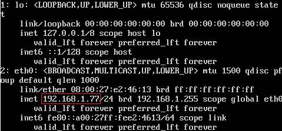
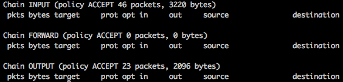

Title: Introductie tot Linux - Deel 2
Date: 2016-04-07 18:00
Category: Basis
Tags: basis, linux, ubuntu
Slug: introductie-tot-linux-deel-2
Authors: Sling
Summary: Het tweede deel uit een drie-delige serie die je de basis van het werken met de Linux commandline uitlegt, zodat je over voldoende basiskennis beschikt om de andere tutorials te kunnen volgen.

Welkom terug bij de Introductie tot Linux! Als het goed is heb je net deel 1 afgerond en heb je bij het nakijken van de opdrachten gemerkt dat je het snapt. Als dat nog niet zo was, dan adviseer ik je om nog een keertje door deel 1 te lopen en wat te experimenteren met de commando’s, want we gaan er vanaf nu vanuit dat je bekend bent met al die commando’s en termen.

Je begint je nu waarschijnlijk iets comfortabeler te voelen met Linux, je weet hoe je kan navigeren door het bestandssysteem, hoe je werkt met bestanden en teksteditors, wat gebruikers en groepen zijn, en nog wat kleine tips en trucs. De terminal is een stuk minder eng geworden en misschien inderdaad wel handiger dan een interface met knopjes om in rond te klikken, toch?

We gaan in deze tutorial dieper duiken in Linux en leren hoe we ons systeem kunnen onderhouden, zodat we hier nog jarenlang plezier van kunnen hebben. Het is belangrijk dat je dingen zoals beveiliging, updates, netwerkconfiguratie, handleidingen opzoeken en het op afstand inloggen op je systeem goed onder de knie krijgt.

---

# Voordat we verder gaan: Inloggen via SSH

Zoals je waarschijnlijk gemerkt hebt is het werken in de VirtualBox console niet heel erg prettig. Je kan niet zomaar wisselen tussen dit venster en andere programma’s, kopieren en plakken van tekst is niet praktisch en scrollen door het venster is ook al niet mogelijk. We gaan hier dus eerst een beter alternatief voor gebruiken!

Dé manier om op afstand (dat wil zeggen, via een netwerk) in te loggen op een Linux computer is door middel van het SSH-protocol. Hoe dit protocol werkt gaat iets te diep om in deze tutorial uit te leggen, maar het is de meest gebruikte en een hele veilige manier om over een netwerk zoals je lokale LAN of het wereldwijde Internet in te loggen op je Linux computer.


Voordat we hier mee beginnen moeten we een aanpassing doen op onze virtuele machine. Standaard zit je VM namelijk niet in hetzelfde netwerk als de computer waar je nu op werkt, maar in een intern netwerk van VirtualBox. Hierdoor zullen we niet eenvoudig een netwerkverbinding kunnen opzetten. Om dit aan te passen moeten we in het ‘VirtualBox Manager’ venster naar de ‘Settings’ van onze VM gaan en onder het kopje ‘Network’ kiezen voor ‘Attached to: Bridged Adapter’ in plaats van ‘Attached to: NAT’. Als je meerdere netwerkkaarten hebt in je systeem, dien je vervolgens nog de juiste te kiezen, namelijk degene die je ook op dit moment gebruikt voor je internetverbinding. Klik na het aanpassen op ‘Ok’ en herstart de VM.

Om nu gebruik te maken van SSH hebben we nog twee stukken software nodig: een SSH-client om verbinding te kunnen maken vanaf ons eigen systeem, en een SSH-server die draait op ons nieuwe Linux systeem zodat verbindingsverzoeken van onze SSH-client kunnen worden afgehandeld.

Het installeren van de SSH-server gaat met het volgende commando: `sudo apt install openssh-server`. Wat apt precies doet leren we in een later hoofdstuk van deze tutorial, dit commando zal het openssh-server pakket downloaden en installeren op ons systeem. Ubuntu zal na het installeren meteen deze SSH-server service opstarten, en er ook voor zorgen dat deze telkens bij het opstarten van het Linux systeem ook wordt gestart, hier hebben we dus verder geen omkijken meer naar.

Om een netwerkverbinding te maken tussen een client en een server zullen we de client moeten vertellen welke hostname of IP-adres de server heeft. We zullen in dit geval het IP-adres van de server moeten invullen in onze SSH-client. Je kunt het commando `ip addr` uitvoeren op je Ubuntu systeem om dit IP-adres op te zoeken:



Vergelijk jouw uitvoer met de afbeelding en zoek zo het IP-adres op, wat in het voorbeeld door een rood kadertje is aangegeven. Het adres zal waarschijnlijk beginnen met `10.iets`, `172.(16 t/m 31).iets` of `192.168.iets`, dit zijn zogenaamde lokale IPv4-adressen en zijn alleen te bereiken op je interne netwerk. Schrijf dit IP-adres ergens op zodat je dit later nog kan gebruiken.

De laatste stap die we nu nog moeten uitvoeren is het installeren van een SSH-client. Hoe we dat doen hangt af van welk besturingssysteem je op je huidige computer draait.

Voor Windows kun je het beste ‘Putty’ gebruiken, dit is hier te downloaden, door in het kopje ‘Package files’ op de juiste .msi file te klikken, 32-bit of 64-bit. Na het opstarten van Putty hoef je alleen maar bij ‘Host Name’ het IP-adres in te vullen wat je VM heeft gekregen en kun je op ‘Open’ klikken onderaan. Hierna zul je op een loginprompt uitkomen waar je de gebruikersnaam en wachtwoord kan opgeven.

Als je Linux of OS X draait, dan kun je de ingebouwde terminal gebruiken door het commando `ssh sling@192.168.1.77` in te voeren. Pas natuurlijk wel even het IP-adres aan naar het adres wat jouw VM heeft gekregen, en de gebruikersnaam naar de gebruiker die je tijdens de installatie had opgegeven. De eerste keer kun je een waarschuwing krijgen waarin een fingerprint wordt getoond. Type hier `yes` om door te gaan, een volgende keer zul je deze waarschuwing niet meer krijgen.

Nu zijn we via SSH ingelogd op ons Linux systeem, en kun je het VirtualBox venster dus minimaliseren, deze hebben we niet meer nodig. Voer nu eens een commando zoals `find /` in en scroll door de uitvoer. Handig toch? Als je dit commando te lang vindt duren kun je het trouwens afbreken met de toetscombinatie Ctrl + C.

# Beveiliging

Wat gebruikers en groepen zijn is inmiddels bekend, we weten dat normale gebruikers minder rechten hebben dan de root gebruiker, en dat gebruikers die in de ‘sudo’ groep zitten het commando `sudo` kunnen gebruiken om tijdelijk meer rechten te krijgen. Maar wat zijn die rechten nou eigenlijk en hoe kun je ze gebruiken om je systeem beter te beveiligen?


## Bestandspermissies bekijken

Allereerst zullen we eens kijken naar rechten op ons bestandssysteem, ook wel permissies genoemd. Deze permissies bepalen welke gebruikers en groepen bestanden of mappen mogen openen en/of bewerken. Neem bijvoorbeeld de map `/root` die we als normale gebruiker niet mochten openen, of het bestand `/etc/passwd` wat we wel mochten lezen maar niet mochten bewerken. Welke rechten er actief zijn voor een bepaalde map of bestand, kunnen we zien als we de optie `-l` (dat is de kleine letter L) meegeven aan het commando `ls`. Deze optie staat voor ‘long’ en als je dit uitprobeert in de /-directory kun je zien waarom. Je ziet dan bijvoorbeeld dit:


We zien duidelijk een stuk meer informatie dan zonder deze optie. De laatste kolom komt je als het goed is bekend voor, want dat zijn de stukjes tekst die ziet als je de optie `-l` niet gebruikt. Laten we de laatste regel in de bovenstaande lijst eens ontleden:


Dit voorbeeld gaat om de map `var`. We weten dat het om een map gaat omdat de regel begint met een `d` (directory), bestanden zouden op deze plek een `-` teken hebben staan. Vervolgens staat helemaal op het einde van de regel de naam, in dit geval `var`. Hiertussen staan nog enkele andere stukken informatie, die in de afbeelding toegelicht zijn. Omdat het een systeemmap is, is de eigenaar en groep van de map de `root` gebruiker. De datum waarop deze map voor het laatste gewijzigd is, zal waarschijnlijk dezelfde datum zijn waarop dit systeem is geïnstalleerd, omdat deze map door Linux zelf gebruikt wordt voor diverse zaken zoals we in de vorige tutorial gezien hebben. De grootte van een bestand of map wordt in bytes weergegeven. Je zou denken dat de grootte die hier te zien is de totale grootte van de map is, inclusief de bestanden die er in zitten, maar dat is niet het geval. Dit is namelijk de grootte van de map zonder inhoud, wat in Linux altijd 4096 bytes is. Waarom dat zo is hoeven we nu niet te weten. Voor de oplettende lezer: de ’12’ die naast de eigenaar staat valt ook buiten de stof van deze tutorial.

Het belangrijkste stukje uit deze regel wat we voor dit hoofdstuk moeten begrijpen is het eerste stuk: de permissies. De eerste letter, in dit geval een `d`, laat zien of het een directory of bestand is, de overige letters geven aan welke permissies er actief zijn. Deze zijn op te splitsen in 3 delen van elk 3 tekens:


Het eerste deel geeft aan welke rechten de eigenaar van deze map heeft, het tweede deel bepaalt de rechten van de groep die aan deze map gekoppeld is, het laatste deel bepaalt ten slotte de rechten die alle andere gebruikers op dit systeem hebben.

Elk blokje kan een combinatie van de volgende 3 permissies hebben:

- `r`: Read (Lezen)
- `w`: Write (Schrijven)
- `x`: eXecute (Uitvoeren)

Als er een bepaalde permissie niet actief is, zal er op die plek een `-` teken staan. In het voorbeeld heeft de eigenaar lees + schrijf + uitvoerrechten, en hebben de groep en alle andere gebruikers op het systeem lees + uitvoerrechten.

Wat lees en schrijfrechten zijn spreekt voor zich, maar uitvoeren is bijzonder. Voor bestanden betekent dit namelijk dat ze als programma uitgevoerd kunnen worden, maar voor mappen betekent dit dat de map geopend mag worden met het commando `cd`. Stel dat een gebruiker wel leesrechten heeft op een map maar geen uitvoerrechten, dan mag hij de map wel zien staan (lezen) maar niet openen (uitvoeren).

Stel dat je nu wil weten of een bepaalde groep of gebruiker het bestand `/usr/lib/x86_64-linux-gnu/plymouth/renderers/drm.so` kan lezen, dan zal deze gebruiker execute rechten moeten hebben op al deze mappen (anders kan hij ze niet in) en tenslotte moet hij leesrechten hebben op het bestand zelf. Als je alleen maar `ls -l` uitvoert op dit bestand dan zie je de rechten voor het bestand zelf, maar niet voor alle mappen waar de gebruiker doorheen zal moeten navigeren.

Al deze mappen kun je met de hand gaan controleren met `ls -l /`, `ls -l /usr`, `ls -l /usr/lib`, `ls -l /usr/lib/x86_64-linux-gnu`, etc. etc. Maar dit kan gelukkig ook een stuk efficiënter met het commando `namei`. Met de opties `-mo` laat dit commando voor elk deel van een pad, dus mappen en het bestand zelf, de informatie zien die we nodig hebben. Dit zien we na het uitvoeren van `namei -mo /usr/lib/x86_64-linux-gnu/plymouth/renderers/drm.so`:


Zo kunnen we met 1 eenvoudig commando meteen de permissies, eigenaar en groep van een bestand of map zien, handig!

<div class="opdracht">
  <p>Opdracht 1</p>
  <div class="subopdracht">Voer het commando <code>ls -al</code> eens uit in je homedirectory, en probeer voor elke regel uit te leggen of het een bestand of map is, en welke rechten er op actief zijn. De optie <code>-a</code> hebben we trouwens nog niet eerder gezien, deze gebruik je om verborgen bestanden en mappen op linux te tonen. Verborgen bestanden en mappen hebben een naam die begint met een punt.</div>
  <div class="subopdracht">Gebruik het <code>namei</code> commando om in 1 keer te zien welke rechten, en eigenaar er horen bij het bestand <code>/etc/shadow</code> en de mappen waarin het zit. Leg uit wat elke regel van de uitvoer betekent.</div>
  <div class="subopdracht">Gebruik nogmaals het commando <code>namei</code> met dezelfde opties, maar kijk nu naar het bestand <code>/root/.bashrc</code>. Als het niet lukt, probeer te verklaren waarom en gebruik een extra commando om toch de rechten te zien.</div>
</div>

## Bestandspermissies aanpassen

Om deze permissies aan te kunnen passen gebruiken we de volgende commando’s:

Commando                   | Uitleg
-------------------------- | --------------------------
`chmod u+rwx /tmp/bestand` <br /> `chmod g-rw /tmp/bestand` <br /> `chmod go+x /tmp/bestand` | Pas de bestandspermissies aan. Het eerste argument geeft drie dingen aan: welke permissies we willen aanpassen (u = user, g = group en/of o = other), of we rechten willen weghalen of toevoegen (- of +) en welke rechten we willen aanpassen (r, w en/of x). Het tweede argument is het bestand of de map die we willen aanpassen.
`chown user /tmp/bestand` <br /> `chown root:users /tmp/bestand` | Pas het eigendom van een bestand aan. Je kan zowel alleen de gebruiker, als de gebruiker en de groep tegelijkertijd aanpassen. Gebruiker en groep worden dan gescheiden door een `:` teken.
`chgrp users /tmp/bestand` | Pas alleen de groep van een map of bestand aan, zonder de eigenaar aan te passen.

Tip: Als je meerdere bestanden tegelijk wil aanpassen kun je `*` gebruiken in de bestandsnaam en als je ook bestanden in submappen wil veranderen gebruik je de optie `-R`. Dus bijvoorbeeld: `chmod -R o-rwx ~` om alle bestanden en mappen in je eigen home-directory onbeschikbaar te maken voor andere gebruikers op het systeem, en `chmod u+x /tmp/*.sh` om alle bestanden in de map `/tmp` die eindigen op `.sh` uitvoerbaar te maken voor de eigenaar van de bestanden.

Er is ook nog een kortere en efficiëntere manier dan zoiets als `rwxr-x---` om aan te geven wat voor rechten een bestand of map heeft, en dat gebeurt met een numerieke waarde tussen de 000 en 777 die we aan `chmod` kunnen meegeven als eerste argument. Hiervoor moeten we elke permissie een waarde geven:

- Read = 4
- Write = 2
- Execute = 1

Als je rechten combineert tel je simpelweg deze waarden bij elkaar op:

- Read + Write = 4 + 2 = 6
- Read + Execute = 4 + 1 = 5
- Write + Execute = 1 + 2 = 3
- Read + Write + Execute = 1 + 2 + 4 = 7

En zo hebben we voor elke mogelijke situatie een getal tussen de 1 en de 7. Net als bij de andere notatie zet je de gebruiker, groep en other rechten achter elkaar neer waardoor je een drie-cijferig getal krijgt. Als er op een plek geen rechten zijn, wordt het getal 0 gebruikt.

Bestanden die alleen door de eigenaar gelezen en geschreven mogen worden, en waar verder geen andere rechten op zitten, hebben op deze manier de permissies ‘600’. Bestanden waar iedereen alles mee mag uitvoeren, hebben ‘777’ als permissies.

**Noot**: Behalve deze ‘simpele’ permissies zijn er ook nog extra permissies in te stellen, als je bijvoorbeeld meerdere groepen verschillende rechten wil geven op een bestand of map. Dit wordt gedaan met Access Control Lists ofwel ACL’s. Omdat dit maar weinig wordt gebruikt in de praktijk gaan we daar hier verder niet op in. Naast ACL’s kun je rechten op een systeem nog gedetailleerder instellen door systemen zoals selinux en apparmor, waarmee de beveiliging van een systeem flink wordt aangescherpt. Over deze onderwerpen volgen losstaande tutorials omdat ze zo uitgebreid (en complex) zijn.

<div class="opdracht">
  <p>Opdracht 2</p>
  <div class="subopdracht"><p>Voer de volgende instructies stap voor stap uit en let op dat je voor sommige commando’s root-rechten nodig hebt:</p>
    <ul>
      <li>Maak in de <code>/</code> directory een nieuwe map met de naam <code>hackers-hut</code>.</li>
      <li>Maak de groep <code>hackers</code> eigenaar van deze map en zorg ervoor dat gebruikers in deze groep de map mogen lezen, schrijven en uitvoeren.</li>
      <li>Pas de rechten aan zodat andere gebruikers op het systeem de map <code>hackers-hut</code> niet in kunnen.</li>
      <li>Controleer dit door als je eigen gebruikersaccount de map te openen.</li>
      <li>Voeg nu je eigen gebruiker toe aan de groep <code>hackers</code> en kijk of je inderdaad nu wel toegang krijgt. Dit zal niet direct lukken, omdat je lidmaatschap van de <code>hackers</code> groep pas actief is na opnieuw te hebben ingelogd op het systeem.</li>
    </ul>
  </div>
  <div class="subopdracht">
  	<p>Zet de volgende permissies om naar de numerieke waarde. De eerste regel is alvast ingevuld als voorbeeld:</p>
    <table>
      <tr><td><code>rwxr-xr-x</code></td><td>755</td></tr>
      <tr><td><code>rwx------</code></td><td></td></tr>
      <tr><td><code>---rwxrw-</code></td><td></td></tr>
      <tr><td><code>r--r--r--</code></td><td></td></tr>
      <tr><td><code>rwxrwxrwx</code></td><td></td></tr>
      <tr><td><code>rw----r--</code></td><td></td></tr>
      <tr><td><code>-wx--xr--</code></td><td></td></tr>
      <tr><td><code>---------</code></td><td></td></tr>
    </table>
  </div>
  <div class="subopdracht">
  	<p>Zet de volgende numerieke permissies om naar de tekstuele weergave. Ook hier is weer 1 regel voorgedaan:</p>
    <table>
      <tr><td>755</td><td><code>rwxr-xr-x</code></td></tr>
      <tr><td>500</td><td></td></tr>
      <tr><td>644</td><td></td></tr>
      <tr><td>775</td><td></td></tr>
      <tr><td>005</td><td></td></tr>
      <tr><td>040</td><td></td></tr>
      <tr><td>123</td><td></td></tr>
      <tr><td>762</td><td></td></tr>
    </table>
  </div>
</div>

## Meer over sudo

Voordat we het hoofdstuk over permissies afsluiten is het nog nuttig om iets meer te weten over `sudo`. In deel 1 van deze tutorial hebben we al gelezen dat er een speciale groep is van gebruikers die sudo mogen gebruiken. Deze groep heet ‘sudo’, en de gebruiker die je tijdens de installatie van Ubuntu hebt aangemaakt wordt automatisch lid gemaakt van deze groep, omdat je anders je eigen systeem niet zou kunnen beheren. Het nadeel van deze groep is wel, dat je alle rechten op het hele systeem hebt wanneer je er lid van bent.


Stel dat je in een project aan het werken bent en verantwoordelijk bent voor de linuxserver die gebruikt wordt. Er komt een programmeur bij je project werken en die vraagt je elke dag 20 keer om de applicatie die je aan het maken bent te herstarten zodat zijn nieuwe code getest kan worden. Deze applicatie mag niet door normale gebruikers worden herstart, maar alleen door de ‘root’ gebruiker. Je voegt de gebruiker toe aan de ‘sudo’ groep en je hebt nergens meer last van. Helaas heeft je programmeur niet zoveel verstand van linux, maar nu wel volledige rechten op je systeem, en de volgende dag heeft hij per ongeluk het hele systeem om zeep geholpen.

In deze situatie zou je graag willen dat een gebruiker 1 specifiek commando met root-rechten kan uitvoeren, maar voor de rest geen extra rechten krijgt. Dit kan ook met sudo, door deze rechten vast te leggen in het configuratiebestand `/etc/sudoers`. Let goed op, want als je dit bestand verkeerd opslaat, dan kan het zijn dat je zelf geen sudo rechten meer hebt, waardoor je dit bestand ook niet meer kunt repareren. Daarom is er een speciale teksteditor die je zou moeten gebruiken om hier aanpassingen in te doen: `visudo`. Deze editor weet hoe dit bestand er uit zou moeten zien, en zal bij typefouten weigeren om het bestand op te slaan. Standaard is dit gebaseerd op ‘nano’ wat we al eerder gezien hebben, dus de interface zal je bekend voorkomen.

Om een gebruiker 1 specifiek commando te kunnen laten uitvoeren, plaats je onderaan dit bestand een regel zoals:

`pietje ALL=(ALL) NOPASSWD /usr/sbin/service onze-applicatie restart`

Vervolgens kan de gebruiker ‘pietje’ het bovenstaande commando als ‘root’ uitvoeren, als hij er ‘sudo’ voor zet.

**Let op**: Ik adviseer je echter om met minimale kennis van Linux hier nog niet teveel mee te doen. Je kan namelijk heel snel beveiligingslekken maken door verkeerde beslissingen te nemen. Als je bijvoorbeeld de teksteditor ‘vim’ als extra commando aan een gebruiker geeft via sudo, dan geef je die gebruiker effectief ook volledige rechten op het systeem. Dit komt omdat je in ‘vim’ ook een shell kan opstarten, een feature die niet bij iedereen bekend is.

---

# Software installeren en updaten

Na de installatie van Ubuntu is er al een hoop software beschikbaar op je systeem. Tot nu toe hebben we alle commando’s kunnen uitvoeren zonder iets te hoeven installeren. Maar als we straks bepaalde tools willen gebruiken die nog niet standaard aanwezig zijn, zullen we deze zelf moeten installeren.

Software wordt op 2 manieren verspreid, als ‘pakket’ wat je kant-en-klaar kunt installeren, en als broncode. Dit laatste komt op Windows vrijwel niet voor omdat windows-gebruikers doorgaans geen tools hebben geïnstalleerd om deze broncode om te zetten naar een bruikbaar bestand, maar op Linux komt dit regelmatig voor. Het is wel iets ingewikkelder en foutgevoeliger om dit te installeren dus bij voorkeur maken we gebruik van pakketten.


## Ubuntu Repositories

Gelukkig is vrijwel alle software die je nodig gaat hebben als pakket beschikbaar. Nu vraag je je waarschijnlijk wel af, "Waar vind ik deze pakketten?". Het antwoord hierop zijn zogenaamde _repositories_. Dit zijn collecties van pakketten die jouw Linuxdistributie, in ons geval Ubuntu, voor de gebruikers klaar heeft staan en die getest zijn zodat ze werken op jouw versie van Linux. Ook worden updates van deze pakketten hierin bijgehouden, zodat het eenvoudig is om je systeem up to date te houden. Het installeren, verwijderen, kortom het beheren van de pakketten op je systeem wordt package management genoemd.

Veel Linuxdistributies hebben hun eigen manier van package management. Ubuntu gebruikt hiervoor het Aptitude package management system ofwel _apt_. De volgende apt commando’s zullen we gaan gebruiken:

Commando             | Uitleg
-------------------- | --------------------
`apt install nmap`   | Installeer het pakket `nmap`.
`apt remove nmap`    | Verwijder het pakket `nmap`.
`apt update`         | Haal de nieuwe lijst van pakketten op zodat we weten of er updates beschikbaar zijn.
`apt upgrade`        | Installeer alle updates die beschikbaar zijn, behalve updates voor de kernel.
`apt dist-upgrade`   | Installeer alle updates die beschikbaar zijn, inclusief de kernel. Na het updaten van de kernel is een herstart van het systeem nodig.
`apt autoremove`     | Verwijder alle packages die niet meer nodig zijn op het systeem. Bijvoorbeeld oude versies van onderdelen van Linux, of onderdelen van al-verwijderde software.
`apt search scanner` | Zoek in de repositories naar pakketten die iets met `scanner` te maken hebben. Erg handig voor als je niet meer precies weet hoe een pakket heet

De meeste van deze commando’s zul je met `sudo` moeten uitvoeren omdat je als normale gebruiker niet zomaar software mag installeren op het systeem.

**Noot**: je kunt in plaats van bovenstaande commando’s ook wel eens het commando `aptitude` gebruikt zien worden. Dit werkt ongeveer hetzelfde maar toch zijn er een aantal verschillen. Ik raad je aan om voor nu alleen `apt` te gebruiken zodat je geen onverwachte resultaten krijgt.

Het voordeel van een package manager is ook dat eventuele afhankelijkheden meteen worden geïnstalleerd. Zo is het pakket nmap afhankelijk van nog een aantal andere pakketten voordat je het kunt gebruiken, dit heten _dependencies_. Al deze informatie heeft Ubuntu al voor ons uitgezocht dus hier hoeven we zelf niet meer aan te denken. Als we vervolgens nmap verwijderen dan laat de package manager ons ook weten dat de extra pakketten die we hiervoor hadden geïnstalleerd hadden niet meer nodig zijn. Erg handig dus!

Net zoals andere besturingssystemen geregeld een nieuwe versie uitbrengen werkt Ubuntu ook met versies, deze worden elk half jaar uitgebracht. De versie, ook wel _release_ genoemd, die we nu gebruiken heet Ubuntu Server 16.04 LTS. De 16 staat voor het jaar waarin het uitgekomen is, 2016, de 04 staat voor de maand april. De afkorting LTS staat voor _Long Term Support_, wat betekent dat dit een speciale versie van Ubuntu is die voor langere tijd ondersteund zal worden. Bij Ubuntu is deze ondersteuning op dit moment maar liefst 5 jaar! Er zullen dus nog tot april 2021 updates worden uitgebracht voor deze versie van Ubuntu, waardoor je dit systeem voorlopig niet hoeft te upgraden naar een hogere versie. Voor normale versies, zoals de versies 15.04 en 15.10 is er maar 1 jaar ondersteuning.

Wanneer je toch wil upgraden naar een hogere versie, bijvoorbeeld als de volgende LTS release is uitgekomen, dan kun je dit niet met `apt` doen, maar met het speciaal hiervoor bedoelde commando `do-release-upgrade`. Als je dit uitvoert zie je of er een nieuwe release beschikbaar is en of je een upgrade wil starten. Als je zoals nu een LTS-release gebruikt zal hij alleen nieuwe LTS-releases als upgrades zien, en de normale releases negeren.

<div class="opdracht">
  <p>Opdracht 3</p>
  <div class="subopdracht">Sinds de installatie van ons systeem loopt de informatie die Ubuntu heeft over de nieuwe pakketten weer een stuk achter. Geef het commando om de lijsten met pakketen te vernieuwen.</div>
  <div class="subopdracht">Geef het commando om deze updates te installeren. Onze kernel-versie willen we op dit moment nog hetzelfde laten. Hoeveel updates staan er klaar? Hoeveel schijfruimte kost dit of gaat dit besparen? Kijk na het installeren nog eens of er nog updates te installeren zijn.</div>
  <div class="subopdracht">Ter ontspanning willen we graag het spel Space Invaders spelen, en dan wel de speciale _ncurses_ versie. Zoek op hoe dit pakket heet.</div>
  <div class="subopdracht">Installeer het space invaders spel en probeer het uit. Als je bekomen bent van al het grafische spektakel kun je het spel afsluiten en weer verwijderen.</div>
  <div class="subopdracht">Laten we nu ook onze kernel updaten. Geef hiervoor het juiste commando op. Bekijk de huidige kernelversie met het commando `uname -r`, herstart de virtuele machine, en voer dit commando nogmaals uit om te kijken of het versienummer nu verhoogd is.</div>
  <div class="subopdracht">Kijk of er na het installeren van al deze updates pakketten zijn die niet meer nodig zijn en dus verwijderd kunnen worden.</div>
</div>

## Extra repositories gebruiken

Welke repositories Ubuntu gebruikt staat ingesteld in het configuratiebestand `/etc/apt/sources.list`, hier staan na de installatie alleen de officiële repositories van Ubuntu in. Niet iedereen kan daar zomaar pakketten aan toevoegen, dus het komt regelmatig voor dat een nieuw of weinig gebruikt pakket niet gevonden kan worden als je dit probeert te installeren met `apt install`.

Vaak stellen de auteurs van die software wel een eigen repository beschikbaar die je kan toevoegen aan je apt configuratie, zodat je toch gewoon met `apt` het pakket kan installeren. Het voordeel daarvan is dat je bij het installeren van updates op je systeem ook de updates voor deze extra repositories binnenhaalt. Zo’n niet-officiële repository wordt een PPA genoemd, wat staat voor _Personal Package Archive_. Een PPA voeg je toe met het volgende commando: `add-apt-repository ppa:gebruiker/ppa-naam`, welke gebruiker en ppa-naam je moet opgeven wordt vaak vermeld op de website van het pakket wat je wil installeren. Soms zijn er nog extra acties nodig, zoals het toevoegen van keys met `apt-key add`, maar ook dat zul je op de website van een pakket terugvinden.

Let op dat je na het toevoegen van zo’n PPA altijd even `apt update` moet uitvoeren zodat je de lijst van pakketten in deze nieuwe repository toevoegt aan je systeem.

## Losse pakketten installeren

Als je een pakket wil installeren wat echt niet in een repository zit, dan zit er niks anders op dan het losse pakket te downloaden en te installeren buiten de package manager om. Deze pakketten hebben meestal een bestandsnaam die eindigt op `.deb` en zijn los te downloaden van een website. Let op dat je zelf zal moeten controleren of er updates voor dit pakket zijn, en dat je dependencies ook zelf zal moeten installeren en bijhouden. Vanwege dit handwerk raad ik je aan om het installeren van losse pakketten zoveel mogelijk te vermijden.


Voor het werken met deze bestanden gebruik je het commando `dpkg`. Dit is eigenlijk ook het commando wat de apt package manager onder de motorkap gebruikt, we kunnen dit hierdoor ook nog voor een aantal andere handige dingen gebruiken.

Commando                                | Uitleg
--------------------------------------- | ---------------------------------------
`wget http://example.com/mijn-tool.deb` | Download het bestand `mijn-tool.deb`. Dit commando kun je ook voor andere downloads gebruiken waarvan je de URL weet, je hebt hiervoor geen browser nodig!
`dpkg -i mijn-tool.deb`                 | Installeer het pakket-bestand `mijn-tool.deb`.
`dpkg -r mijn-tool`                     | Maak de installatie van het pakket `mijn-tool` ongedaan. Let op dat je hierbij niet de bestandsnaam hoeft op te geven, maar alleen de naam van het pakket.
`dpkg -l`                               | Geef een lijst van alle geïnstalleerde pakketten op het systeem, inclusief pakketten die via je package manager zijn geïnstalleerd.
`dpkg -L nmap`                          | Bekijk een lijst van alle bestanden die bij het pakket `nmap` horen.
`dpkg -S /etc/host.conf`                | Zoek op bij welk pakket het bestand `/etc/host.conf` hoort.

Let op: Gebruik nooit `dpkg -r` om pakketten te verwijderen die je met je package manager hebt geïnstalleerd. Dit kan er namelijk voor zorgen dat andere pakketten die je verwijderde pakket nodig hadden niet meer goed werken, wat mogelijk je hele systeem onbruikbaar of instabiel maakt!

<div class="opdracht">
  <p>Opdracht 4</p>
  <div class="subopdracht">Kijk eens in het bestand <code>/etc/apt/sources.list</code> om te kijken welke repositories er nu actief zijn. De regels die met een # beginnen zijn commentaar en tellen dus niet mee. Hoe kon je dit ook alweer makkelijk met 1 commando zien?</div>
  <div class="subopdracht">Download het bestand <code>https://hackenkunjeleren.nl/files/cowsay.deb</code> en installeer dit pakket. Probeer hierna het commando <code>cowsay Hello World!</code> uit.</div>
  <div class="subopdracht"></div>
</div>

## Installeren van broncode

Het kan ten slotte ook nog voorkomen dat de maker van een stuk software geen deb-bestand beschikbaar heeft gemaakt en dat je alleen een bestand kunt downloaden waarin de broncode van het programma staat. Meestal gaat het om een gecomprimeerd bestand, zoals een `.zip`-bestand. Dit bestand zullen we moeten downloaden, uitpakken en omzetten (compileren) naar een bruikbaar programma.


We hebben in deze tutorials nog niet eerder gesproken over het uitpakken van gecomprimeerde bestanden, dus laten we even in het kort bekijken hoe dit op Ubuntu werkt. Ten eerste is het goed om te weten dat er verschillende manieren zijn waarop compressie gedaan kan worden, die resulteren in verschillende soorten bestanden. Zo zul je de volgende extensies tegenkomen als je ingepakte bestanden download: `.tar .gz .tar.gz .zip .bz2 .tar.bz2` en misschien nog wel anderen. Elke extensie betekent dat het bestand op een andere manier is ingepakt, en dus ook op een andere manier uitgepakt moet worden.

Gelukkig zijn er tools die ons hierbij kunnen helpen en die automatisch herkennen wat voor soort bestand het is, en het zonder verdere hulp kunnen uitpakken. Een voorbeeld van zo’n tool is `unar`. Dit is standaard nog niet aanwezig op Ubuntu, maar het pakket zit wel in de Ubuntu repositories zodat we het kunnen installeren met `apt install unar`. Om daarna bestanden er mee uit te pakken geven we simpelweg dit commando op, gevolgd door de bestandsnaam van het ingepakte bestand, bijvoorbeeld: `unar pakket.tar.gz`.

Kijk vervolgens of er een map bij is gekomen, en bekijk wat er in deze map staat. Doorgaans vind je een bestand wat `README` of `INSTALL` heet, dit kun je openen in een teksteditor en vervolgens staat daar precies uitgelegd wat je moet doen om het programma te compileren en installeren. Vaak is het compileren niet meer dan het uitvoeren van de commando’s `./configure` en vervolgens `make`. Als het geinstalleerde programma nu ook nog beschikbaar moet zijn voor andere gebruikers op het systeem dan is `make install` ook nodig, hiervoor zijn wel root-rechten benodigd.

Dit is niet altijd triviaal, soms moet je ook nog zelf andere pakketten installeren of zaken aanpassen op het systeem. Als je niet meer precies weet wat je aan het doen bent, is het verstandig om een alternatief te zoeken voor het pakket wat je wilde installeren. Daarnaast raad ik je ook aan om bij de installatie van dergelijke pakketten in je Ubuntu VM even een snapshot te maken zodat je snel terug kan naar een werkende staat van je systeem als er iets mis gaat.

<div class="opdracht">
  <p>Opdracht 5</p>
  <div class="subopdracht">Pacman is natuurlijk een klassieker die we wel eens willen spelen. Helaas is de versie die we willen niet als Ubuntu pakket beschikbaar, maar als ingepakt bestand met broncode. Deze is hier te downloaden: `https://hackenkunjeleren.nl/files/pacman.tar.gz`. Download dit bestand in je virtuele machine, en pak het uit. Ga vervolgens de map in die bij het uitpakken is aangemaakt.</div>
  <div class="subopdracht">Om pacman te kunnen compileren hebben we eerst extra pakketten nodig, en alle afhankelijkheden die hierbij horen. Ook missen we nog het `make` commando. Installeer de pakketten `groff`, `libncurses5-dev`, `build-essential` en `make`.</div>
  <div class="subopdracht">We kunnen nu het spel compileren met de commando’s: `./configure` en `make`. Dit kan even duren, en er kunnen waarschuwingen op het scherm te zien zijn, maar dit is niets om ons druk over te maken.</div>
  <div class="subopdracht">In de huidige map zou na het compileren een uitvoerbaar bestand bijgekomen moeten zijn, het pacman programma. Voer dit uit om het spel te spelen!</div>
</div>

---

# Netwerkbeheer

We hebben het onderwerp netwerken al eerder gezien in deze tutorial toen we het IP-adres opzochten om een SSH-verbinding te kunnen maken naar onze server. Natuurlijk willen we nog enkele andere taken kunnen uitvoeren met betrekking tot de netwerkverbinding van de server, die we in dit hoofdstuk zullen behandelen. Als bepaalde termen je helemaal niets zeggen, lees er voor nu dan even overheen. Je kunt zodra je begint aan de tutorial ‘Introductie tot Netwerken’ waar we al deze (en meer) concepten verder zullen bekijken, altijd nog terugvallen op dit hoofdstuk voor de specifieke commando’s en bestandslocaties.


Bij het aanpassen van de netwerkconfiguratie of firewall kan het gebeuren dat je jezelf buitensluit van het systeem. Als je via SSH inlogt op je server ben je immers via de netwerkverbinding commando’s aan het sturen en als dit ineens afgebroken wordt kun je het niet meer repareren via diezelfde SSH-verbinding. In het geval van een virtuele machine kun je de server nog bereiken via de lokale console, bij een fysieke server zul je deze op een andere manier moeten benaderen. Hou dit in je achterhoofd als je wil gaan experimenteren met deze instellingen.

## IP-adressen

Er zijn twee belangrijke zaken die we in Ubuntu nodig hebben om netwerkconfiguratie te doen, het commando ip en het bestand /etc/network/interfaces. Het commando ip is de opvolger van oa. ifconfig en wordt aangeroepen in combinatie met het object waar je iets mee wil gaan doen. Bijvoorbeeld ip addr om iets met IP-adressen te doen, en ip route om acties op netwerkroutes uit te voeren. De acties die je met dit commando uitvoert zijn meteen actief, maar worden nog niet in een configuratie vastgelegd en zijn dus weer verloren na een reboot. Om deze permanent vast te leggen zodat ze het ook na herstarten van je server nog steeds doen, zul je ze moeten overnemen in bovengenoemd configuratiebestand. We laten verderop in dit hoofdstuk zien hoe dit bestand er uit kan zien.

Hieronder staat een lijst van basis-acties die je nodig zou kunnen hebben om de netwerkconfiguratie van je server te beheren:

Commando                       | Uitleg
------------------------------ | ------------------------------
`ip addr`                      | Zonder verdere argumenten laat dit commando de huidige status en netwerkconfiguratie zien. Hier zie je alle netwerkinterfaces op het systeem, hun naam, MAC-adres, status, MTU, MAC-adressen, IP-adressen en nog veel meer.
`ip addr show eth0`            | Laat alleen de informatie over de netwerkinterface `eth0` zien.
`ip addr add 1.2.3.4 dev eth0` | Voeg het IP-adres `1.2.3.4` toe aan de netwerkinterface `eth0`. Je kan eventueel ook nog extra argumenten opgeven zoals een broadcast adres en label.
`ip addr del 1.2.3.4 dev eth0` | Verwijder het IP-adres `1.2.3.4` van de netwerkinterface `eth0`.
`ip addr flush eth0`           | Verwijder alle IP-configuratie van de netwerkinterface `eth0`. Dit is handig als je een uitgebreide configuratie hebt op een bepaalde interface en deze tijdelijk even leeg wil maken, zonder elk IP apart te moeten verwijderen.

Twee voorbeelden van hoe het een netwerkinterface er in `/etc/network/interfaces` uit zou kunnen zien:

```
auto eth0
iface eth0 inet dhcp
```

```
auto eth0
iface eth0 inet static
	address 149.200.1.2
	netmask 255.255.255.0
	gateway 149.200.1.1
	dns-nameservers 8.8.8.8 8.8.4.4
```

In het bovenste voorbeeld zie je een interface met de naam `eth0` die ingesteld staat op DHCP, dus die bij het opbrengen van de netwerkverbinding zal vragen om een IP-adres aan een DHCP-server op het netwerk.

Het tweede voorbeeld laat zien hoe je een statische configuratie kan maken, waarbij je zaken zoals het IP-adres, netmask, default gateway en DNS-servers zelf kan instellen.

Het activeren en deactiveren van een netwerkinterface kan met twee daarvoor bedoelde commando’s: `ifup eth0` en `ifdown eth0` (hier met onze interface eth0 als voorbeeld, maar dit kan natuurlijk ook op andere interfaces gebruikt worden als je er meerdere hebt). Let op dat als je via SSH verbonden bent met een systeem en je de netwerkverbinding deactiveert, de SSH-sessie ook verbroken zal worden!

## DNS

Als je gebruik maakt van DHCP dan krijg je doorgaans DNS-servers toegewezen op het moment dat je interface een IP-adres ontvangt. Bij een statische configuratie kun je zelf DNS-servers in je netwerkconfiguratie plaatsen. Uiteindelijk staan de DNS-servers die effectief gebruikt worden door je systeem om hostnames om te zetten naar IP-adressen in het bestand `/etc/resolv.conf`. Dit bestand kan er als volgt uit zien:


```
# Dynamic resolv.conf(5) file for glibc resolver(3) generated by resolvconf(8)
#     DO NOT EDIT THIS FILE BY HAND -- YOUR CHANGES WILL BE OVERWRITTEN
nameserver 192.168.1.1
```

Zoals je ziet aan de waarschuwing kun je dit bestand niet zomaar aanpassen en verwachten dat de veranderingen behouden blijven na bijvoorbeeld een reboot. Er is wel een manier om hier handmatig DNS-servers in te plaatsen, als je bijvoorbeeld geen DNS-servers krijgt van de DHCP server, of als je liever je eigen DNS-server wil kunnen instellen. Hiervoor kunnen instellingen in het bestand `/etc/network/interfaces` geplaatst worden, herkenbaar aan de prefix ‘dns-‘. Een voorbeeld van zo’n instelling is in het voorbeeld hierboven al te zien, namelijk ‘dns-nameservers’, waarmee IP-adressen van te gebruiken DNS-servers kunnen worden opgegeven. Andere opties zijn bijvoorbeeld ‘dns-search’ waarbij 1 of meerdere domeinen kunnen worden opgegeven als zoek-domeinen. Wanneer je ‘dns-search hackenkunjeleren.nl’ instelt en een query voor de hostname ‘www’ doet, zal ook naar ‘www.hackenkunjeleren.nl’ gezocht worden.

Naast het opzoeken van hostnames via DNS moet het systeem zelf natuurlijk ook een hostname hebben. Deze wordt tijdens de installatie opgegeven en vervolgens opgeslagen in het bestand `/etc/hostname` en `/etc/hosts`.

Om eenmalig de hostname van de server te veranderen kan het commando `hostname` gebruikt worden, maar dit is na een reboot niet meer actief. Om permanent deze hostname te veranderen moeten beide eerdergenoemde bestanden worden aangepast, en kan het beste de server herstart worden. Op die manier zullen alle services de nieuwe hostname gebruiken en zullen alle gebruikers in hun shell de nieuwe hostname zien.

## Firewalling

Een belangrijk onderdeel van een Linux server die aan het internet hangt, is een firewall. Met een firewall wordt voorkomen dat onbevoegde hosts van buitenaf een verbinding kunnen leggen met de server, en omgekeerd kan het ook worden ingezet om onbevoegde uitgaande verbindingen richting andere hosts worden tegengehouden. De firewall die standaard aanwezig is op Ubuntu (en vrijwel alle andere distributies) is `iptables`.

Je zal in andere tutorials misschien het programma ‘UFW’ tegenkomen, wat een extra gebruikersvriendelijke laag bovenop iptables is, maar deze zullen we hier niet gebruiken om dezelfde reden dat we geen grafische desktop gebruiken. Door direct met iptables te werken begrijp je namelijk beter hoe de firewall werkt en ben je ook in staat om systemen te beheren waar geen UFW aanwezig is.

Om de huidige iptables-configuratie op te vragen kan het commando `sudo iptables -vL` gebruikt worden. Als het goed is zie je dan deze uitvoer:



Zoals te zien is bij het uitvoeren van dit commando op een verse Ubuntu-installatie, zijn er standaard geen firewallregels actief en wordt al het verkeer geaccepteerd. Dit is te zien aan de ACCEPT policy op de 3 ‘chains’ die iptables standaard kent: INPUT, OUTPUT en FORWARD. Een chain kun je zien als een lopende band waar netwerkverkeer overheen gaat en waar acties op uitgevoerd kunnen worden, de standaardactie wordt bepaald door de ingestelde policy, uitzonderingen hierop worden als losse regels ingesteld.

De INPUT en OUTPUT chains zijn, zoals de namen het al aangeven, de plekken waar inkomend en uitgaand verkeer gefilterd kan worden. De FORWARDING chain laten we voor nu even buiten beschouwing, deze is niet interessant voor een server die niet als router of VPN gebruikt wordt. Er zijn naast deze drie standaard chains nog een aantal extra chains en mogelijkheden om eigen chains te maken, deze zullen we in deze tutorial niet verder behandelen.

Een standaard firewallconfiguratie die uitgaand verkeer toestaat, forwarding blokkeert en het inkomende verkeer beperkt tot verbindingen op poort 22 (voor de SSH-verbinding) ziet er als volgt uit:

```
*filter
:INPUT DROP [0:0]
:FORWARD DROP [0:0]
:OUTPUT ACCEPT [0:0]
-A INPUT -m conntrack --ctstate RELATED,ESTABLISHED -j ACCEPT
-A INPUT -i lo -j ACCEPT
-A INPUT -p tcp --dport 22 -m comment --comment "SSH" -j ACCEPT
COMMIT
```

De eerste en laatste regel kun je voor nu negeren, op regels 2, 3 en 4 worden de standaard chains van een policy voorzien, en op regel 5 geven we aan dat verkeer wat hoort bij een bestaande verbinding toegestaan moet worden. Als we deze regel niet zouden toevoegen, dan zouden we geen enkel pakketje kunnen ontvangen, ook niet als wij bijvoorbeeld een verzoek het internet op sturen en op een antwoord wachten. Op regel 6 zie je dat met de optie `-i` een interface wordt gespecificeerd, in dit geval lo ofwel onze loopback adapter. Voor correct functioneren van diverse onderdelen van Ubuntu moet dit verkeer altijd worden toegestaan. Ten slotte laten we op regel 7 inkomende SSH-verbindingen toe, door pakketjes die binnenkomen op TCP poort 22 te accepteren. Door gebruik te maken van de module ‘comment’ kunnen we met de optie `--comment` zelf een tekst toevoegen aan een regel, wat helpt met de leesbaarheid van je configuratie.

Wanneer je deze configuratie in een tekstbestand opslaat met het commando `iptables-save > /root/firewallconfiguratie`, kun je met 1 simpel commando de configuratie inladen in iptables. Het commando om de configuratie uit een bestand te laden is: `iptables-restore < /root/firewallconfiguratie`. Let op: deze configuratie is direct actief, dus als je een fout in je firewallinstellingen hebt waardoor je bijvoorbeeld je eigen SSH-verbinding blokkeert, dan zul je direct geen verbinding meer hebben!

Je kan ook vanaf de commandline de configuratie wijzigen door het commando `iptables` met de juiste opties aan te roepen. Een aantal voorbeelden:

Commando                                        | Uitleg
----------------------------------------------- | -----------------------------------------------
`iptables -F`                                   | Maak de configuratie leeg
`iptables -P INPUT ACCEPT`                      | Verander de policy van de INPUT chain naar ACCEPT
`iptables -I INPUT -p tcp --dport 80 -j ACCEPT` | Open TCP poort 80
`iptables -I INPUT -s 10.0.0.4 -j ACCEPT`       | Sta al het verkeer toe vanaf ip 10.0.0.4
`iptables -I OUTPUT -d 10.66.0.4 -j DROP`       | Blokkeer al het verkeer naar ip 10.66.0.4
`iptables -vL --line-numbers`                   | Laat een genummerde lijst zien van regels
`iptables -D INPUT 4`                           | Verwijder de 4e rule uit de input chain

Merk op dat de volgorde van het toepassen van regels van boven naar onder is. Als je dus op regel 1 van de INPUT chain een poort openzet, en op regel 2 een specifiek IP blokkeert, dan zal dit geblokkeerde IP nog steeds op de geopende poort je server kunnen benaderen. Plaats daarom IP-blokkades altijd bovenaan je regels, door `iptables -I INPUT` (de I van Insert) te gebruiken. Wanneer je een regel onderaan de INPUT chain wil plaatsen gebruik je `iptables -A INPUT` (de A van Append).

Na het rebooten zal je firewall configuratie niet meer actief zijn, dus deze moeten we permanent maken. Ubuntu heeft hiervoor een handig pakket beschikbaar: `iptables-persistent`, te installeren met `apt install iptables-persistent`. Tijdens de installatie zal worden gevraagd of de huidige configuratie opgeslagen kan worden, zodat deze direct veiliggesteld is. Als je dit op een later moment nogmaals wil doen, gebruik dan `service iptables-persistent save`.

Er zijn nog veel meer dingen mogelijk met iptables, maar dat is stof voor een latere tutorial die specifiek over firewalling op Linux gaat.

## Netwerkinformatie

Er zijn nog een groot aantal andere tools beschikbaar die handig zijn om informatie over de netwerkverbindingen van je Ubuntu server te verkrijgen. Een selectie van deze tools volgt hieronder in een tabel:

Commando             | Uitleg
-------------------- | --------------------
`netstat -paut`      | Bekijk alle openstaande TCP en UDP netwerkverbindingen, zowel poorten waarop een service staat te luisteren als reeds gemaakte verbindingen tussen twee hosts. Toon ook het PID en de programmanaam van het bijbehorende proces.
`lsof -Pi`           | Alternatieve manier om te kijken welke processen er netwerkverbindingen gebruiken. De optie `-P` zorgt ervoor dat poortnummers altijd als getal worden weergegeven, de optie `-i` laat alleen de openstaande netwerksockets zien in plaats van alle open bestanden.
`lsof -i:22`         | Kijk welke processen specifiek poort 22 gebruiken.
`mtr nu.nl`          | Voer een traceroute uit naar het IP achter `nu.nl` en blijf telkens ping pakketten sturen om packetloss te meten per _hop_.
`ethtool eth0`       | Bekijk gedetailleerde informatie over de Ethernet-verbinding op interface eth0, zoals bijvoorbeeld de snelheden die ondersteund worden en de snelheid die op dit moment gebruikt wordt.
`speedtest-cli`      | Voer een speedtest uit. Deze tool moet je eerst installeren met `sudo apt install speedtest-cli`
`dig nu.nl`          | Resolve de hostname `nu.nl` naar het bijbehorende IP-adres, met gebruik van de standaard ingestelde DNS-server(s).
`dig nu.nl @8.8.8.8` | Gebruik in plaats van de standaard DNS-server(s) de specifiek opgegeven DNS-server, 8.8.8.8 (één van Google’s DNS resolvers).

<div class="opdracht">
  <p>Opdracht 6</p>
  <div class="subopdracht">Bekijk welke netwerkinterfaces er op dit moment aanwezig zijn en welke IP-adressen ze hebben. Voeg een extra IP-adres toe met het `ip` commando en kijk nogmaals naar het overzicht van ip-adressen. Reboot de virtuele machine en controleer of het adres nu niet meer aanwezig is.</div>
  <div class="subopdracht">Kijk welke DNS-server er op dit moment gebruikt wordt en kijk met behulp van de commandline wat het IP-adres is van de hackenkunjeleren.nl server. Probeer daarna ook het commando `host hackenkunjeleren.nl` en kijk welke extra informatie je te zien krijgt.</div>
  <div class="subopdracht">Maak een nieuw tekstbestand, plaats hierin de standaard firewallconfiguratie die eerder genoemd werd, sla dit bestand op en laad deze in iptables. Controleer of je wijzigingen actief zijn. Dump de huidige configuratie naar een nieuw bestand en vergelijk dit bestand met het tekstbestand wat je eerder aangemaakt hebt.</div>
  <div class="subopdracht">Zoek uit op welke poorten er op dit moment services luisteren op je systeem. Welke twee commando’s kun je hiervoor gebruiken?</div>
  <div class="subopdracht">Installeer het `speedtest-cli` script en voer een speedtest uit. Komt de snelheid overeen met wat je thuis zou moeten hebben? Is het vergelijkbaar met een test op je eigen systeem in een browser op speedtest.net?</div>
</div>

---

# Hulp krijgen

We sluiten deze tutorial af met een stukje praktische informatie, namelijk hoe je zelfstandig meer informatie kan krijgen over de commando’s die we in deze tutorials geleerd hebben en die we in andere tutorials nog gaan leren.

## Manpages

Wanneer er op Linux namelijk een pakket wordt geïnstalleerd, dan worden naast de programmabestanden, configuratie en andere afhankelijkheden ook zogenaamde _manpages_ geïnstalleerd op de computer. Deze manpages kun je aanroepen met het commando `man` gevolgd door hetgeen waar je meer informatie over wilt krijgen. Dit kan een ander commando zijn, maar ook bijvoorbeeld onderdelen uit het Linux besturingssysteem, configuratiebestanden, en nog veel meer.

Elke ontwikkelaar is in principe vrij om zijn manpage in te delen zoals hij wil, maar in de loop van de jaren is een standaardformaat ontstaan waar bijna alle manpages zich aan houden. Je komt dus vaak dezelfde hoofdstukken in deze handleidingen tegen en de indeling ziet er ook hetzelfde uit.

Sommige manpages zien er erg ingewikkeld uit, omdat er nou eenmaal veel mogelijk is met bepaalde commando’s. Kijk bijvoorbeeld eens naar de manpage van het `adduser` commando:

```man
NAME
       adduser, addgroup - add a user or group to the system

SYNOPSIS
       adduser  [options] [--home DIR] [--shell SHELL] [--no-create-home] [--uid ID] [--firstuid ID] [--lastuid
       ID]  [--ingroup  GROUP  |   --gid   ID]   [--disabled-password]   [--disabled-login]   [--gecos   GECOS]
       [--add_extra_groups] [--encrypt-home] user

       adduser  --system  [options]  [--home  DIR]  [--shell  SHELL]  [--no-create-home]  [--uid ID] [--group |
       --ingroup GROUP | --gid ID] [--disabled-password] [--disabled-login] [--gecos GECOS] user

       addgroup [options] [--gid ID] group

       addgroup --system [options] [--gid ID] group

       adduser [options] user group
```

We zien hier dat er 5 verschillende manieren zijn om dit pakket te gebruiken, elk gevolgd door bepaalde opties en argumenten. Twee van deze manieren gebruiken zelfs een heel ander commando, namelijk `addgroup`. De laatste manier van aanroepen lijkt het simpelste, je hoeft dan slechts een user en een group op te geven. Met het blokje `[options]` wordt verwezen naar alle opties die verder in de manpage gespecificeerd worden. Alles wat tussen `[ ]` tekens staat is optioneel, en kan dus weggelaten worden. Met dat in ons achterhoofd, blijkt de eerste optie het simpelste, want behalve het allerlaatste argument `user`, is de rest optioneel. Je kan het dus aanroepen met `adduser gebruikersnaam`.

Als er meerdere opties zijn die niet gecombineerd kunnen worden, dan staan ze bij elkaar tussen deze rechte haken, maar gescheiden door een pipe-teken. Bijvoorbeeld: `[--ingroup GROUP | --gid ID]`. Als je deze opties allebei zou opgeven, dan weet het adduser commando niet precies welke groep je nou bedoelt.

## Andere lokale hulpbronnen

Niet alle commando’s en onderdelen van je systeem zijn terug te vinden in manpages. Denk aan het ‘bash’ pakket op je systeem, wat de shell verzorgt (het prompt waar je commando’s kan invoeren). Bash heeft zelf namelijk wel een manpage, maar daar staat geen beschrijving van de commando’s die bash aanbiedt. Door `help` te typen in je bash-prompt zie je om welke commando’s dit gaat. Als je toch meer informatie wil hebben over deze commando’s dan biedt `info` gevolgd door het bash commando hier uitkomst.

## Als het echt niet lukt..

Natuurlijk kan het gebeuren dat je er met de op het systeem aanwezige hulpbronnen nog niet uitkomt. Het kan dan erg handig zijn om exacte foutmeldingen (natuurlijk zonder hele specifieke informatie zoals persoonlijke instellingen, gebruikersnamen, paden, etc.) te gebruiken als Google zoekopdrachten. Als je niet met hele obscure dingen bezig bent dan is de kans heel groot dat iemand deze fout of vraag al eens eerder gehad heeft, en dat het antwoord erop te vinden is op sites zoals Stackoverflow of Superuser.

Naast zoekmachines kun je je vraag ook nog stellen in het IRC-kanaal wat bij de applicatie hoort waar de fout optreedt. Op welk netwerk en in welk kanaal de ontwikkelaars/supporters van een applicatie zitten kun je meestal terugvinden op de website van het project. Niet alle applicaties hebben een eigen IRC-kanaal, in die gevallen zul je moeten terugvallen op een algemeen kanaal, zoals het kanaal van je Linux-distributie (bijvoorbeeld #ubuntu-server op chat.freenode.net).

Als het op IRC ook niet lukt, doordat er bijvoorbeeld niemand aanwezig is of reageert, dan kun je het ook nog proberen op de mailinglist van de applicatie die je gebruikt. De meeste grotere open source projecten hebben hun eigen mailinglijsten, gesplitst voor vragen over het gebruik van de software en over het ontwikkelen aan de software. Een voorbeeld kun je zien op [http://httpd.apache.org/lists.html](http://httpd.apache.org/lists.html)

Bedenk je bij het opstellen van een email wel dat dit gelezen zal worden door honderden, misschien wel duizenden mensen, en dat het ook voor altijd in de meestal openbare archieven van die mailinglijst terug te vinden zal zijn. Stel je vraag dus op de goede manier, met voldoende informatie om hem te kunnen beantwoorden.

<div class="opdracht">
  <p>Opdracht 7</p>
  <p>Voor deze opdracht hoef je geen online hulpbronnen te gebruiken!</p>
  <div class="subopdracht">We hadden eerder in deze tutorial het programma <code>cowsay</code> geinstalleerd en kort gebruikt. Zoek op wat dit programma nog meer kan en probeer hier enkele dingen van uit.</div>
  <div class="subopdracht">Vergelijk de uitvoer van de commando’s <code>man nano</code> en <code>info nano</code>, beschrijf wat de verschillen ongeveer zijn tussen deze twee hulpbronnen.</div>
  <div class="subopdracht">Zoek op wat er allemaal mogelijk is met het <code>cd</code> commando en probeer enkele dingen uit.</div>
</div>

---

Dit besluit deel 2 van de tutorial ‘Introductie tot Linux’. In het 3e en laatste deel zullen we de volgende onderwerpen bespreken:

- Partities en bestandssystemen
- Geavanceerd gebruik van de shell
- Processen en services
- Hardware
- Logging en debugging

Hetzelfde geldt hier als bij de vorige tutorial: voordat je naar de volgende tutorial gaat is het een goed plan om nog eens deze tutorial door te lopen en je af te vragen of je elk commando kent. Probeer nog eens zelf wat creatiefs te verzinnen met deze commando’s en oefen, oefen, oefen. Door alleen maar deze tekst te lezen zul je na korte tijd deze kennis alweer kwijt zijn dus het is belangrijk om het vaak toe te passen!

---

# Antwoorden op opdrachten

Hieronder zijn per opdracht de antwoorden te bekijken, door op de juiste opdracht te klikken. Probeer natuurlijk wel eerst de opdrachten te maken, anders leer je de stof niet goed en kom je bij andere tutorials kennis te kort, met valsspelen heb je alleen jezelf.

<details>
  <summary>Opdracht 1</summary>
  <ul>
    <li>Voorbeeld van wat er bij ls -al in je homedir te zien kan zijn (dit kan bij jou iets anders zijn):<br />
    	<br />
    	In deel 1 hebben we al de speciale betekenis van <code>.</code> (de huidige map) en <code>..</code> (de bovenliggende map) gezien, in de uitvoer van <code>ls -l</code> staan deze twee ook altijd vermeld. We kunnen zien dat de gebruiker <code>sling</code> en de groep <code>sling</code> eigenaar zijn van de huidige map <code>/home/sling</code> en dat de bovenliggende map <code>/home</code> eigendom is van de groep en gebruiker <code>root</code>. Beide mappen hebben volledige rechten voor de eigenaar, en lees- en uitvoerrechten voor de groep en alle andere gebruikers. In dit voorbeeld staan 10 bestanden en mappen in de huidige map, die allemaal eigendom zijn van de gebruiker <code>sling</code> en groep <code>sling</code>. De overige eigenschappen zijn als volgt:<br />
    	<table>
    		<tbody>
				<tr>
					<th>Naam</th>
					<th>Type</th>
					<th>Owner-rechten</th>
					<th>Group-rechten</th>
					<th>All-rechten</th>
				</tr>
				<tr>
					<td>.bash_history</td>
					<td>bestand (verborgen)</td>
					<td>lees+schrijf</td>
					<td>geen</td>
					<td>geen</td>
				</tr>
				<tr>
					<td>.bash_logout</td>
					<td>bestand (verborgen)</td>
					<td>lees+schrijf</td>
					<td>lees</td>
					<td>lees</td>
				</tr>
				<tr>
					<td>.bashrc</td>
					<td>bestand (verborgen)</td>
					<td>lees+schrijf</td>
					<td>lees</td>
					<td>lees</td>
				</tr>
				<tr>
					<td>.cache</td>
					<td>map (verborgen)</td>
					<td>lees+schrijf+uitvoer</td>
					<td>geen</td>
					<td>geen</td>
				</tr>
				<tr>
					<td>.lesshst</td>
					<td>bestand (verborgen)</td>
					<td>lees+schrijf</td>
					<td>geen</td>
					<td>geen</td>
				</tr>
				<tr>
					<td>notes</td>
					<td>map</td>
					<td>lees+schrijf+uitvoer</td>
					<td>lees+schrijf+uitvoer</td>
					<td>lees+uitvoer</td>
				</tr>
				<tr>
					<td>notes.tar</td>
					<td>bestand</td>
					<td>lees+schrijf</td>
					<td>lees+schrijf</td>
					<td>lees</td>
				</tr>
				<tr>
					<td>notitie1</td>
					<td>bestand</td>
					<td>lees+schrijf</td>
					<td>lees+schrijf</td>
					<td>lees</td>
				</tr>
				<tr>
					<td>.profile</td>
					<td>bestand (verborgen)</td>
					<td>lees+schrijf</td>
					<td>lees</td>
					<td>lees</td>
				</tr>
				<tr>
					<td>tekstbestanden</td>
					<td>map</td>
					<td>lees+schrijf+uitvoer</td>
					<td>lees+schrijf+uitvoer</td>
					<td>lees+uitvoer</td>
				</tr>
			</tbody>
		</table>
    </li>
    <li>Met <code>namei -mo /etc/shadow</code> kun je zien wat gevraagd wordt. Er zijn 3 regels te zien, de eerste regel geeft aan dat de map <code>/</code> door iedereen te lezen en uit te voeren is, maar dat alleen de gebruiker root hier schrijfrechten heeft. Daarna wordt getoond dat voor de map <code>/etc</code> ook diezelfde rechten gelden. Tenslotte zie je dat het bestand (let op de missende ‘d’, omdat het geen map is) <code>shadow</code> alleen gelezen mag worden door de gebruiker root of de groep shadow, en alleen gewijzigd mag worden door de gebruiker root.</li>
    <li>Als we het commando <code>namei -mo /root/.bashrc</code> uitvoeren krijgen we een foutmelding te zien: ‘No such file or directory’. Dit is te verklaren door de regel die boven de melding staat, waar je namelijk kan zien dat de map <code>/root</code> alleen rechten heeft voor de gebruiker root. Omdat we execute rechten nodig hebben om in een map te kunnen kijken, en wij als normale gebruiker die rechten niet hebben, kan het bestand niet gevonden worden. Pas als we <code>sudo</code> voor dit commando plaatsen krijgen we de juiste uitvoer.</li>
  </ul>
</details>

<details>
  <summary>Opdracht 2</summary>
  <ul>
    <li><code>sudo mkdir /hackers-hut</code>, <code>sudo chgrp hackers /hackers-hut</code>, <code>sudo chmod g+w /hackers-hut</code>, <code>sudo chmod o-rx /hackers-hut</code>, <code>cd /hackers-hut/</code> (dit geeft ‘Permission denied’), <code>sudo usermod -aG hackers sling</code>, log opnieuw in op het systeem en voer <code>cd /hackers-hut</code> uit.</li>
    <li>De juiste numerieke waarden zijn: 700, 076, 444, 777, 604, 314, 000</li>
    <li>De juiste permissies zijn: <code>r-x------</code>, <code>rw-r--r--</code>, <code>rwxrwxr-x</code>, <code>------r-x</code>, <code>---r-----</code>, <code>--x-w--wx</code>, <code>rwxrw--w-</code></li>
  </ul>
</details>

<details>
  <summary>Opdracht 3</summary>
  <ul>
    <li><code>sudo apt update</code></li>
    <li><code>sudo apt upgrade</code>. In mijn geval waren er 114 updates beschikbaar, waarna er 6,420kB aan schijfruimte extra gebruikt zal worden. Deze getallen kunnen bij jou natuurlijk wat afwijken. Na het installeren van de updates zijn er geen andere updates meer beschikbaar, in tegenstelling tot Windows is 1 keer updaten dus voldoende, en daar is niet eens een reboot voor nodig!</li>
    <li><code>apt search space invaders ncurses</code></li>
    <li><code>sudo apt install ninvaders</code>, <code>ninvaders</code> (om te spelen), <code>sudo apt remove ninvaders</code></li>
    <li><code>sudo apt dist-upgrade</code></li>
    <li><code>sudo apt autoremove</code> (kan best zijn dat hier geen onnodige pakketten uitkomen, het is immers nog een aardig schoon systeem)</li>
  </ul>
</details>

<details>
  <summary>Opdracht 4</summary>
  <ul>
    <li><code>grep -v '#' /etc/apt/sources.list</code></li>
    <li><code>wget https://www.hackenkunjeleren.nl/files/cowsay.deb</code>, <code>sudo dpkg -i cowsay.deb</code>, <code>cowsay Hello World!</code></li>
    <li><code>dpkg -L cowsay</code></li>
  </ul>
</details>

<details>
  <summary>Opdracht 5</summary>
  <ul>
    <li><code>wget https://www.hackenkunjeleren.nl/files/pacman.tar.gz</code>, <code>sudo apt install unar</code>, <code>unar pacman.tar.gz</code>, <code>cd myman-wip-2009-10-30/</code></li>
    <li><code>sudo apt install libncurses5-dev groff build-essential make</code></li>
    <li><code>./configure</code>, <code>make</code> (stond al in de opdracht)</li>
    <li>Er zijn twee programma’s bijgekomen in deze map, <code>myman</code> en <code>myman.command</code>. Beide kunnen we uitvoeren om het spel te starten, bijvoorbeeld: <code>./myman</code></li>
  </ul>
</details>

<details>
  <summary>Opdracht 6</summary>
  <ul>
    <li><code>ip a</code>, <code>sudo ip addr add 1.2.3.4 dev eth0</code> (of een ander IP natuurlijk), <code>ip a</code>, <code>sudo reboot</code>, <code>ip a</code>.</li>
    <li><code>cat /etc/resolv.conf</code>, <code>dig hackenkunjeleren.nl</code>. Met het <code>host</code> commando is naast 1 IP adres (of eigenlijk, 1 A-record) ook het AAAA-record (IPv6) te zien en het MX-record (e-mail).</li>
    <li><code>nano mijntekstbestand</code>, Kopieer de firewallconfiguratie uit de tutorial, plak in het nano scherm (of type het eventueel over), sla het bestand op. <code>sudo iptables-restore < mijntekstbestand</code>. <code>sudo iptables -vL</code> om te controleren, en <code>sudo iptables-save > firewallconfiguratie</code> om de huidige configuratie te dumpen. Vergelijken kan door beide tekstbestanden te <code>cat</code>'en bijvoorbeeld. Bovenaan en onderaan zal een regel commentaar verschenen zijn, en de tellers achter de chains zullen misschien niet meer op 0 staan, maar verder zou de uitvoer identiek moeten zijn.</li>
    <li><code>netstat -paut</code> en <code>lsof -i</code></li>
    <li><code>sudo apt install speedtest-cli</code> voor installatie, en daarna <code>speedtest-cli</code> om de test uit te voeren.</li>
  </ul>
</details>

<details>
  <summary>Opdracht 7</summary>
  <ul>
    <li><code>man cowsay</code></li>
    <li>Manpages zijn vooral erg technisch en gericht op programmeurs/beheerders. Een info-pagina is meer een handleiding en is doorgaans overzichtelijker opgebouwd, wat te merken is aan de kopjes die je te zien krijgt waarmee je kan navigeren door de informatie.</li>
    <li>Omdat <code>cd</code> geen eigen manpage heeft (het is een onderdeel van _bash_) kun je informatie hierover opzoeken met <code>info cd</code>.</li>
  </ul>
</details>