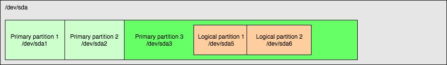

Title: Introductie tot Linux - Deel 3
Date: 2017-11-19 18:00
Category: Basis
Tags: basis, linux, ubuntu
Slug: introductie-tot-linux-deel-3
Authors: Sling
Summary: Het derde deel uit een drie-delige serie die je de basis van het werken met de Linux commandline uitlegt, zodat je over voldoende basiskennis beschikt om de andere tutorials te kunnen volgen.

Welkom bij het derde en laatste deel uit de serie Introductie tot Linux! Als het goed is heb je net deel 2 afgerond en heb je bij het nakijken van de opdrachten gemerkt dat je het snapt. Als dat nog niet zo was, dan adviseer ik je om nog een keertje door de vorige tutorial te lopen en wat te experimenteren met de commando’s, want we gaan er weer vanuit dat je bekend bent met al die commando’s en termen.

Je hebt nu bijna genoeg ervaring met de terminal en de beginselen van Linux om te kunnen starten met de overige tutorials waar Linux gebruikt wordt. Er zijn nog een paar onderdelen die erg handig zijn om te weten en ook wil ik je nog een aantal handvatten geven om problemen met je Linux systeem op te kunnen lossen. Nadat je deze tutorial hebt gevolgd en de opdrachten foutloos kunt maken, heb je een solide basiskennis van Linux opgebouwd en kun je je goed redden op een server met alleen de terminal. Cool toch?

In andere tutorials zullen we op hele specifieke onderdelen nog veel dieper gaan dus als je hierna nog steeds meer wilt weten wees dan gerust; er is nog enorm veel te leren over Linux!

---

# Partities en bestandssystemen

In deel 1 van deze Linux tutorials heb je gezien hoe de mappenstructuur van Linux in elkaar zit, met bovenaan een `/` map en daarin allemaal submappen. Het lijkt alsof de harde schijf van onze (virtuele) computer 1 grote ruimte is waar je bestanden en mappen in kan gooien, klinkt simpel toch?

Onder de motorkap is het iets ingewikkelder. Je kan in een systeem meerdere harde schijven hebben, er zijn een heleboel manieren om op zo’n harde schijf gegevens op te slaan, elk met z’n eigen voor- en nadelen. We gaan dit niet allemaal tot in detail toelichten hier, maar er zijn wel een aantal begrippen waar je bekend mee zou moeten zijn.

Een harde schijf – ook wel harddisk of simpelweg disk genoemd – is het fysieke apparaat waar de gegevens opgeslagen staan. Zo’n disk biedt plek voor een bepaalde hoeveelheid data, afhankelijk van hoeveel GB of TB de disk groot is. De disk is opgedeeld in kleinere stukken, genaamd partities. Zo’n partitie is een afgebakend gedeelde op de disk waar vervolgens een bestandssysteem op gezet kan worden. Een bestandssysteem is een vooraf afgesproken manier om bestanden en mappen op een partitie te plaatsen. Grafisch kun je het dus als volgt zien:

We beginnen met twee harddisks op ons systeem en zullen stap voor stap deze disks gaan installeren zodat we ze kunnen gebruiken. De commando’s om deze acties uit te voeren in Linux zullen we daarna bekijken. Eerst zijn onze disks nog helemaal kaal en ongebruikt:

De namen `/dev/sda` en `/dev/sdb` zijn de namen zoals je die waarschijnlijk op je Linux systeem ook zult tegenkomen. In de speciale `/dev` partitie (die eigenlijk niet echt een partitie op een harde schijf is) staan alle apparaten van het systeem, en alle S-ATA disks beginnen vervolgens met `sd`. De eerste disk krijgt daarna de letter `a`, de tweede `b`, etcetera. Kortom: onze eerste disk is dus `/dev/sda` en onze tweede disk `/dev/sdb`.

Onze eerste disk is 50GB groot en onze tweede disk 20GB. Laten we op beide disks een partitie aanmaken, op `sda` een partitie van 30GB en op `sdb` een partitie van 20GB:

Je ziet dat partities ook een eigen naam hebben gekregen in `/dev`, namelijk `sda1` en `sdb1`. Onze tweede disk is nu helemaal in gebruik, er past geen andere partitie meer naast. Op onze eerste disk is nog 50 – 30 = 20GB vrij. In het plaatje hebben we dit groen gemaakt. Laten we hier ook nog een partitie op aanmaken:

De tweede partitie op de `sda` schijf heeft de naam `sda2` gekregen, er lijkt wel logica in te zitten! Nu er geen vrije ruimte meer is, kunnen we alle ruimte gaan gebruiken op onze harde schijven. Linux weet nu echter nog niet hoe er bestanden en mappen op gezet moeten worden, daarvoor moeten we de partities formatteren volgens een bepaald bestandssysteem.

We gaan `sda1` formatteren als `ext3`, `sda2` gaan we gebruiken als `swap` partitie (dat is een stukje harde schijf die als RAM wordt gebruikt zodra je echte interne geheugen vol zit, net als het wisselbestand op Windows), en `sdb1` gaan we formatteren als `btrfs`. Wat `ext3` en `btrfs` betekenen hoef je nu nog niet te weten. Hierna ziet het er als volgt uit:

Nu weet Linux hoe we de partities kunnen gebruiken. Maar de partities moeten nu nog gekoppeld worden aan een plek in onze bestandsstructuur. In de vorige tutorial hebben we een hele lijst van mappen gezien die op een Linuxsysteem gebruikt worden, je kan al deze mappen koppelen aan partities. Dit koppelen wordt _mounten_ genoemd.

Laten we `/` ofwel de root van ons bestandssysteem mounten op `sda1` en `/home` mounten op `sdb1`:

Vanaf nu worden alle bestanden standaard op `/dev/sda1` geplaatst, behalve als ze onder `/home` vallen, in dat geval zal Linux de tweede disk gebruiken en ze op de partitie `/dev/sdb1` zetten. Dit heeft bijvoorbeeld als voordeel dat als een proces bezig is met het lezen van een bestand in `/home`, je hier niet op hoeft te wachten als je een bestand in `/var` wil lezen. `/var` valt namelijk niet onder `/home` maar onder `/` en staat dus op de eerste harde schijf.

Laten we nu enkele commando’s doorlopen die de acties kunnen uitvoeren die we zojuist hebben gezien, en enkele andere disk-gerelateerde commando’s (als je partities wil aanpassen, verwijderen, etc., zorg dan dat je een snapshot maakt van je VM voordat je hiermee aan de slag gaat, zodat je altijd weer terug kan naar een werkende state):

Commando                | Uitleg
----------------------- | -----------------------
`fdisk -l`              | Laat alle partitietabellen van alle disks zien. Hierin staan welke partities er aangemaakt zijn, welk type ze hebben, hoe groot ze zijn, etcetera.
`fdisk /dev/sda`        | Open de partitietabel van disk `/dev/sda`. Dit opent een soort shell waarin je commando’s kan uitvoeren:   p = print huidige partitietabel   n = maak nieuwe partitie   d = verwijder partitie   w = schrijf nieuwe partitietabel naar de harddisk en verlaat fdisk   q = verlaat fdisk zonder wijzigingen te bewaren
`fsck /dev/sda1`        | Voer een controle (**f**ile**s**ystem **c**hec**k**) uit van het bestandssysteem op de `/dev/sda1` partitie. Dit wordt tijdens het opstarten uitgevoerd als je een Linux-systeem zomaar uitzet zonder goed af te sluiten, om te voorkomen dat er bestanden verloren gaan. Dit kun je niet uitvoeren op partities die op dit moment gemount zijn.
`mount`                 | Bekijk alle actieve mounts op het systeem.
`mount /dev/sda2 /home` | Met het mount commando kunnen we ook handmatig mounts activeren. Dit voorbeeld zal de partitie `/dev/sda2` mounten als `/home`
`umount /home`          | Unmounten, ofwel het ontkoppelen van een partitie, kan met het commando `umount`. Let op, zonder de letter 'n'. Dit is handig als je bijvoorbeeld een filesystem check wil uitvoeren, of een partitie wil aanpassen. Zorg ervoor dat je niet op dit moment in de directory staat die je probeert te unmounten, anders krijg je waarschijnlijk foutmeldingen dat de partitie nog in gebruik is.
`mount | grep ext`      | Met alleen `mount` krijgen we nogal een grote lijst mounts te zien. Hier zitten vooral allemaal interne Linux-zaken tussen die voor ons nu niet zo interessant zijn. Het commando hiernaast laat alle mounts zien die `ext` in hun informatie hebben staan. Voor onze Ubuntu VM zien we hier onze twee mounts, eentje op `/` en eentje op `/boot`. Een stuk overzichtelijker! Wat `grep` precies doet zien we in het volgende hoofdstuk.
`mkfs.ext3`             | Met de `mkfs.*` commando’s kun je partities formatteren volgens een bepaald bestandssysteem. Dit kun je niet uitvoeren op bestandssystemen die al gemount zijn. Als je dit uitvoert op een bestaande partitie dan zullen je gegevens zeer waarschijnlijk niet meer terug te halen zijn, kijk hiermee dus uit!  Probeer eens `mkfs` en vervolgens 2x de Tab toets in te drukken, om te zien welke commando’s er allemaal zijn die met mkfs beginnen.
`du`                    | Met `du` kun je bekijken hoeveel ruimte er gebruikt wordt in de huidige map. Je kan aan du ook opties meegeven zoals `-s` voor een optelsom van alle mappen onder de huidige map, of `-h` voor human-readable getallen in plaats van alleen maar bytes. Ook kun je aan `du` een argument meegeven als je niet de huidige map maar een andere plek in het bestandssysteem wil opzoeken. Probeer bijvoorbeeld eens: `du -sh /etc`
`df`                    | Met `df` kun je bekijken hoeveel ruimte er nog vrij is op alle gemounte partities. De getallen zijn in bytes, je kunt ook hier de optie `-h` gebruiken om dit human-readable te maken. De uitvoer van dit commando is een stuk overzichtelijker dan `mount` en geeft je ook nog eens informatie over de beschikbare ruimte, handig!
`shred`                 | Met het `shred` commando kun je een apparaat goed wissen, zodat hier geen bestanden meer vanaf kunnen worden gehaald. Dit werkt voor vrijwel alle bestandssystemen en disks.

Waar staan nu deze mounts en partitietabellen opgeslagen? Als we de computer afsluiten en weer opstarten, dan zijn onze mounts – die we tijdens de Ubuntu installatie hebben aangemaakt – weer magisch actief.

Er zijn twee bestanden in de `/etc` map die hier relevant zijn, bekijk ze eens met een teksteditor:

Bestand      | Uitleg
------------ | ------------
`/etc/fstab` | In dit bestand staan de mounts die door de gebruiker zijn ingesteld, en welke mounts er bij het opstarten van linux actief moeten worden. Ook staan hier nog enkele ‘flags’ zoals bijvoorbeeld het wel of niet uitvoeren van een fsck als het systeem uitgevallen is.
`/etc/mtab`  | Dit bestand wordt door Linux aangemaakt op basis van ons /etc/fstab bestand, zodra we terwijl Linux draait zelf nog mounts of umounts uitvoeren kun je ze in dit bestand zien verschijnen of verdwijnen. Als je een mount handmatig hebt uitgevoerd kun je de betreffende regel uit /etc/mtab kopieren naar /etc/fstab zodat deze bij het opstarten ook weer actief wordt.

## Soorten partities: Primary, Extended, Logical

Tot nu hebben we het over partities gehad alsof een disk in oneindig veel stukjes opgedeeld kan worden die allemaal gelijkwaardig zijn, maar doordat er in het verleden standaarden zijn geweest die limieten op het aantal partities hebben gelegd is hierin wat onderscheid te maken. 

De manier waarop onze disk ingedeeld is staat beschreven in een klein stukje aan het begin van de schijf, genaamd het Master Boot Record (MBR). Dit gebeurt volgens een standaard die al in 1983 werd vastgelegd en waarin een partitietabel beschreven wordt met maximaal 4 partities. Deze 4 partities noemen we _primary_ partities. In zo'n partitietabel staat bijvoorbeeld voor elke partitie waar hij fysiek op de harde schijf begint en eindigt.

Al snel na de introductie van de MBR standaard werd duidelijk dat er soms meer dan 4 partities nodig zijn, waardoor een uitbereiding op deze indeling werd bedacht in de vorm van een _extended_ partitie: een van de primary partities kan als _extended_ partitie dienen, waarna het mogelijk is om hierin toch meerdere partities te maken, ondanks de limiet van 4. Deze extra partities worden _logical_ partities genoemd, en deze beginnen en eindigen dus binnen de ruimte die de extended partitie in beslag neemt:

Het is gebruikelijk dat de eerste 4 partitienamen sdX1 t/m sdX4 gereserveerd worden voor de primary partities, waardoor de eerste logical partitie meestal <code>sda5</code> heet, dit is ook in de afbeelding hierboven afgebeeld.

## LVM ofwel de Logical Volume Manager

Voordat we naar ons eigen systeem gaan kijken moeten we nog even kennismaken met _LVM_. Dit is een laagje tussen je fysieke harde schijven en je partities, en het geeft nog wat extra flexibiliteit bij bijvoorbeeld het vergroten of verkleinen van partities en het gebruiken van meerdere fysieke harde schijven tegelijk. Omdat dit – als je alle standaardopties selecteert – op een Ubuntu systeem actief is, is dit ook op onze server actief.

Bij LVM zijn er drie objecten die belangrijk zijn om te kennen:
– Volume Groups
– Physical Volumes
– Logical Volumes

We zullen in deze tutorial nog niet alle details van LVM bekijken omdat er nogal veel mee mogelijk is, maar het is voor nu voldoende om te weten dat een _Volume Group_ een verzameling van _Physical Volumes_ en _Logical Volumes_ is. Meestal is er 1 Volume Group op een systeem aanwezig. Physical Volumes zijn fysieke harde schijven en Logical Volumes zijn plekken waar partities op gemaakt kunnen worden.

Met de volgende commando’s kun je deze 3 verschillende objecten bekijken:

Commando    | Uitleg
----------- | -----------
`vgdisplay` | Bekijk alle details over de LVM Volume Groups
`pvdisplay` | Bekijk alle details over de LVM Physical Volumes
`lvdisplay` | Bekijk alle details over de LVM Logical Volumes

We hebben eerder het commando <code>fdisk -l</code> gezien om alle disks en partities te kunnen tonen. Het is belangrijk om te weten dat de LVM Logical Volumes in de uitvoer van dit commando ook als disk worden getoond. De naam van zulke disks is als volgt opgesteld: <code>/dev/mapper/[naam volume group]-[naam logical volume]</code>.

  
Opdracht 1

  
Hoeveel disks zijn er op dit moment op je Ubuntu VM? Hoeveel hiervan zijn eigenlijk LVM Logical Volumes?

  
Als het goed is heb je 1 'echte' disk gevonden, welke partities zijn er op deze disk aanwezig? Wat voor type partities zijn dit? (Primary, Extended of Logical)

  
Hoe is LVM ingesteld op je systeem? Beschrijf welke volume groups er zijn, op welke physical volumes ze staan en welke logical volumes ze bevatten.

  
Welke mounts zijn er op dit moment actief met als type <code>ext2</code> of <code>ext4</code>?

  
Hoe groot zijn alle gemounte partities en hoeveel ruimte is er nog op beschikbaar? Je kan de <code>udev</code> en <code>tmpfs</code> partities negeren.

  
Stop je VM en voeg er een disk aan toe. Ga hiervoor naar de instellingen van je VM, klik vervolgens op Opslag &rarr; Controller: SATA &rarr; Disk-toevoeg-knopje (het vierkante knopje naast Controller: SATA) &rarr; Maak een nieuwe schijf aan &rarr; Doorgaan (VDI) &rarr; Doorgaan (Dynamisch gealloceerd) &rarr; Vul een leuke naam in en stel een grootte in van 1GB &rarr; Aanmaken &rarr; Ok. Start je VM weer op en kijk of je nieuwe disk zichtbaar is.

  
We willen onze nieuwe disk gaan gebruiken. Deel je disk op in 2 partities van ongeveer gelijke grootte, formatteer 1 van deze partities als <code>ext4</code> en de andere als <code>btrfs</code>. Tenslotte willen we de eerste disk mounten onder <code>/extradisks/een</code> en de tweede onder <code>/extradisks/twee</code>. Tip: maak deze paden aan als map voordat je ze mount op je nieuwe partities!

  
Bekijk na het uitvoeren van deze acties nog eens de disks, partities en mounts op het systeem. Maak wat bestanden en mappen aan op je nieuwe mounts, of kopieer bestaande bestanden of mappen hierheen.

  
We willen onze nieuwe partitie <code>/dev/sdb1</code> op een betrouwbare manier wissen (niet met alleen maar <code>rm</code> dus!). Bekijk daarna nog eens de inhoud van deze partities, lukt dat? Probeer te verklaren wat er gebeurt.

  
Voer een filesystem check uit op <code>/dev/sdb1</code>, kunnen we dit filesystem nog redden?

---

# Geavanceerd gebruik van de shell

(piping, redirection, eenvoudige shellscripts)
echo, >, <, >>, <<, |, -, stdin/stdout/stderr, more, less, 

  
Opdracht 2

  

awk, sed, grep, variabelen, export, for, xargs, history

  
Opdracht 3

  

---

# Processen en Services

Wat is een proces?
(h)top/ps/pstree, forken, bg/fg, &, screen, kill, pkill, pgrep
service start/stop

  
Opdracht 4

  

---

# Hardware

swapspace/free, /proc/cpuinfo, uname -a, hwinfo, lspci, lsusb, dmesg, lshw

  
Opdracht 5

  

---

# Logging en Debugging

Wat zijn logbestanden? Wat is debugging?
syslog, dmesg, /var/log, strace, tail -f, load, free, watch

  
Opdracht 6

  

---

Dit besluit het laatste deel van de serie ‘Introductie tot Linux’ tutorials, gefeliciteerd! Als je nog meer over Linux wilt leren, kijk dan eens naar de Linux categorie in de lijst tutorials.

---

# Antwoorden op opdrachten

Hieronder zijn per opdracht de antwoorden te bekijken, door op de juiste opdracht te klikken. Probeer natuurlijk wel eerst de opdrachten te maken, anders leer je de stof niet goed en kom je bij andere tutorials kennis te kort, met valsspelen heb je alleen jezelf.

  
Opdracht 1

  <ul>
    <li>Met het commando <code>sudo fdisk -l</code> zien we 3 disks: <code>/dev/sda</code>, <code>/dev/mapper/ubuntu--vg-root</code> en <code>/dev/mapper/ubuntu--vg/swap_1</code>. De laatste twee zijn LVM Logical Volumes, te herkennen aan de naam die begint met <code>/dev/mapper/</code>.</li>
    <li>De echte disk is <code>/dev/sda</code>, in de uitvoer van het vorige commando zagen we hiervan ook de partitietabel met daarin 3 partities: <code>/dev/sda1</code> (Primary), <code>/dev/sda2</code> (Primary, Extended) en <code>/dev/sda5</code> (Logical). Je kan de partitietabel ook bekijken door <code>sudo fdisk /dev/sda</code> te starten en het commando <code>p</code> te geven. Bonus: Door te kijken naar de 'Start' en 'End' getallen kun je ook zien dat <code>sda5</code> op de extended partitie <code>sda2</code> staat.</li>
    <li><code>sudo vgdisplay</code> laat 1 Volume Group zien met de naam <code>ubuntu-vg</code>. <code>sudo pvdisplay</code> laat ons het physical volume (PV) <code>/dev/sda5</code> zien met daaraan gekoppeld de volume group (VG) <code>ubuntu-vg</code>. Tenslotte bekijken we met <code>sudo lvdisplay</code> de Logical volumes, waarvan er twee aanwezig zijn op de <code>ubuntu-vg</code> volume group; <code>root</code> en <code>swap_1</code>.</li>
    <li>Met het commando <code>mount | grep ext</code> zien we twee mounts, <code>/dev/mapper/ubuntu--vg-root</code> wat gemount is als <code>/</code> en <code>/dev/sda1</code> wat gemount is als <code>/boot</code>.</li>
    <li>Met het commando <code>df -h</code> zien we diezelfde twee mounts weer terug, <code>/</code> heeft op mijn systeem een grootte van 8.8G waarvan nog 6.3G vrij is en <code>/boot</code> is 472MB groot en heeft 342MB beschikbaar. Deze waarden kunnen natuurlijk wat verschillen van jouw eigen Ubuntu VM.</li>
    <li>Als de stappen goed gegaan zijn heb je nu in de uitvoer van <code>sudo fdisk -l</code> ook een <code>/dev/sdb</code>!</li>
    <li>Voer de volgende commando's uit: <code>sudo fdisk /dev/sdb</code>, <code>n</code> (nieuwe partitie), <code>p</code> (Primary), <code>[enter]</code> (Default partition number), <code>[enter]</code> (Default first sector, we willen aan het begin van de disk starten), <code>+500M</code> (Ongeveer de helft van de 1GB disk die we hebben aangemaakt). Tweede partitie op dezelfde manier maar bij 'Last sector' kiezen we voor de standaardwaarde, zodat de hele disk gevuld is. Nu schrijven we de partitietabel naar de disk en verlaten we fdisk met het commando <code>w</code>. We kijken opnieuw naar <code>sudo fdisk -l</code> en zien dat onze nieuwe partities <code>/dev/sdb1</code> en <code>/dev/sdb2</code> heten. We formatteren de eerste als ext4 met het commando <code>sudo mkfs.ext4 /dev/sdb1</code> en de tweede als btrfs met <code>sudo mkfs.btrfs /dev/sdb2</code>. We maken nu de mappen aan waarop we willen mounten: <code>sudo mkdir -p /extradisks/een</code> en <code>sudo mkdir -p /extradisks/twee</code>, en mounten daarna onze partities hierop met <code>sudo mount /dev/sdb1 /extradisks/een</code> en <code>sudo mount /dev/sdb2 /extradisks/twee</code>.</li>
    <li>(Eigen invulling, gebruik commando's zoals <code>sudo fdisk -l</code>, <code>df -h</code> en <code>mount</code>)</li>
    <li>Het wissen kan met het commando <code>sudo shred /dev/sdb1</code> (kan eventjes duren), als we hierna in de map <code>/extradisks/een</code> bijvoorbeeld <code>ls</code> uitvoeren krijgen we allerlei rare foutmeldingen over EXT-fs, waarschijnlijk heeft de shred actie ons ext4 bestandssysteem beschadigd.</li>
    <li>We verlaten de directory <code>/extradisks/een</code> (als je hierin stond) met bijvoorbeeld <code>cd /</code> en unmounten deze partitie met <code>sudo umount /extradisks/een</code>. Nu kunnen we een filesystem check uitvoeren met <code>sudo fsck /dev/sdb1</code>. Helaas kan deze onze partitie na een <code>shred</code> ook niet meer redden (maar dit was natuurlijk ook de bedoeling van dat commando :-)).</li>
  </ul>

  
Opdracht 2

  <ul>
    <li></li>
  </ul>

  
Opdracht 3

  <ul>
    <li></li>
  </ul>

  
Opdracht 4

  <ul>
    <li></li>
  </ul>

  
Opdracht 5

  <ul>
    <li></li>
  </ul>

  
Opdracht 6

  <ul>
    <li></li>
  </ul>

