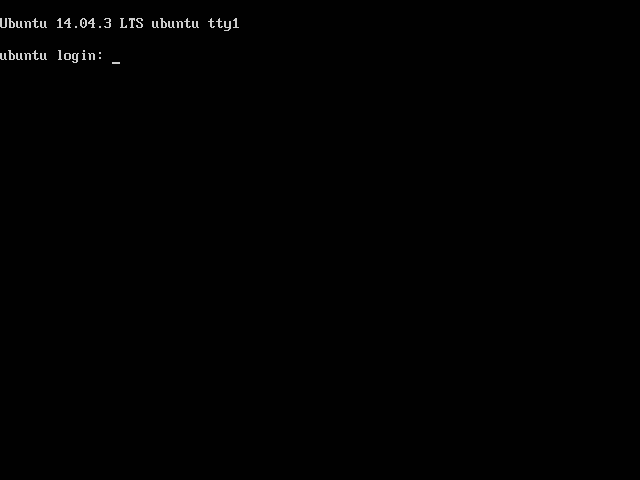
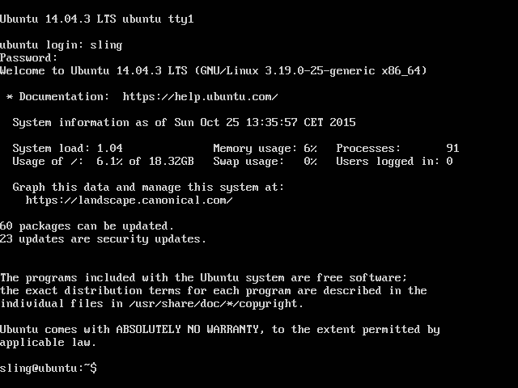
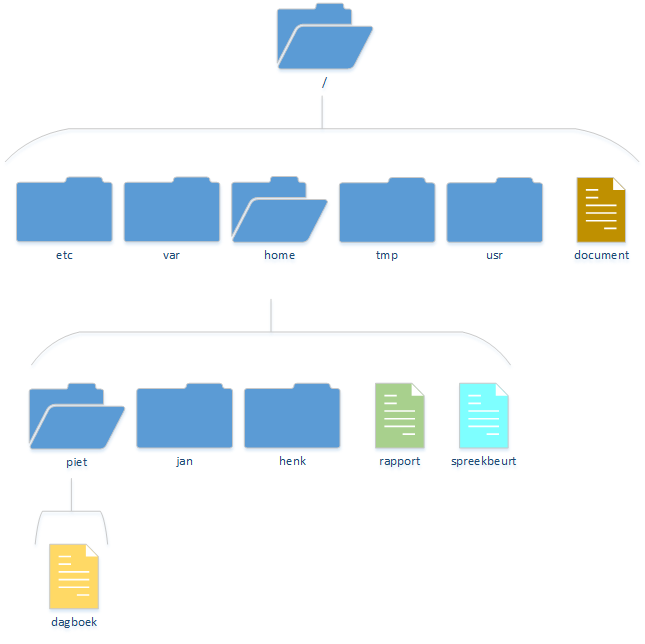
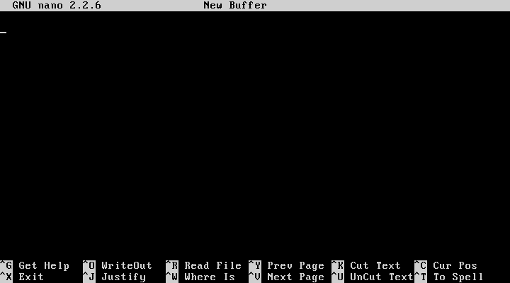

Title: Introductie tot Linux
Date: 2015-10-25 18:00
Category: Basis
Tags: basis, linux, ubuntu
Slug: introductie-tot-linux
Authors: Sling
Summary: Het eerste deel uit een drie-delige serie die je de basis van het werken met de Linux commandline uitlegt, zodat je over voldoende basiskennis beschikt om de andere tutorials te kunnen volgen.

In deze uitgebreide tutorial zal ik je bekend maken met de beginselen van het gebruiken en beheren van een Linux-systeem. Dit zijn vaardigheden die nodig zijn om veel andere tutorials te kunnen volgen, aangezien daar op de kennis gebouwd wordt die je in deze tutorial zal vergaren.

Als je de goede volgorde van de basis tutorials aanhoudt heb je net de [vorige tutorial](je-eigen-linux-systeem.html) over Linux afgerond, waar we een virtuele machine hebben opgezet met hierop Ubuntu Server. Zo niet, dan adviseer ik je om deze eerst te volgen. We gaan in de onderstaande tutorial namelijk direct met dit systeem aan de slag! Zorg ervoor dat je virtuele machine gestart is en je in de console `ubuntu login:` ziet staan.

Het zwarte rechthoekige venster wat je nu ziet met links bovenin wat tekst, heet de terminal. Vrijwel alles wat we met Linux zullen gaan doen, zullen we in deze omgeving uitvoeren. Je kent dit soort interfaces misschien van vroeger, zoals MS-DOS of hele oude spelcomputers. De terminal die je nu ziet is echter allesbehalve ouderwets. Het is trouwens wel mogelijk om Linux via een grafische omgeving met icoontjes en knopjes te beheren, maar dat gaan we niet doen! Hiervoor zijn een heleboel redenen te bedenken, waaronder de volgende:

- Door in een terminal te werken sta je veel dichter bij de echte werking van de computer, een grafische beheerinterface verbergt wat er eigenlijk onder de motorkap gebeurt. Door bekend te raken met de terminal leren we dus veel beter hoe Linux echt werkt.
- Als we later scripts gaan maken die taken voor ons gaan automatiseren, dan willen we daar kunnen opschrijven wat de computer moet doen. Deze opdrachten zullen identiek zijn aan wat we in de terminal intypen, of hier sterk op lijken.
- Op Linux servers draait bijna nooit een grafische interface. Als je jezelf aanleert om Linux via een grafische interface te beheren, zul je dus voor een heleboel verrassingen komen te staan als je je vaardigheden in de praktijk wil brengen.
- In het begin zal het even wennen zijn en zul je geregeld denken “Maar in een grafische omgeving kan ik dit veel makkelijker!”, maar uiteindelijk zul je je realiseren dat je via een terminal juist veel meer mogelijkheden hebt dan in een grafische omgeving, en dat je veel sneller en efficiënter kan werken.

# 0. In- en uitloggen, opstarten en afsluiten.

Wat je op dit moment in de terminal ziet is het zogenaamde login prompt, wat verschijnt zodra Linux klaar is met opstarten. Je kan hier een gebruikersnaam invoeren, op enter drukken, je wachtwoord invoeren, en weer op enter drukken. Als dit goed gaat, ben je ingelogd. Let op dat je bij het invoeren van het wachtwoord geen tekens te zien krijgt op het scherm, om zo te voorkomen dat mensen die mee kijken op je scherm kunnen zien hoeveel tekens je wachtwoord heeft.

  
Opdracht 1

  
Wat gebeurt er als je een gebruikersnaam invult die niet bestaat?

  
Wat gebeurt er als je wel je eigen gebruikersnaam invult, maar een verkeerd wachtwoord invult?

  
Log ten slotte in met je goede gebruikersnaam en wachtwoord om door te gaan met de volgende stappen.

Als het goed is zie je nu een scherm zoals dit:

We zijn nu ingelogd, wat betekent dat we commando‘s kunnen gaan uitvoeren. Dit zijn korte instructies die we intypen en afsluiten met de enter-toets. Linux leest vervolgens wat we hebben getypt en volgt deze instructies nauwkeurig op.

De eerste commando’s die we zullen gaan bekijken hebben te maken met het stoppen en herstarten van de computer, en het uitloggen van de gebruiker. Dat geeft ons meteen een heleboel controle over ons nieuwe Linux systeem. Hier volgt een aantal commando’s die we hiervoor kunnen gebruiken:

Commando                   | Uitleg
-------------------------- | --------------------------
`logout`                   | Log de huidige gebruiker uit en keer terug naar het login prompt.
`sudo reboot`              | Start de computer opnieuw op
`sudo halt`                | Stop meteen de computer
`sudo shutdown -h now`     | Stop meteen de computer (-h staat voor ‘halt’)
`sudo shutdown -h 5`       | Stop over 5 minuten de computer
`sudo shutdown -r now`     | Start de computer opnieuw op (-r staat voor ‘reboot’)

Het `sudo` commando is hier nodig, maar mag je voor nu even negeren. We zullen later in deze tutorial bekijken wat dit precies doet. Als je dit commando gebruikt wordt er om je wachtwoord gevraagd.

De laatste drie commando’s bestaan, zelfs zonder `sudo`, nog steeds uit meerdere gedeeltes. Het commando `shutdown` heeft namelijk extra _opties_ en _argumenten_ nodig, om te weten wat er precies moet gebeuren. Voorbeelden van opties bij `shutdown` zijn `-r` en `-h`. Opties worden gebruikt om de actie die een commando uitvoert wat specifieker te maken, in dit geval om aan te geven dat het shutdown commando de computer moet herstarten of uitschakelen. Deze opties hebben in dit geval ook nog een argument nodig, die aangeeft wanneer het `shutdown` commando de computer moet herstarten of uitschakelen. Er bestaan ook commando’s die je argumenten mee _kan_ geven, maar waar het niet verplicht is. Hoe je erachter kan komen wat een commando allemaal aan extra argumenten accepteert, zullen we later zien.

Nog iets wat je misschien opgevallen is, is dat er meerdere commando’s zijn die je kunt gebruiken om de computer meteen uit te zetten of te herstarten. Dit is iets wat in Linux veel voorkomt; er zijn meerdere manieren om hetzelfde doel te bereiken. Hou dat in je achterhoofd als je deze tutorial volgt, de voorbeelden die hier gegeven worden zijn in de meeste gevallen niet de enige manier om je doel te bereiken. Wel proberen we je de meest gebruikte manier aan te leren.

  
Opdracht 2

  
Probeer bovenstaande commando’s eens uit en observeer wat er gebeurt.

  
Wat gebeurt er als je <code>sudo</code> weglaat en alleen maar <code>halt</code> intypt?

  
Wat gebeurt er als je <code>sudo shutdown</code> zonder opties intypt?

  
Wat gebeurt er als je bij <code>sudo shutdown</code> wel de optie <code>-h</code> opgeeft maar hier geen argument achter zet?

**Let op**: Voordat we doorgaan naar het volgende hoofdstuk is het belangrijk om te vermelden dat je een Linux systeem nooit zomaar uit mag zetten zonder de goede afsluitprocedure te volgen. Als je de VM geforceerd afsluit in VirtualBox dan gebeurt er hetzelfde als wanneer je bij een echte computer de stekker er zomaar uit trekt. Linux krijgt dan namelijk niet de kans om ‘netjes’ alle processen die lopen te beeindigen, wat kan betekenen dat je bestanden kwijtraakt die recentelijk zijn bewerkt en/of dat je schijf corrupt raakt!

# 1. Mappen en bestanden

Laten we voordat we onze eerste mappen en bestanden gaan aanmaken eerst bekijken hoe Linux deze mappen indeelt, ofwel hoe de structuur van het bestandssysteem in elkaar steekt. Je zult op Windows waarschijnlijk al eens namen gezien hebben zoals:
`C:\Program Files\Microsoft Office\OFFICE15\EXCEL.EXE`
met vooraan de naam van de schijf, vervolgens een serie mappen en op het einde de bestandsnaam. Op Linux is dit niet veel anders, behalve dat je als basis niet een ‘schijf’ hebt, maar een `/`. Zo ziet op Linux een volledig pad er als volgt uit: `/etc/programma/configuratie.txt`. Dit betekent een bestand `configuratie.txt` in de map `programma`, die weer in de map `etc` zit.

Een voorbeeld van een mappenstructuur op Linux is als volgt:

Helemaal bovenaan staat een `/`-teken, wat het startpunt is voor alle bestanden en mappen op het systeem. Het is zelf eigenlijk ook een soort map, waarin bestanden (in dit geval het bestand `document`) en submappen (in dit geval de mappen `etc`, `var`, `tmp`, `usr`, `home`) staan. In het voorbeeld hebben we nog een paar mappen uitgeklapt om het idee verder te illustreren. Ook staan er op diverse plekken bestanden.

  
Opdracht 3

  
Er staan 4 bestanden in de bovenstaande afbeelding, wat zijn de volledige paden naar deze bestanden?

De bovenstaande afbeelding geeft natuurlijk maar een heel kleine greep uit de mappen die je kunt vinden op je Ubuntu server. Gelukkig heeft elke distributie, ook Ubuntu, voor het grootste gedeelte dezelfde mappenstructuur. Dus als je je straks comfortabel voelt met de Ubuntu structuur dan zul je je al snel thuis voelen op andere distributies. Door te werken met je Ubuntu systeem zul je vanzelf te weten komen waar veel van de mappen voor gebruikt worden, we zullen de belangrijkste mappen nu alvast doornemen:

Locatie        | Uitleg
-------------- | --------------
`/`            | Het startpunt van alle bestanden en mappen op je systeem, ook wel de ‘root’ (Engels woord voor de wortel van een plant of boom) map genoemd.
`/bin`         | Programma’s worden in deze map opgeslagen. Veel commando’s die we gaan gebruiken in deze tutorial zul je als een bestand in deze map vinden.
`/boot`        | In de boot map vind je alle bestanden die te maken hebben met het opstarten van Linux.
`/dev`         | Dit is een speciale map, waarin geen bestanden staan maar waarin alle hardware onderdelen van de computer een soort snelkoppeling hebben. Andere onderdelen van Linux en diverse programma’s kunnen deze koppelingen gebruiken om met de hardware van je systeem te praten.
`/etc`         | In windows staan alle instellingen van programma’s verspreid over het hele systeem, maar in Linux vind je alle configuratiebestanden in deze map. Hier zul je als beheerder van een systeem vaak mee te maken hebben.
`/home`        | Zoals de naam al aangeeft is dit de map waarin alle thuis-directories van de gebruikers te vinden zijn. Er zal op dit moment maar 1 map in staan, namelijk die van je eigen aangemaakte gebruiker.
`/lib`         | In deze map staan systeem libraries, dit zijn bestanden die nodig zijn voor de werking van diverse services en programma’s. We zullen hier in deze tutorial niets mee doen.
`/media`       | Verwisselbare apparaten zoals USB-sticks zijn in deze map te benaderen.
`/mnt`         | In deze map kunnen extra opslagapparaten gemount worden. Meer hierover in deel 2 van deze tutorial.
`/root`        | In de map /home staan de gebruikersmappen van de normale gebruikers, maar het beheersaccount van Linux (met de gebruikersnaam ‘root’) heeft een eigen plek in het bestandssysteem, namelijk deze map; /root. Let op, de ‘root’ van het bestandssysteem ‘/’ is wat anders dan deze map /root !
`/tmp`         | Hier staan tijdelijke bestanden die door diverse programma’s en gebruikers kunnen worden aangemaakt. Deze map kan bij een reboot worden leeggemaakt, dus sla hier niets belangrijks op!
`/var`         | Tenslotte staat in deze map een grote verscheidenheid aan bestanden, eigenlijk alles wat in de overige mappen niet thuishoort. Belangrijk om te weten: de meeste logbestanden worden in deze map opgeslagen.

Ga deze lijst nu niet uit je hoofd leren, maar probeer als je in deze en volgende tutorials mappen in Linux tegenkomt, te bedenken of je snapt waarom er juist voor die map gekozen is.

In de terminal bevindt je je op elk moment in een map op het systeem, net zoals je in bijvoorbeeld Windows Verkenner (of DOS) gewend bent. De commando’s die je uitvoert en die met mappen of bestanden te maken hebben worden dan in die locatie uitgevoerd. Maak je bijvoorbeeld een nieuw bestand aan zonder daarbij te vertellen in welke map dat moet gebeuren, dan maakt Linux het bestand aan in de map waar je op dat moment bent.

Tijd om zelf aan de slag te gaan! Hieronder volgt een lijst van commando’s die je zal gaan gebruiken om met bestanden en mappen te werken. Lees de lijst om te beginnen eerst door, zonder ze in je terminal te typen. Direct hierna volgt een opdracht waarmee je al deze commando’s kan oefenen.

Commando                           | Uitleg
---------------------------------- | ----------------------------------
`ls`                               | Bekijk de inhoud van de huidige map. Probeer ook eens de optie `-l` hierachter te zetten.
`ls /tmp`                          | Bekijk de inhoud van map `/tmp`
`pwd`                              | Bekijk in welke map we op dit moment zitten, de ‘working directory’.
`cd /tmp`                          | Navigeer naar `/tmp`
`touch mijnbestand`                | Maak een nieuw, leeg bestand aan met de naam `mijnbestand`
`cp mijnbestand /tmp`              | Kopieer het bestand `mijnbestand` in de huidige map naar de map `/tmp`
`cp mijnbestand /tmp/mijnbestand2` | Kopieer het bestand `mijnbestand` in de huidige map naar de map `/tmp` en geef het als nieuwe naam `mijnbestand2`
`mv /tmp/mijnbestand2 /home/user/` | Verplaats het bestand `/tmp/mijnbestand2` naar de map `/home/user/` (dit kun je ook gebruiken om mappen en bestanden een nieuwe naam te geven)
`mkdir /home/user/mijnmap`         | Maak een nieuwe map in `/home/user/` met de naam `mijnmap`
`rm /home/user/mijnbestand2`       | Verwijder het bestand `mijnbestand2` in de map `/home/user/`
`rmdir /home/user/mijnmap`         | Verwijder de map `/home/user/mijnmap` (de map `/home/user/` blijft bestaan)

  
Opdracht 4

  
Zoek op in welke map je op dit moment bent en bekijk de inhoud van de huidige map. Dit is onze eigen thuis (home) map waarin we alles mogen doen wat we willen, zonder dat andere gebruikers op het systeem daar last van hebben.

  
Maak hier een nieuwe map aan, met de naam <code>notities</code>, en bekijk daarna opnieuw de inhoud van de huidige map.

  
Navigeer van de huidige map naar de map <code>notities</code> die je zojuist hebt aangemaakt en maak daarin een bestand met de naam <code>notitie1</code>

  
Ga terug naar de map waar je begon (je home map).

  
Geef de map <code>notities</code> een nieuwe naam: <code>notes</code>.

  
Kopieer het bestand <code>notitie1</code> uit de map <code>notes</code> naar de map waar je begon.

  
Probeer de map <code>notes</code> te verwijderen. Waarom lukt dit niet? Verwijder het bestand wat er voor zorgt dat je de map niet kan verwijderen en probeer het opnieuw.

  
Bekijk de inhoud van de root map (<code>/</code>) en probeer wat door de mappen hierin te navigeren. Zijn er mappen waar je niet in kunt komen? In welke map staan de meeste bestanden denk je?

Tip: Gebruik het commando `clear` om het scherm leeg te maken zodat je wat meer overzicht krijgt! Als je er echt niet meer uit komt kun je altijd uitloggen met `logout` en weer opnieuw inloggen.

Stel nu dat je de volgende map zou willen aanmaken: `~/a/b/c/d/e/f/g/h/i/j/k/l/test/foo/1/` (gewoon, omdat het kan). Als we dat met de commando’s die we net hebben geleerd zouden moeten doen, dan moeten we best veel commando’s uitvoeren: `cd ~`, `mkdir a`, `cd a`, `mkdir b`, `cd b`, etcetera. Niet erg effectief dus. Hetzelfde geldt voor het verwijderen, als we in onze home map staan en we typen `rmdir ~/a/b/c/d/e/f/g/h/i/j/k/l/test/foo/1/` dan krijgen we de melding dat de map `a` niet leeg is. Als we map `a` in gaan krijgen we de melding dat `b` niet leeg is, etcetera. Daar zijn gelukkig handigere commando’s voor:

Commando               | Uitleg
---------------------- | ----------------------
`mkdir -p werkmap/b/c` | Maak in de huidige map de mappenstructuur `werkmap/b/c` aan. Dit betekent dus een map `werkmap`, met daarin een map `b`, en daarin ten slotte een map `c`.
`rm -r werkmap`        | Verwijder de map `werkmap` en alle mappen en bestanden die daar in zitten. Dit kan een gevaarlijk commando zijn, kijk dus goed of je geen typefouten hebt gemaakt voordat je dit uitvoert!

Probeer beide commando’s eens uit en gebruik tussen het aanmaken en verwijderen eens `cd` en `pwd` om te zien hoe je door je mappenstructuur heen kan navigeren.

## Zoeken op je systeem: find en locate

Je hebt net al rondgekeken in het systeem en een heleboel mappen en bestanden gezien. Best een wirwar van namen, het kan dus best eens gebeuren dat je niet meer precies weet waar je ook alweer dat ene bestand een paar weken geleden had opgeslagen. Gelukkig kun je in Linux ook zoeken naar een bepaalde bestandsnaam in je systeem, en zelfs zoeken _in_ een groep bestanden naar een stukje tekst.

Linux houdt hiervoor een speciaal lijstje bij van alle bestanden en mappen in het systeem waar je heel snel doorheen kan zoeken. Dit lijstje wordt elke 24 uur automatisch geupdate, als de computer aan staat. Het zoeken in deze lijst kan met het commando `locate` gevolgd door de naam van het bestand of map waar je naar op zoek bent. Probeer het eens uit met bijvoorbeeld `locate test` en je zult zien dat je heel snel een lange lijst bestanden met ‘test’ in de naam te zien krijgt. Als je niet wilt wachten totdat het systeem deze lijst automatisch update, dan kun je dit ook met de hand doen, met het commando `sudo updatedb`. Het uitvoeren hiervan kan eventjes duren, maar daarna zul je weer heel snel kunnen zoeken, inclusief de meest recent aangemaakte mappen en bestanden.

Als je iets specifieker wil zoeken dan zul je gebruik moeten maken van het commando `find`. Dit commando heeft geen speciale lijst die hij snel kan doorzoeken, maar het zoekt echt de harde schijf door. Hierdoor is het trager dan `locate`.

Je kan met dit commando allerlei speciale condities opgeven, waar ik hier een paar voorbeelden van zal geven. Het kan best gebeuren dat je meldingen krijgt met ‘Permission denied’, want find probeert elke map die hij tegenkomt in te gaan, ook al heeft jouw gebruikersaccount hier misschien helemaal geen toegang toe. Hoe we deze foutmeldingen kunnen weg laten leren we in deel 3 van deze tutorial.

Commando                       | Uitleg
------------------------------ | ------------------------------
`find /var -name test`         | Zoek alle bestanden en mappen met de naam `test` in de map `/var`
`find /etc -name *.conf`       | Zoek alle bestanden en mappen die eindigen op `.conf` in de map `/etc`
`find / -type d -name ba*`     | Zoek alle mappen in het hele systeem die beginnen met `ba`
`find /etc -type f -name test` | Zoek alle bestanden met de naam `test` in de map `/etc`
`find /var -mmin -10`          | Zoek alle bestanden en mappen op het hele systeem die in de laatste 10 minuten zijn gewijzigd.

Je krijgt ongetwijfeld meer tekst te zien bij sommige van bovenstaande commando’s dan er in je terminal past. Daardoor zie je alleen maar het onderste gedeelte van de uitvoer. Hoe je toch alle uitvoer kan zien en hier doorheen kan scrollen leren we in de volgende tutorial.

## Tab-completion, zoeken in bestanden en handige tekens.

Het komt nog wel eens voor dat je moet werken met hele lange bestands- of mapnamen. Neem bijvoorbeeld de map `/usr/src/Linux-headers-3.19.0-25/drivers/`, de eerste twee mappen uittypen in je terminal lukt nog wel maar de rest zou je liever niet helemaal willen uitschrijven omdat dit veel moeite kost en je kan ook nog eens makkelijk een typefoutje maken. Gelukkig is er een hele handige manier om Linux voor jou te laten werken in dit soort gevallen: tab-completion.

  
Opdracht 5

  
Ga de map <code>/usr/src/</code> in en bekijk welke bestanden en mappen hier in staan. Realiseer je dat je deze lange namen niet wil intypen en voer alleen het commando <code>cd</code> gevolgd door de eerste paar letters van de namen in. Druk nu op de &lt;tab&gt; toets op je toetsenbord en kijk wat er gebeurt. Wat gebeurt er als je nog een paar keer op tab drukt?

  
Probeer eens de eerste letter van een commando in te typen, en druk twee keer op de &lt;tab&gt; toets. Je krijgt alle mogelijke commando’s die met deze letter beginnen te zien! Ga zo enkele letters af om te zien hoeveel commando’s Linux wel niet heeft.

We hebben enkele alinea’s terug gezocht naar bestanden en mappen op basis van de bestandsnaam. Maar het zou natuurlijk ook wel erg handig zijn als we _in_ de bestanden op ons systeem kunnen zoeken naar stukken tekst. Gelukkig heeft Linux hier een hele geavanceerde tool voor, namelijk `grep`. Je kan een heleboel dingen met dit commando, maar voor deze tutorial zullen we ons tot enkele eenvoudige oefeningen beperken. Het enige wat je bij hier goed moet onthouden is de volgorde van de argumenten die je meegeeft. Het eerste argument na grep is de zoekterm die je wil gebruiken, en het tweede argument is het bestand waar je in wil zoeken. Ook is het met een extra optie mogelijk om in mappen (en submappen) te zoeken, ik zal dit laten zien in enkele voorbeelden:

Commando                        | Uitleg
------------------------------- | -------------------------------
`grep 'root' /etc/passwd`       | Zoek naar alle regels in `/etc/passwd` waar het woord `root` in voorkomt.
`grep -r 'root' /etc`           | Zoek naar alle regels in alle bestanden en mappen in `/etc` waar het woord `root` in voorkomt.
`grep -r -i 'root' /etc`        | Hetzelfde als hierboven, maar zoek nu naast `root` ook naar `Root`, `ROOT`, etc; kortom: niet hoofdlettergevoelig.
`grep -r -i -n 'root' /etc`     | Weer hetzelfde, maar laat nu ook bij elk zoekresultaat het regelnummer zien waarop het woord `root` is gevonden.
`grep -v 'nologin' /etc/passwd` | Zoek naar alle regels in `/etc/passwd` waar het woord `nologin` **niet** in voorkomt.

Tip: Je kan bij de meeste commando’s meerdere losse opties zoals `-r -i` ook schrijven als `-ri`

  
Opdracht 6

  
Zoek naar alle regels in het bestand <code>/etc/group</code> waarin je gebruikersnaam voorkomt.

  
Op welk regelnummer komt <code>battery</code> het eerst voor in het bestand <code>/etc/hdparm.conf</code> ?

  
Welke bestanden in de map <code>/etc/pam.d/</code> bevatten het woord <code>password</code> ?

  
In het bestand <code>/etc/hdparm.conf</code> staat een hoop commentaar, wat dient als documentatie. Elke commentaar-regel begint met een <code>#</code>. Gebruik 1 <code>grep</code> commando om te achterhalen wat er behalve dit commentaar in het bestand staat.

We sluiten dit hoofdstuk af met enkele tekens die je in alle commando’s kunt gebruiken die we net geleerd hebben. Als je deze tekens slim gebruikt hoef je een stuk minder te typen en kun je op veel systemen dezelfde commando’s gebruiken, ook al verschillen de mappen misschien van naam. Het gaat om drie tekens / tekencombinaties:

Tekens | Uitleg | Voorbeeld
------ | ------ | ------
`.`    | De huidige map. Handig als je bijvoorbeeld iets van of naar de huidige map wil kopieren of verplaatsen. | `cd /tmp` `cp /boot/grub/grub.cfg. `
`..`   | De bovenliggende (in Engels: parent) map. Dit kun je meerdere keren gebruiken in een pad. | `cd /boot/grub/` `cp grub.cfg ../../tmp`
`~`    | De home map van de huidige gebruiker, dus een map in `/home/` of bij de root gebruiker de map `/root` | `cd ~`

Tip: Als je net met cd naar een andere map bent genavigeerd, onthoudt Linux in welke map je hiervoor zat. Gebruik daarvoor cd -. Je kan op die manier heel eenvoudig tussen twee locaties wisselen.

# 2. Tekstbestanden

Het soort bestand wat we het meeste zullen gaan gebruiken in alle tutorials is een _tekstbestand_. In tegenstelling tot bijvoorbeeld video’s, afbeeldingen of programma’s zijn tekstbestanden gewoon leesbaar voor mensen. Bijna alle configuratiebestanden, broncode van programma’s, websites, scripts, en nog veel meer zijn in essentie allemaal tekstbestanden.

Deze bestanden kun je openen in een _editor_ waarna je de inhoud kan bekijken en aanpassen. Ook kun je de inhoud van zo’n bestand direct in je terminal bekijken door het commando `cat` te gebruiken gevolgd door het volledige pad van een bestand, of een bestandsnaam als je je al in de goede map bevindt. Bijvoorbeeld: `cat /etc/hosts`.

Er zijn een heleboel soorten editors op Linux die elk andere eigenschappen hebben. Een editor die eenvoudig te gebruiken is, is `nano`. Dit programma is al standaard geinstalleerd op Ubuntu dus dit kunnen we meteen gaan gebruiken. Veel uitgebreidere editors die vaak door programmeurs en hackers gebruikt worden zijn `emacs` en `vim` maar omdat deze nogal een steile leercurve hebben zullen we hier in deze tutorial geen gebruik van maken. 

Type nu `nano` in de terminal en druk op enter, het volgende scherm verschijnt:

We kunnen direct gaan typen zoals je dit ook gewend bent in bijvoorbeeld kladblok of wordpad op Windows. Je kunt de pijltjestoetsen gebruiken om door regels heen te navigeren, en toetsen zoals Home, End, PageUp en PageDown kun je ook gebruiken.

Onderaan staat een rij met acties die we kunnen uitvoeren met de sneltoetsen die we hiervoor moeten gebruiken er naast. Het `^` teken betekent dat we de Ctrl toets moeten gebruiken in combinatie met de letter die er achter staat. De belangrijkste voor nu zijn Ctrl+X voor het verlaten van nano (Exit) en Ctrl+O voor het opslaan van een bestand (WriteOut). Als we een nieuw bestand aan het typen zijn wordt bij het opslaan gevraagd wat de naam van het bestand moet worden. Dit wordt vervolgens in de map opgeslagen waarin we nano hebben opgestart. Als we nano afsluiten terwijl er nog niet-opgeslagen wijzigingen zijn, wordt ons ook gevraagd of we deze nog willen opslaan.

De handigste manier om een tekstbestand te openen in nano is door het als argument mee te geven vanaf de terminal. Bijvoorbeeld: `nano /etc/hosts` start nano en opent meteen het bestand wat je hebt opgegeven.

  
Opdracht 7

  
Ga terug naar je home map, maak hier een nieuwe map aan met de naam ‘tekstbestanden’, en plaats een kopie van het bestand /etc/hosts in deze map.

  
Open het bestand wat we net in de nieuwe map hebben geplaatst met nano. Gebruik de pijltjestoetsen of andere toetsen om naar het einde van de langste regel te gaan en voeg hier enkele woorden toe.

  
Sla het bestand op, sluit nano weer af en controleer of je wijzigingen zijn verwerkt door het bestand met <code>cat</code> te tonen op de terminal.

  
Open het bestand <code>/etc/passwd</code> met nano en probeer dit te wijzigen en op te slaan. Wat gebeurt er? Kun je het opslaan in je eigen home map?

# 3. Gebruikers en groepen

In de laatste vraag van de vorige opdracht probeerden we om een bestand te bewerken waar we geen toegang tot hadden, het bestand `/etc/passwd`. Dit komt omdat we niet de eigenaar waren van dit bestand, en niet iedereen dit bestand zomaar mag bewerken. Voor dit laatste is een goede reden, in dit bestand staat namelijk een lijst van alle gebruikers op dit systeem en de eigenschappen van al deze gebruikers.

Een gebruiker op linux is niet veel meer dan een combinatie van de volgende eigenschappen, die worden opgeslagen in onder andere het bestand `/etc/passwd`. Laten we de laatste regel van dit bestand op mijn ubuntu systeem er eens bij pakken, dat is namelijk mijn eigen gebruiker:

`sling:x:1000:1000:sling,,,:/home/sling:/bin/bash`

De velden die je daar van links naar rechts per regel ziet staan (gescheiden door een : teken) zijn:

- Gebruikersnaam
- Wachtwoord
- User ID (een getal, bijvoorbeeld 1001)
- Group ID
- Commentaar (de 3 komma’s die hier staan hebben een historische achtergrond, vroeger stonden hier ook extra zaken zoals telefoonnummer, kamernummer, - locatie, etc., gescheiden door komma’s)
- Home directory
- Shell (het programma wat onze commando’s interpreteert)

Het zal je misschien al opgevallen zijn dat er een ‘x’ staat in het wachtwoord veld. Dat is natuurlijk niet het echte wachtwoord, dat staat namelijk versleuteld in het bestand `/etc/shadow` waar normale gebruikers niet bij kunnen.

Tijdens de installatie van ons Linux systeem hebben we de naam moeten opgeven van ons gebruikersaccount, en met dat account hebben we ook ingelogd op het systeem. Je zag in de vorige opdracht ook dat er een flinke lijst andere gebruikers bestaan op het systeem. Dit zijn allemaal gebruikers die ingebouwd zijn in Ubuntu voor diverse doeleinden.

Er is 1 bijzondere gebruiker en die staat helemaal bovenaan de lijst in het bestand `/etc/passwd`, de gebruiker `root`. Dit is een account waarmee we het systeem kunnen beheren, en alle commando’s kunnen uitvoeren, inclusief commando’s die – als ze niet goed worden aangeroepen – het systeem kunnen beschadigen of onbruikbaar kunnen maken. Het klinkt misschien leuk of makkelijk om altijd als root te werken zodat je geen last hebt van restricties en alles kan doen, maar dit is erg gevaarlijk. Je hoeft maar een typefout te maken en je hebt misschien wel alle bestanden op het systeem verwijderd! Je kan om die reden niet als root inloggen op de ‘login:’ prompt en er is ook geen standaard wachtwoord voor ingesteld.

Linux is daarnaast bedoeld als systeem om met meerdere gebruikers tegelijk op te kunnen werken. Gebruikers kunnen via het netwerk inloggen (hoe dat gaat zien we in deel 3 van deze tutorial) en allerlei acties uitvoeren zonder dat ze last van elkaar hebben. Je kan je voorstellen dat bijvoorbeeld het afsluiten van een systeem iets is wat niet alle gebruikers zomaar mogen doen, want misschien zijn er wel mensen bezig met het schrijven van een tekstbestand en raken die wijzigingen zomaar verloren omdat het systeem uitgezet wordt. Daarom is het shutdown commando wat we eerder hebben gebruikt een commando wat alleen de root gebruiker mag uitvoeren.

Toch konden we de computer uitzetten, door `sudo` voor dit commando te zetten. Sudo geeft ons namelijk tijdelijk dezelfde rechten als de root gebruiker, alleen voor het commando wat we er achter zetten. Niet iedereen mag zomaar sudo gebruiken, daarom is er een speciale groep waar gebruikers in gezet kunnen worden die deze rechten nodig hebben.

Dit brengt ons op een nieuw concept: _groepen_. Groepen kunnen gebruikers bevatten, en elke gebruiker zit minimaal in 1 groep maar kan ook in meerdere groepen tegelijk zitten. Een voorbeeld is dus de ‘sudo’ groep, waarin alle gebruikers zitten op het systeem die met ‘sudo’ commando’s mogen uitvoeren.

Laten we de belangrijkste commando’s die er zijn om met gebruikers en groepen te werken eens op een rij zetten:

Commando                | Uitleg 
----------------------- | ----------------------- 
`sudo adduser pietje`   | Voeg een gebruiker toe met de naam `pietje`. Er wordt om een wachtwoord gevraagd en om extra optionele informatie zoals de volledige naam van de gebruiker. Dit commando maakt ook meteen een groep aan met de naam `pietje`, en maakt dit de primaire groep van de nieuwe gebruiker.
`sudo usermod pietje`   | Met dit commando kun je allerlei opties aanpassen van de gebruiker `pietje`. Als je geen optie of argument opgeeft, krijg je een lange lijst te zien van wat er mogelijk is. Een voorbeeld van zo’n optie is `usermod pietje -aG sudo,verkoop`, wat de gebruiker `pietje` toevoegt aan de groepen `sudo` en `verkoop`.
`sudo deluser pietje`   | Verwijder de gebruiker met de naam `pietje`.
`sudo addgroup verkoop` | Voeg een groep toe met de naam `verkoop`.
`sudo delgroup verkoop` | Verwijder de groep met de naam `verkoop`.
`groups pietje`         | Bekijk in welke groepen de gebruiker `pietje` zit.
`passwd`                | Pas het wachtwoord aan van de huidige gebruiker.
`sudo passwd pietje`    | Pas het wachtwoord aan van de gebruiker `pietje`. Alleen de root gebruiker mag andermans wachtwoorden aanpassen, vandaar dat hier `sudo` voor moet staan.
`whoami`                | Laat zien als welke gebruiker je op dit moment bent ingelogd op het systeem.
`id`                    | Laat zien als welke gebruiker, primaire groep en extra groepen (inclusief alle ID’s) je op dit moment commando’s uitvoert.

  
Opdracht 8

  
Maak twee nieuwe gebruikers aan: <code>alice</code> en <code>bob</code>.

  
Maak een nieuwe groep aan met de naam <code>hackers</code> en maak de <code>alice</code> en <code>bob</code> hier lid van.

  
Oeps, Alice heeft haar wachtwoord laten uitlekken. Wijzig haar wachtwoord naar <code>veiligwachtwoord</code>.

  
Alice heeft nog een keer haar wachtwoord doorverteld. Nu zijn we er wel klaar mee, verwijder haar gebruikersaccount.

  
Je bent nog ingelogd als je eigen gebruiker, bekijk de uitvoer van <code>id</code>. In welke groepen zit je allemaal?

  
Voer nu <code>sudo id</code> uit, verklaar wat je hier ziet.

Dit besluit deel 1 van de tutorial ‘Introductie tot Linux’, goed dat je het zo lang hebt volgehouden! In het volgende deel zullen we de volgende onderwerpen bespreken:

- Beveiliging
- Software installeren en updaten
- Netwerkbeheer
- Inloggen via SSH
- Handleidingen en andere hulp

Voordat je naar de [volgende tutorial](introductie-tot-linux-deel-2.html) gaat is het een goed plan om nog eens deze tutorial door te lopen en je af te vragen of je elk commando kent. Probeer nog eens zelf wat creatiefs te verzinnen met deze commando’s en oefen, oefen, oefen. Door alleen maar deze tekst te lezen zul je na korte tijd deze kennis alweer kwijt zijn dus het is belangrijk om het vaak toe te passen.

---

# Antwoorden op opdrachten

Hieronder zijn per opdracht de antwoorden te bekijken, door op de juiste opdracht te klikken. Probeer natuurlijk wel eerst de opdrachten te maken, anders leer je de stof niet goed en kom je bij andere tutorials kennis te kort, met valsspelen heb je alleen jezelf.

  
Opdracht 1

  <ul>
    <li>Als je een gebruikersnaam invult die niet bestaat, wordt er toch om een wachtwoord gevraagd. Een foutmelding dat de gebruikersnaam niet bestaat zou een aanvaller precies kunnen vertellen welke gebruikersnamen geldig zijn op de server en dat willen we liever niet.</li>
    <li>Als je een verkeerd wachtwoord invult, dan zul je zien dat je weer overnieuw een gebruikersnaam moet invullen. Als je een typefout gemaakt hebt in je gebruikersnaam zou je hem op deze manier ook nog kunnen corrigeren.</li>
    <li>Als de laatste stap niet lukt, dan zul je de virtuele machine opnieuw moeten installeren volgens de vorige tutorial. Onthoud goed je gebruikersnaam en wachtwoord!</li>
  </ul>

  
Opdracht 2

  <ul>
    <li>De eerste opdracht bestaat alleen uit het uitvoeren van de commando’s. Je zal gemerkt hebben dat Linux een stuk sneller kan opstarten dan Windows.</li>
	<li>Je krijgt een foutmelding die aangeeft dat je ‘root’ moet zijn. Wat dat precies betekent zien we iets verderop in deze tutorial.</li>
	<li>Zonder extra opties weet het commando <code>shutdown</code> niet wat het moet doen. Het vertelt ons zelfs dat het een tijd verwacht als argument, en verwijst ons naar het commando <code>shutdown –help</code> voor meer informatie. Bonuspunten als je hier ook naar gekeken hebt!</li>
 	<li>Ook met de optie <code>-h</code>, die vertelt dat we een ‘halt’ willen uitvoeren, moeten we nog steeds een tijdstip opgeven.</li>
  </ul>

  
Opdracht 3

  <ul>
    <li>Deze vier bestanden hebben de volgende paden: <code>/document</code>, <code>/home/rapport</code>, <code>/home/spreekbeurt</code> en <code>/home/piet/dagboek</code>.</li>
  </ul>

  
Opdracht 4

  <ul>
	<li>Bekijk de huidige map met <code>pwd</code> (we krijgen dan iets te zien zoals <code>/home/sling</code>) en de inhoud van deze map met <code>ls</code> (zonder verdere opties of argumenten). Er staat nu nog niks in de map, omdat het een helemaal nieuw systeem is.</li>
	<li>Met het commando <code>mkdir notities</code> maak je in de huidige map een nieuwe map aan. Met <code>ls</code> zien we nu ineens deze map staan.</li>
	<li>Met het commando <code>cd notities</code> verplaatsen we ons naar deze nieuwe map. Een nieuw bestand aanmaken kan met <code>touch notitie1</code>.</li>
	<li>Om terug te gaan naar de home map, typen we in wat we bij de eerste opdracht zagen, bijvoorbeeld: <code>cd /home/sling</code>.</li>
	<li>Een map hernoemen is eigenlijk hetzelfde als de map verplaatsen naar een andere map met een andere naam. We gebruiken dus <code>mv notities notes</code>.</li>
	<li>Het bestand notitie1 is met de vorige actie ook meeverhuisd naar de map ‘notes’. Om dit bestand naar onze home map te kopieren gebruiken we: <code>cp notes/notitie1 /home/sling</code>.</li>
	<li>Volgens de instructies zouden we de directory kunnen verwijderen met <code>rmdir</code> notes maar we krijgen de melding ‘Directory not empty’. De map moet dus leeg zijn voordat we deze kunnen verwijderen. Om te zien welk bestand hier in staat gebruiken we <code>ls notes</code> of <code>cd notes</code> gevolgd door <code>ls</code>. Vervolgens verwijderen we het bestand met <code>rm notes/notitie1</code> als we nog in de home map zaten, of met <code>rm notitie1</code> als we naar de map notes gegaan waren. Om uiteindelijk de map te kunnen verwijderen gaan we terug naar onze home map (als je dat nog niet was) met <code>cd /home/sling</code> en nu kunnen we <code>rmdir notes</code> gebruiken!</li>
	<li>Met <code>ls /</code> zien we alle mappen en bestanden die in de root van het bestandssysteem staan. Je kan met <code>cd /bin</code> bijvoorbeeld de map <code>bin</code> in gaan en hier <code>ls</code> uitvoeren. Gebruik je creativiteit! Als het goed is kom je ook de map <code>/root</code> tegen, waar je niet in mag.</li>
  </ul>

  
Opdracht 5

  <ul>
    <li>Zodra je op tab drukt wordt de rest van de bestandsnaam aangevuld, tot het punt waarop er meerdere mogelijkheden zijn. Als je daarna nog twee keer op tab drukt wordt een lijst getoond van de mogelijkheden.</li>
	<li>Dit werkt dus niet alleen voor mappen en bestanden maar ook voor commando’s op de shell. Er zijn meer dan 1000 verschillende commando’s beschikbaar op een standaard Ubuntu installatie, en nog veel meer als je er een uitgebreide selectie aan software op installeert.</li>
  </ul>

  
Opdracht 6

  <ul>
    <li><code>grep 'sling' /etc/group</code> (het resultaat zal ergens tussen de 5 en 10 regels zijn)</li>
    <li><code>grep -n 'battery' /etc/hdparm.conf</code> zou moeten laten zien dat op regel 42 het woord battery voor het eerst voorkomt.</li>
    <li><code>grep -r 'password' /etc/pam.d/</code> zou 11 bestanden moeten laten zien waarin dit woord voorkomt.</li>
    <li><code>grep -v '#' /etc/hdparm.conf</code> laat zien dat er eigenlijk alleen ‘quiet’ in staat.</li>
  </ul>

  
Opdracht 7

  <ul>
    <li><code>cd ~ mkdir tekstbestanden</code>, <code>cp /etc/hosts ~/tekstbestanden</code></li>
	<li><code>nano ~/tekstbestanden/hosts</code></li>
	<li>Gebruik Ctrl+W om het bestand op te slaan en druk op enter om dezelfde bestandsnaam aan te houden, Ctrl+X om nano te verlaten, en <code>cat ~/tekstbestanden/hosts</code> om de inhoud van het gekopieerde en bewerkte bestand te tonen.</li>
	</li>Zodra je het bestand hebt geopend zie je onderin al staan ‘Warning: No write permission’. Als je het bestand daarna met Cltr+O probeert op te slaan, krijg je nogmaals een vergelijkbare melding. We hebben blijkbaar geen rechten om dit bestand aan te passen. Wel kunnen we deze tekst opslaan in onze eigen home map, omdat we daar wel alle rechten hebben.</li>
  </ul>

  
Opdracht 8

  <ul>
    <li><code>sudo adduser alice</code>, <code>sudo adduser bob</code>. Let op dat je eerst je eigen password moet invullen bij het eerste gebruik van sudo, en later de passwords van de nieuwe gebruikers!</li>
	<li><code>sudo addgroup hackers</code>, <code>sudo usermod alice -aG hackers</code>, <code>sudo usermod bob -aG hackers</code></li>
	<li><code>sudo passwd alice</code></li>
	<li><code>sudo deluser alice</code>. Let op de melding die je krijgt, er is een groep aangemaakt tijdens het aanmaken van de user ‘alice’ en die groep heet ook ‘alice’. Deze groep bestaat nu nog steeds op ons systeem.</li>
	<li>Standaard zit het eerste gebruikersaccount wat je tijdens de installatie van Ubuntu aanmaakt in allerlei groepen, die je met het commando <code>id</code> kunt zien. Dit zijn bijvoorbeeld de groepen adm, cdrom, sudo, dip, plugdev, lpadmin en sambashare. Je hoeft niet te weten wat al deze groepen precies doen, maar als het goed is weet je wel waar de groep sudo voor is.</li>
	<li>Alles wat je met <code>sudo</code> uitvoert, krijgt tijdelijk root-rechten. Dus ook het commando <code>id</code>. Je ziet dus in welke groepen root zit, en dat is alleen de groep ‘root’.</li>
  </ul>

