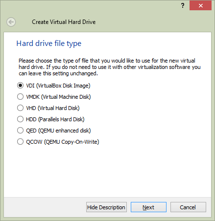

Title: Je eigen Linux systeem!
Date: 2015-10-18 18:00
Category: Basis
Tags: basis, linux, virtualbox, ubuntu
Slug: je-eigen-linux-systeem
Authors: Sling
Summary: Na deze tutorial heb je een virtuele machine met Ubuntu zodat je verder aan de slag kunt met Linux!

# Wat is Linux?

Net zoals Windows (van Microsoft) en Mac OS X (van Apple) is Linux een besturingssysteem wat op een computer geïnstalleerd kan worden. Het grootste verschil tussen Linux en deze andere twee populaire besturingssystemen is dat Linux open source is. Dat betekent dat de broncode vrij beschikbaar gesteld wordt voor iedereen om te lezen, maar ook om aanpassingen te doen als de gebruiker dit wil. Door deze openheid kan een Linux-systeem veel eenvoudiger doorgrond worden en kan het van top tot teen onder de loep gelegd worden om hier van te leren.

_Noot voor de oplettende lezers: de bovenstaande paragraaf is in de details niet helemaal correct, de term Linux verwijst naar de kernel van het besturingssysteem en GNU/Linux is de collectie van kernel plus alle tools er omheen, maar voor deze introductie is dit niet van belang._

# Waarom heb ik het nodig?

Als hacker, en vooral als beginnende hacker, zul je veel gebruik gaan maken van bestaande stukken software (tools) om je te helpen met diverse taken. Vrijwel alle veelgebruikte tools zijn op en voor Linux ontwikkeld, omdat dit het meeste flexibiliteit geeft voor de programmeur en voor ons als gebruiker. Op gesloten besturingssystemen loop je als hacker al snel tegen beperkingen aan die niet op te lossen zijn door een blik op de code te werpen en/of een aanpassing te maken.

Daarnaast zit je met Linux veel ‘dichter’ bij de echte werking van de computer en wordt er minder voor je verborgen. Dit is wel zo prettig als we meer proberen te leren over de werking van de computer en de hierop draaiende software. Het is tegelijkertijd ook de reden dat vooral in het verleden Linux als ‘te moeilijk’ werd ervaren door nieuwe gebruikers, maar dit is sinds de laatste jaren flink veranderd.

Dit wil overigens niet zeggen dat we Windows links laten liggen, want het is nog altijd het meest gebruikte besturingssysteem dat er is. Maar wanneer we Windows tegenkomen in de hierop volgende tutorials, zal dit eerder zijn als doelwit van een aanval of juist een poging zijn tot verdediging, dan een systeem waarop we onze tools gaan draaien en zelf op gaan werken.

Als je zelf al Linux draait, dan is dat natuurlijk mooi meegenomen en hoef je in principe niet nog een nieuw Linux-systeem in te richten. Toch adviseer ik je om deze tutorial te volgen zodat je zeker weet dat er geen problemen ontstaan met het uitvoeren van tools en commando’s in andere tutorials. Er wordt namelijk niet op alle mogelijke vormen van Linux getest of de genoemde tools daar ook werken, als iedereen met dezelfde basis omgeving begint dan kan er eigenlijk niets mis gaan.

# Virtualbox

Als we deze tutorial 10 of 15 jaar geleden hadden geschreven dan zouden we op dit moment vragen om een oude pc te regelen waar we Linux op gingen installeren. Dit betekent een hoop gedoe en mogelijk allerlei problemen met hardware die niet (goed) ondersteund wordt. Gelukkig kunnen we tegenwoordig gebruik maken van een virtuele computer, een ‘virtual machine’. Dit is een programma wat op je computer draait, en wat zelf weer een andere computer emuleert. Hier kun je vervolgens weer een nieuw besturingssysteem op draaien met daarop allerlei andere software. Een computer in een computer dus. Voor nu gaan we op dit concept niet dieper in, en is dit het enige wat je hierover hoeft te weten.

Het programma wat zo’n virtual machine (VM) kan aanmaken en draaien heet een ‘hypervisor’. De hypervisor die we in deze tutorial gaan gebruiken heet [VirtualBox](https://www.virtualbox.org/). Dit programma kan zowel op Windows, Linux als Mac OS X draaien zodat iedereen deze tutorial zou moeten kunnen volgen. In het volgende hoofdstuk zullen we VirtualBox installeren en een nieuwe VM aanmaken.

Hou er rekening mee dat je minimaal 512MB geheugen beschikbaar moet hebben, en ongeveer 20GB harde schijf ruimte. De rest van de specificaties van je eigen computer zijn niet zo van belang. Dit geheugen hoeft overigens niet **altijd** beschikbaar te zijn, alleen wanneer we onze VM aan hebben staan. Je kan dus straks prima je VM afsluiten zodat je genoeg geheugen hebt voor andere taken zoals gamen. Wat we ook nodig hebben is een netwerkverbinding, het liefste via een router die IP adressen uitdeelt via DHCP. Als je met meerdere computers gebruik maakt van je internetverbinding, of een wireless verbinding gebruikt, dan zal dit zeer waarschijnlijk met DHCP werken en hoef je hier dus niets bijzonders voor te doen.

# Aanmaken nieuwe virtuele machine

De allereerste stap is uiteraard het downloaden en uitvoeren van het installatiebestand voor VirtualBox, wat te vinden is op [deze pagina](https://www.virtualbox.org/wiki/Downloads). Kies op die pagina voor het bovenste linkje ‘Windows hosts’ als je nu op Windows draait, onder het kopje ‘VirtualBox (versie hier) platform packages’. De installatie is niet erg ingewikkeld, maar er is wel een aandachtspuntje: omdat er een extra netwerkadapter wordt geïnstalleerd zal op je systeem de internetverbinding kort onderbroken worden, dus houd hier rekening mee.

Start na de installatie VirtualBox op zodat we kunnen beginnen met het aanmaken van een VM. Je ziet nu dit:

Dit is het hoofdscherm van VirtualBox waar we straks onze VM kunnen beheren. Zoals op het scherm te lezen is, is het linkervak nu nog helemaal leeg omdat er geen VM’s zijn aangemaakt. Laten we hier wat aan doen, klik op de blauwe ‘New’ knop om een nieuwe VM aan te maken.

We geven onze nieuwe VM een naam en vullen alvast in dat we Linux gaan installeren, en wel de distributie ‘Ubuntu (64-bit)’. Als deze optie er niet is, kies dan voor ‘Ubuntu (32-bit)’. Klik op ‘Next’.

We kunnen nu de hardware-specificaties van onze VM gaan instellen, te beginnen met het interne geheugen. Voor ons is 512MB voldoende geheugen, maar als je erg veel geheugen hebt in je computer dan kun je hier ook prima 1 of 2 GB van maken als je wil. Klik op ‘Next’.

Vervolgens gaan we een harde schijf aanmaken, zorg ervoor dat ‘Create a virtual hard drive now’ geselecteerd is en klik op ‘Create’.

Er zijn verschillende soorten virtuele harde schijven, voor ons is het type ‘VDI (VirtualBox Disk Image)’ een goede keuze. Klik op ‘Next’.

We kunnen de ruimte voor de virtuele schijf in 1 keer reserveren op onze echte harde schijf (Fixed size), of het laten mee groeien naarmate er meer nodig is (Dynamically allocated). Tenzij je verwacht om je harde schijf helemaal te vullen terwijl je met deze virtuele machine bezig bent is het voor ons niet zo van belang wat we hier kiezen, dus laat het op de standaardwaarde staan. Klik op ‘Next’.

Om de schijf definitief aan te maken kiezen we hoe groot deze mag worden, 10GB is meer dan voldoende voor wat we met deze VM gaan doen dus stel dat hier in. Dit kan door de slider te verplaatsen of door rechts de grootte in te vullen. Klik op ‘Create’ om de schijf aan te maken en terug te keren naar het hoofdscherm.

Onze VM is nu aangemaakt en staat uit. Laten we op de groene ‘Start’ knop klikken en kijken wat er gebeurt!

Omdat er nog niks op de harde schijf van de VM staat, en we geen bestand geladen hebben in de virtuele DVD/CD-speler, is er geen besturingssysteem om te starten. VirtualBox vraagt ons daarom vanaf welke schijf we moeten starten. We hebben op dit moment nog geen bestand bij de hand, dus klik op ‘Cancel’ en in het volgende venster op ‘Power off the machine’ en ‘Ok’.

In het volgende hoofdstuk zullen we een installatieschijf laden in onze VM zodat we Linux kunnen gaan installeren.

# Installatie van Ubuntu

Er zijn veel verschillende types Linux beschikbaar en we zullen in een andere tutorial dieper op deze types (deze worden ‘distributies’ genoemd) in gaan, maar we kiezen voor een veelgebruikte en toegankelijke distributie om mee te beginnen genaamd Ubuntu. Specifieker, we kiezen Ubuntu Server 16.04 LTS. Download het laatste installatie bestand op [deze site](http://releases.ubuntu.com/16.04/), te herkennen aan de naam ‘ubuntu-16.04.[versie]-server-amd64.iso’. Plaats het in een map waar je het straks kan terugvinden.

Na het downloaden van dit bestand keren we terug naar VirtualBox, waar we het in onze virtuele DVD/CD-speler gaan plaatsen. Klik hiervoor in het hoofdvenster op je VM en vervolgens op de gele ‘Settings’ knop. Het volgende venster opent:

Klik in het Settings venster links op ‘Storage’ en vervolgens op het CD-icoon waar nu ‘Empty’ naast staat. Rechts verschijnt een ander CD-icoon met een klein pijltje erop, klik hierop en kies ‘Choose a virtual CD/DVD disk file’. Je krijgt nu een verkenner-venster te zien van Windows, navigeer naar je gedownloade Ubuntu bestand en dubbelklik hierop. Klik op ‘OK’ om weer terug te keren naar het hoofdscherm.

Als we nu de VM weer starten door op de groene ‘Start’ knop te klikken, zal deze net alsof we een fysieke Ubuntu-CD in een fysieke computer gestopt hebben, in de Ubuntu installer belanden. Dit ziet er zo uit:

Als je dit niet ziet, maar een foutmelding krijgt zoals ‘This kernel requires an x86-64 CPU, but only detected an i686 CPU.’ dan heb je waarschijnlijk een wat oudere computer en moet je de 32-bit versie van Ubuntu Server gebruiken. Deze is ook op de [ubuntu site](http://releases.ubuntu.com/16.04/) te vinden, maar dan moet je het bestand ‘ubuntu-16.04.[versie]-server-i386.iso’ hebben, en de bovenstaande stappen sinds de download opnieuw uitvoeren.

**Let op**: zodra je op de console van de VM klikt, verdwijnt je muiscursor en kun je je muis niet gebruiken totdat je een speciale toets hebt ingedrukt. Welke toets dit is staats rechtsonderin het venster waarin je bovenstaand scherm ziet staan. Dit kan bijvoorbeeld de rechter of linker Alt toets zijn, of op een Apple computer de linker of rechter cmd toets.

We zullen nu de schermen die hierop volgen doorlopen, hiervan is niet telkens een screenshot gemaakt. Tussen sommige stappen kan een wachttijd zitten, wees dus geduldig! Maak de keuzes volgens de lijst hieronder en druk steeds op Enter om te bevestigen. De keuzes waar ‘(standaard)’ achter staat worden al als eerste optie gegeven en hoef je dus niet aan te passen.

- Language: ‘English‘ (standaard)
- Ubuntu installer main menu: ‘Install Ubuntu Server‘ (standaard)
- Select a language: ‘English – English‘ (standaard)
- Select your location: ‘other‘
- Select your location: ‘Europe‘
- Select your location: ‘Netherlands‘
- Configure locales: ‘United States – en_US.UTF-8‘ (standaard)
- Configure the keyboard: ‘No‘ (standaard)
- Configure the keyboard: ‘English (US)‘ (standaard)
- Configure the keyboard: ‘English (US) – English (US, international with dead keys)‘ (standaard)
- Configure the network: ‘ubuntu‘ (standaard)
  Let op: Als je hier ‘Network autoconfiguration failed’ ziet, dan heeft je VM geen IP-adres gekregen van het virtuele netwerk en is er hoogstwaarschijnlijk iets mis gegaan met het aanmaken van de VM.
- Set up users and passwords: Kies een gebruikersnaam, bijvoorbeeld je voornaam
- Set up users and passwords: Laat de door je ingevulde gebruikersnaam hier staan
- Set up users and passwords: Kies een wachtwoord voor je account, en onthoud dit goed!
- Set up users and passwords: Herhaal het wachtwoord, ter controle op typefouten
- Set up users and passwords: ‘No‘ (standaard)
- Configure the clock: ‘Yes‘ (standaard)
  Let op: als je deze stap helemaal niet ziet, dan heeft je VM zeer waarschijnlijk geen internetverbinding. Heeft je gastsysteem nog wel internet? Dan is er mogelijk wat mis gegaan met het aanmaken van je VM.
- Partition disks: ‘Guided – use entire disk and set up LVM‘ (standaard)
- Partition disks: ‘SCSI (0,0,0) (sda) – 10.7 GB ATA VBOX HARDDISK‘ (standaard)
- Partition disks: ‘Yes‘
- Partition disks: ‘Continue‘ (standaard)
- Partition disks: ‘Yes‘
- Configure the package manager: ‘Continue‘ (standaard)
- Configuring tasksel: ‘No automatic updates‘ (standaard)
- Software selection: ‘Continue‘ (standaard)
- Install the GRUB boot loader on a hard disk: ‘Yes‘ (standaard)
- Finish the installation: ‘Continue‘ (standaard)

De VM zal zich nu opnieuw opstarten en een knipperende cursor naast ‘ubuntu login:’ laten zien. We hebben een werkende Ubuntu server!

# En nu?

Er zijn enkele belangrijke taken die we met deze VM moeten kunnen uitvoeren voordat we er veilig mee kunnen werken, die zal ik in dit hoofdstuk toelichten.

## Slaapstand

Laten we onze VM erbij pakken, als het goed is is er nog steeds een Ubuntu loginscherm te zien. Stel dat we onze eigen computer willen afsluiten, dan zal deze VM plotseling afgesloten worden, alsof je de stekker eruit trekt. Omdat een pc die Linux draait niet zomaar van de stroom getrokken mag worden (dit heeft onder andere te maken met het cachen van informatie in het geheugen, voordat het naar de harde schijf wordt geschreven) zullen we dit op een iets elegantere manier moeten oplossen.

Als we de huidige staat van de VM willen bewaren en hem als het ware in ‘slaapstand’ willen zetten, dan kan dit gelukkig met VirtualBox. Klik op het kruisje rechtsbovenin het venster ‘hackenkunjeleren [Running] – Oracle VM VirtualBox’, en kies vervolgens voor ‘Save the machine state’. Het kan enkele seconden duren, maar vervolgens is de toestand van de virtuele disk en het geheugen vastgelegd en staat er ‘Saved’ bij onze VM in het VirtualBox hoofdscherm. De computer waar je nu op werkt kan veilig worden afgesloten, er is ook geen geheugen meer gereserveerd voor de VM.

## Een snapshot maken

Een snapshot kun je zien als een momentopname van hoe de harde schijf en het interne geheugen van een VM er op dit moment uitzien. Dit is erg handig voor het maken van een backup die je kunt gebruiken als er iets mis is gegaan met je Linux systeem en je niet meer precies weet hoe je dit herstelt. Je kan een onbeperkt aantal snapshots maken, maar bedenk wel dat elke snapshot een flink aantal gigabytes in beslag kan nemen.

We zullen nu een snapshot maken van direct na de installatie, nu er nog niets is uitgevoerd op het systeem. In het VirtualBox hoofdscherm staat na het selecteren van een VM aan de rechterkant een knop ‘Snapshots’. Als je hierop klikt zie je op dit moment alleen ‘Current State’ staan en verder niets. Klik op het fototoestel-icoontje boven ‘Current State’ om een snapshot te maken. Je kan elke snapshot een naam geven, zodat je weet in wat voor staat de machine zich bevond. Laten we nu iets invullen als ‘Schone Ubuntu installatie’. Als je straks meerdere snapshots hebt gemaakt zul je ze hier in chronologische volgorde zien, en kun je op een snapshot klikken en de VM terugzetten naar de toestand van het gekozen snapshot, of de gekozen snapshot verwijderen als deze niet meer nodig is.

## Opstarten en afsluiten

Net als een gewone computer kun je een VM opstarten en afsluiten. Onze huidige VM staat als het goed is nog in de ‘Saved’ staat en kan alleen maar gestart worden. Selecteer de VM en klik op ‘Start’ om weer terug te keren in het Ubuntu login scherm.

Om de VM netjes af te sluiten, klikken we weer op het kruisje en kiezen we voor ‘Send the shutdown signal’. Dit is in feite hetzelfde als 1x kort de powerknop van een PC indrukken. Ubuntu zal zich netjes afsluiten en bij de VM zal ‘Powered Off’ komen te staan.

---

In de [volgende tutorial](introductie-tot-linux.html) gaan we aan de slag met je nieuwe Ubuntu systeem!