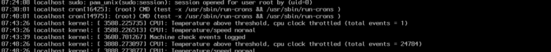
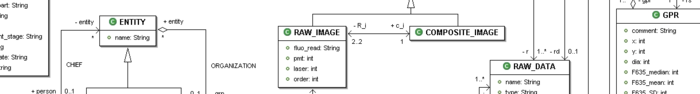
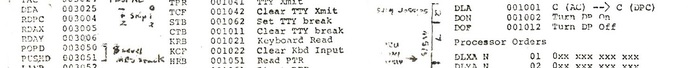

Title: Tutorials 
Slug: tutorials
Authors: Sling

Hieronder staat een lijst met alle tutorials op hackenkunjeleren.nl, gesorteerd op categorie. Heb je ideeën voor meer tutorials, laat dan een bericht achter onderaan de pagina!

**Tip**: Wanneer je net begint, kun je het beste starten met de tutorials in de ‘Basis’ categorie, en pas daarna verder gaan met de rest.

# Basis
* [Introductie: Wat is hacken, is deze site voor mij?](../introductie-wat-is-hacken-is-deze-site-voor-mij.html)
* [Presentatie: Wat is een hacker nou eigenlijk?](../presentatie-wat-is-een-hacker-nou-eigenlijk.html)
* [Geschiedenis van Hacken – Deel 1 (tot 1990)](../geschiedenis-van-hacken-deel-1.html)
* [Geschiedenis van Hacken – Deel 2 (vanaf 1990)](../geschiedenis-van-hacken-deel-2.html)
* [Introductie tot IRC](../introductie-tot-irc.html)
* [Slimme vragen stellen: hoe hou je je medehackers te vriend?](../slimme-vragen-stellen-hoe-hou-je-je-medehackers-te-vriend.html)
* [Je eigen Linux systeem!](../je-eigen-linux-systeem.html)
* [Introductie tot Linux – Deel 1](../introductie-tot-linux-deel-1.html)
* [Introductie tot Linux – Deel 2](../introductie-tot-linux-deel-2.html)

## Gepland
* Introductie tot Linux - Deel 3
* The Big Picture - Waar te beginnen?

# Algemeen
* [Hackers en Justitie, of: ‘Hoe blijf ik uit de gevangenis?’](../hackers-en-justitie-of-hoe-blijf-ik-uit-de-gevangenis.html)
* [Wat komt er kijken bij een professionele penetratietest?](../wat-komt-er-kijken-bij-een-professionele-penetratietest.html)
* [Presentatie: Security Challenges](../presentatie-security-challenges.html)

## Gepland
* Hacktivisme
* Hackevenementen (Congressen, Camps en meer)
* Hackerspaces, nu ook bij u in de buurt!
* Internet Memes
* Anonymous, 4chan, Lulzsec
* Character Encoding (ANSI, UTF, en meer enge afkortingen)
* Meer over IRC

# Netwerken

## Gepland
* Introductie tot netwerken
* TCP/IP en ICMP
* Linux Poorten en Sockets
* DHCP
* DNS
* DNSSEC
* Routing en Switching
* Het Internet, een serie buizen?
* BGP en OSPF
* Firewalls: pf (BSD)
* Firewalls: iptables / netfilter (Linux)
* Cisco IOS
* Juniper JunOS
* VPN / IPSEC
* Wireless netwerken
* Netwerk troubleshooting
* Netwerk tools

# Telefonie

## Gepland
* Introductie tot telefonie (Analoog, POTS)
* Introductie tot telefonie (Digitaal, VOIP)
* Asterisk: Open Source telefoniecentrale
* Phreaking

# Linux

## Gepland
* Meer over Linux
* Werken op de Shell
* Tekstbestanden bewerken
* VIM – De enige teksteditor!
* Linux bestandssystemen en opslag
* Linux beveiliging, gebruikers en groepen
* Softwarebeheer op Linux
* Processen op Linux
* Netwerkconfiguratie op Linux
* LAMP: Linux, Apache, MySQL, PHP
* Proxyserver installatie en configuratie
* Introductie tot E-Mail
* SMTP Mailserver installatie en configuratie
* POP3/IMAP Mailserver installatie en configuratie
* De Linux Kernel
* Samba, NFS, CIFS en meer

# Security

## Gepland
* Introductie tot security
* Security: Hoe moet het niet
* Man-in-the-Middle aanvallen
* In de aanval: Footprinting
* Scannen en Enumeration: Doelen inventariseren
* Wachtwoorden, OTP, Two-Factor Authenticatie
* Fysieke beveiliging
* Desktopbeveiliging
* Biometrische beveiliging
* Introductie tot Social Engineering
* Introductie tot Exploiting (Bugs en Backdoors)
* Buffer en Heap Overflows
* Shellcode
* Virussen, Trojans en andere malware
* Botnets
* Denial of Service
* Wireless Security
* Overzicht van Hacking Tools
* Hacking tools in detail: Nikto
* Hacking tools in detail: Metasploit
* Hacking tools in detail: Kali
* Hacking tools in detail: aircrack-ng
* Reverse Engineering
* Logbestanden
* Introductie tot Forensics
* Anti-forensics, sporen uitwissen
* Port-knocking
* Telnet en andere onveilige protocollen

# Web

## Gepland
* Introductie tot Websites (HTML, CSS)
* Introductie tot Web security
* Session Hijacking
* Cross-site scripting
* LFI/RFI
* Webserverbeveiliging
* Webapplicatiebeveiliging

# Windows

## Gepland
* Introductie tot Windows Security
* Windows Tools

# Databases

## Gepland
* Introductie tot Databases
* SQL
* Relationeel of niet?
* MySQL
* MSSQL
* NoSQL (MongoDB, etc)
* Big Data
* ODBC
* Oracle
* PostgreSQL
* Databasebeveiliging
* Introductie tot SQL Injectie
* Geavanceerde SQL Injectie
* MySQL en PHP

# Programmeren

## Gepland
* Introductie tot Programmeren
* Zoveel talen!
* Shellscripten in Bash
* Geavanceerde shellscripts
* Introductie tot Javascript
* Introductie tot PHP
* Introductie tot Perl
* Introductie tot Python
* Introductie tot Java
* Introductie tot C++
* Introductie tot C
* Introductie tot Assembly en Machinetaal
* Functioneel, Imperatief, Procedureel, en meer.
* Esotherische programmeertalen
* Compilen en Linken
* Complexiteit
* Je eigen programmeertaal

# Cryptografie

## Gepland
* Introductie tot Cryptografie
* Geschiedenis van Cryptografie
* Numerieke Stelsels (Binair is niet alleen voor nerds!)
* Wiskunde voor Cryptografie
* Asymmetrisch vs Symmetrisch
* Hashes (MD4,MD5,SHA)
* AES
* DES
* SSL en TLS
* PKI Infrastructuur
* Crypto-analyse
* PGP en GPG

# Hardware

## Gepland
* Hardware: Computerarchitectuur
* BIOS en EFI
* Drivers en HAL
* Arduino Introductie
* Raspberry Pi Introductie
* Solderen kun je leren
* Wireless hardware: Antennes en Radiogolven

# Virtualisatie

## Gepland
* Introductie tot Virtualisatie
* Virtualisatie en beveiliging
* Hypervisors Hacken: Ontsnappen uit je VM

