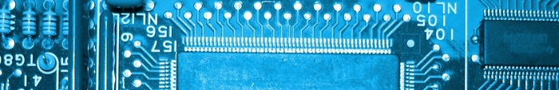

Title: Tutorials 
Slug: tutorials
Authors: Sling

Hieronder staat een lijst met alle tutorials op hackenkunjeleren.nl, gesorteerd op categorie. Heb je ideeën voor meer tutorials, laat dan een bericht achter onderaan de pagina!

**Tip**: Wanneer je net begint, kun je het beste starten met de tutorials in de ‘Basis’ categorie, en pas daarna verder gaan met de rest.

# Basis
* [Introductie: Wat is hacken, is deze site voor mij?](../introductie-wat-is-hacken-is-deze-site-voor-mij.html)
* [Presentatie: Wat is een hacker nou eigenlijk?](../presentatie-wat-is-een-hacker-nou-eigenlijk.html)
* [Geschiedenis van Hacken – Deel 1 (tot 1990)](../geschiedenis-van-hacken-deel-1.html)
* [Geschiedenis van Hacken – Deel 2 (vanaf 1990)](../geschiedenis-van-hacken-deel-2.html)
* [Introductie tot IRC](../introductie-tot-irc.html)
* [Slimme vragen stellen: hoe hou je je medehackers te vriend?](../slimme-vragen-stellen-hoe-hou-je-je-medehackers-te-vriend.html)
* [Je eigen Linux systeem!](../je-eigen-linux-systeem.html)
* [Introductie tot Linux – Deel 1](../introductie-tot-linux-deel-1.html)
* [Introductie tot Linux – Deel 2](../introductie-tot-linux-deel-2.html)

## Gepland:
* Introductie tot Linux - Deel 3
* The Big Picture - Waar te beginnen?

# Algemeen
* 

# Netwerken
* 

# Telefonie
* 

# Linux
* 

# Security
* 

# Web
* 

# Windows
* 

# Databases
* 

# Programmeren
* 

# Cryptografie
* 

# Hardware
* 

# Virtualisatie
* 

