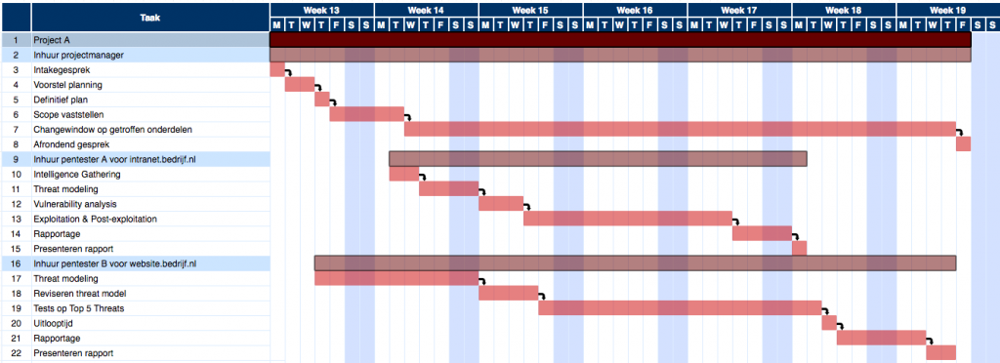

Title: Wat komt er kijken bij een professionele penetratietest?
Date: 2017-04-03 18:00
Category: Algemeen
Tags: pentest, penetratietest
Slug: wat-komt-er-kijken-bij-een-professionele-penetratietest
Authors: Sling
Summary: Het begrip penetratietest kan als buitenstaander nogal mysterieus zijn, in deze tutorial word uitgelegd hoe een professionele penetratietest wordt voorbereid en uitgevoerd, zonder de techniek in te gaan.

# Introductie

De meest voor de hand liggende activiteit die je uitvoert als professioneel hacker gaat om het testen van de beveiliging van systemen. Wat voor systemen je test en wat er allemaal aan mis kan zijn kan alle kanten op, maar de manier waarop je zo’n penetratietest (pentest) aanpakt en wat je aan voorbereiding doet is bijna altijd hetzelfde.

Stel dat iemand je benadert voor het uitvoeren van zo’n test dan is het belangrijk om aan te geven dat zo’n test niet gedaan wordt om te kijken of iets te hacken is. Wanneer je een penetratietest uitvoert en je vindt geen bijzonderheden, dan is dat geen bewijs dat het een perfect veilig systeem is. Misschien heb je iets over het hoofd gezien door gebrek aan kennis of ervaring of simpelweg door een fout te maken, heeft de opdrachtgever je niet de goede informatie gegeven, was een kwetsbaar onderdeel van het systeem niet online terwijl jij je tests uitvoerde, etcetera.

Wat een penetratietest _wel_ is, vanuit het perspectief van een opdrachtgever, is een inzicht in de risico’s van een systeem. Zo’n risico kun je meten door twee factoren met elkaar te vermenigvuldigen:

Hoe groot is de kans dat de kwetsbaarheid wordt misbruikt
Hoe groot is de schade als dit gebeurt
Bijvoorbeeld: Als er een makkelijk te misbruiken lek bestaat waardoor het systeem volledig onbruikbaar gemaakt kan worden, dan is zowel de kans op misbruik als de schade groot. Hierdoor is het uiteindelijke risico ook erg groot.

Veel bedrijven zullen na een test niet zo geïnteresseerd zijn in een lijst van technische fouten en bugs, maar ze willen liever een overzicht van welke bedrijfsmatige risico’s ze lopen als gevolg van de gevonden problemen.

We zullen in deze tutorial de stappen tijdens een pentest beschrijven maar vooral ook dieper in gaan op de voorbereidende stappen die nog voordat je een terminal opent of script start genomen moeten worden.

De informatie die een tester van te voren krijgt kan erg uiteenlopen, dit wordt meestal bepaald door wat voor soort test er gedaan wordt. Als je wil weten wat een aanvaller van buitenaf voor elkaar kan krijgen zonder voorkennis, dan wordt een pentester ook weinig informatie over het systeem gegeven zodat de pentest zo realistisch mogelijk is. Omdat het systeem vanuit de tester gezien een black box is, wordt dit type test ook wel een _black box pentest_ genoemd.

Aan het andere einde van het spectrum is een _white box pentest_, waarbij de tester zoveel informatie krijgt als hij wil. Dit type test wordt ingezet als een organisatie wil weten hoe veilig een systeem of netwerk is als de aanvaller veel voorkennis heeft. Soms wordt nog een extra niveau van testen genoemd; _crystal box pentest_, waar vaak mee wordt bedoeld dat de tester niet alleen informatie krijgt over het systeem maar ook de broncode van de te testen applicaties heeft.

Voor de duidelijkheid, de woorden black en white hebben hier niets te maken met de termen black hat en white hat. Het gaat in deze tutorial volledig om legale pentesten die uitgevoerd worden door professionele hackers.

# Fasen in de pentest

Geen enkele pentest gaat precies hetzelfde, maar om er toch wat structuur in aan te brengen zijn er een aantal stappen of fasen die je kan identificeren tijdens de meeste pentests. Deze fasen zijn:

1. Voorbereiding
1. Informatie verzamelen (Intelligence Gathering)
1. Risicomodelleren (Threat Modeling)
1. Analyse van kwetsbaarheden (Vulnerability Analysis)
1. Exploitation
1. Post-exploitation
1. Rapportage

De voorbereiding omvat alles wat in het volgende hoofdstuk in de tutorial wordt omschreven en daarnaast nog wat andere zaken zoals afspraken met opdrachtgevers over de kosten, facturering, etcetera. De voorbereiding kan door een ander persoon worden uitgevoerd dan degene die de pentest zal uitvoeren, maar dit is niet te adviseren. Een ervaren pentester kan tijdens de voorbereiding namelijk al meteen extra vragen stellen aan de opdrachtgever die essentieel kunnen zijn tijdens de pentest. Maar meer over de voorbereiding verderop in deze tutorial.

De invulling van de andere fasen verschilt per pentest, soms zullen stappen extra uitgebreid worden gedaan en andere keren zullen ze worden overgeslagen. We zullen deze fasen hier kort beschrijven zodat je een beeld krijgt van hoe een complete pentest er uit ziet:

## Informatie verzamelen

In deze fase verzamelen we zoveel mogelijk informatie over ons doelwit, die we vervolgens in de volgende fasen kunnen gebruiken. Hoe meer informatie we kunnen achterhalen, hoe meer _attack vectors_ we kunnen vinden, ofwel manieren om ons doelwit te hacken. De term _OSINT_ ofwel Open Source Intelligence wordt vaak genoemd in deze fase en betekent niets meer dan het raadplegen van publieke informatiebronnen om meer over je doelwit te weten te komen. Een voorbeeld hiervan is bijvoorbeeld een werknemer van een bedrijf wat op LinkedIn aangeeft dat hij in zijn huidige functie ervaring heeft met Ubuntu 10.04, wat ons extra informatie geeft over welk besturingssysteem er bij dit bedrijf gebruikt wordt.

Wel moet je je bij de gevonden informatie altijd beseffen dat het niet 100% correct hoeft te zijn, soms kan een bedrijf zelfs expres onjuiste informatie verspreiden om aanvallers op een verkeerd spoor te zetten.

## Risicomodelleren (Threat Modeling)

Er zijn dikke boeken geschreven over dit onderwerp dus om het in een korte alinea samen te vatten is wellicht wat ambitieus en bij een kleinere pentest wordt dit onderdeel vaak ook overgeslagen, maar omdat het vanuit de bedrijfsmatige kant erg waardevol is noemen we het hier toch even kort. Bij het risicomodelleren voor een pentest wordt de informatie gebruikt die we in de vorige fase hebben verkregen om punten in de organisatie te vinden waar grote risico’s zitten. Dit zijn bijvoorbeeld bedrijfskritische onderdelen zoals een noodstroom aggregaat, die niet goed beschermd lijken te zijn omdat ze bijvoorbeeld aangesloten zitten op het Internet.

Risicomodelleren is dus eigenlijk een duur woord voor het maken van een lijst met "welke onderdelen zijn het belangrijkste om te beschermen".

Deze stap wordt vaak in samenspraak met de opdrachtgever gedaan zodra een lijst van bedrijfsonderdelen ofwel _assets_ is gevonden, omdat de opdrachtgever vaak beter kan inschatten hoe kritisch onderdelen zijn voor de organisatie of het bedrijfsproces.

## Analyse van kwetsbaarheden (Vulnerability Analysis)

Tijdens deze fase begint het daadwerkelijk afvuren van je scanners en tools (en uiteraard ook handmatige tests) op de gevonden doelwitten. Dit kan deels geautomatiseerd door bijvoorbeeld portscanners te draaien, maar afhankelijk van wat er allemaal in de ‘Informatie verzamelen’ fase is gevonden kan het ook zijn dat je voor sommige onderdelen geen geschikte automatische tools hebt en dus zelf iets zal moeten ontwikkelen.

Goed om te melden dat je hier ook een duidelijk onderscheid maakt tussen een _vulnerability scan_, waarbij je voornamelijk bestaande scanners draait en de resultaten uit die tools direct in je rapport zet, en een echte penetratietest. Bij een echte pentest zul je veel dieper ingaan op de gevonden bevindingen en er met de hand analyse op uitvoeren, een rapportage bestaat in dat geval uit een gedetailleerde interpretatie van de gevonden kwetsbaarheden zodat de opdrachtgever er zonder kennis van de gebruikte tools waarde uit kan halen.

De vastgelegde risico’s en assets uit de vorige stap kunnen gebruikt worden om te bepalen welke onderdelen van het bedrijf het meest de moeite zijn om veel tijd in te stoppen. Vooral als de tijdsdruk hoog is tijdens een test is het belangrijk dat je geen tijd verspilt met het tot in detail uitzoeken van systemen die helemaal geen belangrijke bedrijfsfuncties vervullen of informatie bevatten.

## Exploitation

Als het goed is hebben we in dit stadium een lijst met interessante en mogelijk kwetsbare systemen/onderdelen, waar we nu proberen toegang tot te krijgen. De onderdelen die het meest kwetsbaar lijken en het meest kritisch zijn voor de organisatie staan bovenaan deze lijst.

Hoeveel toegang we kunnen krijgen hangt af van allerlei zaken, maar het liefste wil je natuurlijk zoveel mogelijk rechten op een systeem dus we zijn op zoek naar _root_ access op Linux-systemen en _SYSTEM_ access op Windows-systemen, etcetera.

Soms zijn delen van het netwerk afgeschermd door firewalls, denk aan bijvoorbeeld een intranet wat niet direct aan het Internet gekoppeld is. Zodra we een systeem onder controle hebben wat wel aan het Internet hangt en kwetsbaar was voor onze aanval, komt het vaak voor dat we vanuit dit systeem wel bij een stuk intern netwerk kunnen komen. Op deze manier kunnen we een groot bedrijfsnetwerk stap voor stap doorlopen, en omzeilen we firewalls en andere beveiligingsmaatregelen door kwetsbaarheden op de systemen in het netwerk te misbruiken. Dit springen tussen systemen wordt _pivoting_ genoemd. Zodra je een nieuw stuk netwerk in het zicht krijgt kun je hier weer opnieuw beginnen met het analyseren, scannen en vaststellen van interessante doelwitten.

## Post-exploitation

Nadat we ergens toegang hebben verkregen is het de bedoeling deze toegang te behouden en verder onderzoek te doen. Eerder draaiden we van buitenaf allerlei scans om te zien wat er op een systeem te vinden is, nu kunnen we van binnenuit nog veel meer zien en bijvoorbeeld vaststellen of er interessante informatie op dit systeem staat wat bruikbaar kan zijn voor een aanvaller. Afhankelijk van welk doel je hebt met de pentest kan het hier ook belangrijk zijn om te zoeken naar persoonsgegevens van medewerkers of klanten, het uitwissen van sporen, het omzeilen van detectie, etcetera.

## Rapportage

Zodra de pentest is afgerond is het zaak om de informatie die je hebt verzameld te structureren en een samenvatting te doen van alle uitgevoerde handelingen en de resultaten hiervan. Wat er wel en niet in dit rapport komt verschilt erg per pentest en ieder bedrijf doet dit op zijn eigen manier. Zo’n rapportage wordt vervolgens op een vertrouwelijke manier uitgewisseld met de opdrachtgever, je wilt immers niet dat een lijst kwetsbaarheden die nog niet gedicht zijn op straat komt te liggen.

Om een goed beeld te krijgen van hoe zo’n rapportage er uit ziet is er gelukkig een [aardige verzameling van publiek gemaakte rapportages](https://github.com/juliocesarfort/public-pentesting-reports) op Github gezet.

---

# Voorbereiding

Nu weer terug naar het allereerste begin voordat je met een pentest begint, de voorbereiding.

Om een penetratietest zo waardevol mogelijk te laten zijn, is voorbereiding nodig van zowel de opdrachtgever als de tester. Wees gerust, niet alle onderstaande onderwerpen en stappen hoeven voor elke test uitgevoerd te worden. Er kunnen bijvoorbeeld afspraken gemaakt worden voor meerdere tests of voor een onbepaalde tijd waarin testactiviteiten plaatsvinden. Dit hangt dus maar net van de situatie af. Bedrijven waar weinig tests uitgevoerd worden zullen externe testers inhuren voor losse opdrachten, terwijl bedrijven waar tests onderdeel zijn van het dagelijkse werk mensen voor langere tijd zullen inzetten of zelfs permanente functies creëren voor pentesters.

Dit onderwerp delen we op in 2 gebieden, de Scope (wat gaat er getest worden) en de Rules of Engagement (hoe gaan we de test aanpakken). Tenslotte staan we nog even stil bij het belang van communicatie tijdens een test.

## Scope

De scope van een test bepaalt **wat** er getest zal worden. Je zou denken dat dit niet zo ingewikkeld is om vast te stellen omdat een opdrachtgever je inhuurt om ‘Applicatie X’ of ‘Website Y’ te testen, maar in veel situaties weet een opdrachtgever niet exact hoe zijn eigen systeem in elkaar zit en welke afhankelijkheden er aan vast zitten. Voordat je kan beginnen met een penetratietest zal dit echter wel exact op papier moeten staan, zodat je geen onderdelen mist en/of geen doelwitten uitkiest die helemaal niet getest mogen worden of die niet eens eigendom zijn van de opdrachtgever.

Het vaststellen van de scope gebeurt vaak in eerste instantie in overleg met een manager van een opdrachtgever, maar tijdens zo’n sessie zul je waarschijnlijk snel in technische details verzeilen dus is de aanwezigheid van een ontwikkelaar of beheerder ook gewenst. Wanneer de scope tijdens een test wordt uitgebreid (bewust of onbewust) dan spreekt men ook wel van _scope creep_.

### Vragenlijsten

De volgende vragenlijsten kunnen gebruikt worden om de scope van een pentest meer vorm te geven en op die manier een goede, legale en voor de opdrachtgever bruikbare test uit te voeren. Afhankelijk van of het een black box of white box pentest is, zullen meer of minder vragen beantwoord worden door een opdrachtgever.

Sommige van deze vragen hebben weer een geheel eigen onderzoek nodig wanneer ze met ja of nee worden beantwoord, dit is dus geen complete ‘flowchart’ van hoe je een pentest aanpakt, maar meer een rode lijn van tips die je kunt volgen.

#### Lijst 1: Algemeen

- Waarom laat de opdrachtgever een penetratietest uitvoeren, wat is het doel? Wordt er bijvoorbeeld specifiek voor een bepaald certificaat of compliance getest?
- Is de verantwoordelijke manager op de hoogte van de uit te voeren test?
- Wordt de test uitgevoerd op een productieomgeving of op een andere omgeving, is het belangrijk dat de integriteit van data bewaard blijft en dat systemen bereikbaar blijven? Denk hierbij ook aan gedeelde netwerkcomponenten tussen verschillende omgevingen, zoals een core-router die zowel productie als acceptatie routeert.
    - Bij productietests: Op welke tijdstippen of dagen kunnen de tests worden uitgevoerd met het minste risico op verstoringen? Buiten kantoortijden? Weekenden?
    - Bij productietests: Zijn er monitoring/test systemen actief en worden resultaten van deze systemen gevalideerd, zodat verstoringen betrouwbaar kunnen worden gedetecteerd?
    - Bij productietests: Zijn er disaster recovery procedures opgesteld om verlies van data te mitigeren?
- Krijgt de tester toegang tot QA/test-gegevens van de applicatie/systemen?
- Krijgt de tester toegang tot documentatie over de applicatie/systemen?
- Vanaf welke datum en tot welke datum mogen de tests worden uitgevoerd?
- Bevinden alle onderdelen van het systeem zich in hetzelfde land als de organisatie en tester, of zijn er andere landen (en dus jurisdicties) bij betrokken?

#### Lijst 2: Systemen van derden

- Zijn er systemen van andere betrokken partijen betrokken bij de test? Denk aan een internetprovider, Managed Service Providers, Cloud Services, etc.
    - Zo ja: moeten zij geïnformeerd worden over de test en is dit gedaan?
    - Zo ja: maken deze onderdelen ook uit van de scope?

#### Lijst 3: Systeembeheer

- Zijn er systemen die fragiel of extra kwetsbaar zijn? Bijvoorbeeld systemen die geregeld crashen, op legacy software en/of hardware draaien, of niet goed onderhouden zijn?
- Zijn er change management procedures vastgelegd?
- Wat is de gemiddelde tijd waarop een uitgevallen systeem weer up and running is?
- Hoe is de monitoring van systemen geregeld?
- Wat zijn de meest kritische systemen en applicaties?
- Hoe zijn backups geregeld, en worden restores getest?
- Wat is de laatste keer dat een backup is teruggezet?

#### Lijst 4: Netwerk

- Welke IP-adressen (extern en intern), ranges, subnets, hostnames en domeinen moeten worden getest?
- Zijn er apparaten in het netwerk aanwezig die de resultaten van een pentest kunnen beïnvloeden, zoals een firewall, intrusion detection/prevention system, web application firewall of loadbalancers?
- Als er toegang wordt verkregen tot een systeem, wat moet de tester hiermee doen?
    - Moet de tester een lokale pentest uitvoeren op het systeem?
    - Moet de tester zo hoog mogelijke privileges proberen te verkrijgen op het systeem?
    - Moet de tester geen, minimale, dictionary of brute force password aanvallen uitvoeren op door een wachtwoord beschermde services of verkregen password hashes?
- Is er sprake van stress testing en/of Denial of Service testing? Dit is vooral van belang als een organisatie niet alleen de veiligheid of integriteit wil testen maar ook de stabiliteit en beschikbaarheid van het systeem.

#### Lijst 5: Web Applicaties

- Welke web applicaties worden er getest?
- Welke login systemen worden er getest?
- Welke pagina’s zijn statisch en welke dynamisch?
- Is de broncode beschikbaar voor de tester?
- Is er documentatie beschikbaar? Zo ja, wat voor soort documentatie?
- Zijn de volgende tests onderdeel van de pentest: static analysis, dynamic analysis, fuzzing, role-based testing?

#### Lijst 6: Wireless

- Is het testen van draadloze netwerken onderdeel van de pentest? Zo ja:
    - Welke draadloze netwerken zijn er en welke zijn in scope van de test?
    - Is er een gast-netwerk en zo ja, is daar sprake van een captive portal met login?
    - Wat voor encryptie wordt er gebruikt op de draadloze netwerken.
    - Moet ‘rogue’ apparatuur in kaart worden gebracht?
    - Moeten er ook aanvallen worden getest naar draadloze clients, of alleen access points?
    - Hoeveel clients hebben de draadloze netwerken normaliter?

#### Lijst 7: Fysiek

- Is het fysiek testen van beveiliging onderdeel van de pentest? Zo ja:
    - Welke locaties worden getest?
    - Wat is het doel van de fysieke pentest? Worden er bestaande regels en procedures getest, gaat het om een audit, etc?
    - Zijn er locaties die fysiek worden gedeeld met andere gebruikers/bedrijven?
        - Zo ja, welke verdiepingen/vleugels/etc. zijn in scope?
    - Is er beveiligingspersoneel wat moet worden omzeild?
        - Zo ja, is dit personeel in dienst van een 3e partij?
        - Zo ja, is dit personeel bewapend?
        - Zo ja, mag dit personeel geweld gebruiken?
    - Hoeveel ingangen zijn er in elk gebouw?
    - Mogen lockpicks en bump keys gebruikt worden?
    - Hoeveel vierkante meter is het totale gebied wat in scope is?
    - Zijn alle fysieke beveiligingsmaatregelen gedocumenteerd?
        - Zo ja, krijgt de tester toegang tot deze documentatie?
    - Worden beveiligingscamera’s gebruikt?
        - Zo ja, zijn deze camera’s in eigen beheer?
        - Zo ja, moet de tester proberen toegang te krijgen tot het opgeslagen beeldmateriaal?
    - Is er een alarmsysteem aanwezig op een van de te testen locaties?
        - Zo ja: is het een stil alarm?
        - Zo ja: wordt het alarm in werking gesteld door beweging, openen van deuren, ramen, of door andere sensoren?

#### Lijst 8: Social Engineering

- Mag social engineering worden ingezet voor het verkrijgen van toegang tot gebouwen of systemen?
    - Zo ja: Heeft de opdrachtgever een lijst van email adressen en/of telefoonnummers die het doelwit mogen worden van social engineering aanvallen?

## Rules of Engagement

Nadat je de scope hebt vastgesteld en weet wat er getest moet worden is het tijd om de rules of engagement te bespreken. Deze omschrijven hoe er getest gaat worden. De volgende onderdelen zijn belangrijk om over na te denken en dus ook om te bespreken met je opdracht

### Tijdslijn

Tijdens het bedenken van de scope is de opdrachtgever al gevraagd naar de tijdsspanne waarin de test in zijn geheel plaatsvindt, maar een meer gedetailleerde planning en tijdslijn is nodig om de juiste voorzorgsmaatregelen te treffen en de juiste personen in te kunnen schakelen waar nodig. Een voorstel van zo’n tijdslijn zal voor de pentest worden gemaakt, met de verwachting dat hierin nog wel wat aanpassingen zullen volgen tijdens de daadwerkelijke tests.

Alle betrokken mensen bij de test hebben baat bij zo’n tijdslijn, denk aan systeembeheerders die monitoren of systemen blijven draaien, engineers die gepland onderhoud pauzeren gedurende de tests en medewerkers in een SOC die meldingen over inkomende portscans binnenkrijgen.

Een veelgebruikte manier om zo’n planning inzichtelijk te maken is een _GANTT grafiek_. Hierbij worden alle werkzaamheden in een chronologische lijst gezet, en wordt de individuele tijdsduur afgebeeld op een tijdslijn. Zo is snel te zien welke acties er plaatsvinden op een gegeven moment.

Hieronder staat een voorbeeld van zo’n GANTT grafiek. Je ziet hier dat er 3 personen bij een fictieve test betrokken zijn en dat de werkzaamheden per test anders zijn. Niet alle fasen duren altijd even lang en soms worden bepaalde stappen overgeslagen. Let op dat dit een totaal fictief voorbeeld is, puur om een idee te geven van zo’n grafiek en niet om over te nemen bij een echte test. Klik op de afbeelding voor een grotere versie.

### Lokatie

Een ander aspect van de pentest wat belangrijk is om vast te leggen is de plekken waar de tester wordt verwacht te zijn tijdens het uitvoeren van de pentest. Voor een black box pentest van een systeem wat op Internet aangesloten zit kan het niet zoveel uitmaken waar vandaan iemand werkt – behalve dat natuurlijk wel moet worden afgesproken vanaf welk extern IP er getest wordt – maar bij een white box pentest op een systeem in het interne netwerk van een bedrijf zal een tester doorgaans op lokatie bij de opdrachtgever moeten plaatsnemen.

Als je overweegt om een carriere als pentester hebben is het belangrijk om je te realiseren dat je vaak veel zal moeten reizen, het komt regelmatig voor dat je bv. een week in een hotel zit in de buurt van een klant of als alternatief meerdere uren per dag onderweg bent. Dit gaat uiteraard niet altijd op, soms is een pentester in vaste dienst bij 1 opdrachtgever en zal hier altijd op lokatie tests uitvoeren.

Soms is een test op lokatie niet nodig, maar kan er door middel van een VPN-verbinding naar het bedrijfsnetwerk worden gewerkt. Hierbij is het vertrouwen in de tester erg belangrijk, omdat deze in een voor het bedrijf ongecontroleerde omgeving toegang heeft tot het bedrijfsnetwerk.

### Gevoelige informatie

Ook al is het doel van een pentest vaak het binnendringen van systemen en het bemachtigen van bijvoorbeeld wachtwoorden of andere gevoelige informatie, en teken je bijna altijd een NDA (Non Disclosure Agreement ofwel [geheimhoudingsverklaring](https://nl.wikipedia.org/wiki/Geheimhoudingsverklaring)), is het niet zo dat je zomaar alle informatie mag bekijken. Er zijn wetten die aangeven dat sommige persoonlijke data alleen door bevoegde personen mag worden bekeken, zoals de patientgegevens bij een huisarts en ziekenhuis. Het kan dan zo zijn dat zelfs alleen maar het op je beeldscherm zien van stukjes van deze informatie al strafbaar is, ook al heb je toestemming van de opdrachtgever om de test uit te voeren. Het is daarom dus van groot belang dat je vraagt of er sprake is van dit soort informatie in een organisatie voordat je al je tools er tegenaan gooit. Misschien moet je je tests aanpassen zodat je bepaalde output weglaat als het risico bestaat dat dergelijke informatie in je output staat.

Als het goed is heb je dit probleem niet bij het testen van niet-productieomgevingen, omdat daar alleen testdata aanwezig zou moeten zijn. Immers hebben meestal veel meer mensen toegang tot een testomgeving dan een productieomgeving en kun je bij een testomgeving niet altijd garanderen dat bijvoorbeeld logboeken of andere beveiligingsmaatregelen actief zijn. Wanneer je tijdens een pentest op een niet-productieomgeving toch persoonsgegevens tegenkomt die niet nep of gemaskeerd lijken te zijn, dan is dit zeker iets om direct aan te geven aan de opdrachtgever!

Wat je in ieder geval wil voorkomen is dat je op de een of andere manier dit soort gevoelige informatie op je eigen systeem of netwerk krijgt. Voer dit soort hoog risico tests dus nooit op afstand uit maar altijd op lokatie bij de opdrachtgever, en zeker niet op je eigen computer maar op een systeem wat voor je beschikbaar wordt gesteld om mee te testen.

Om toch een bevinding in je rapport op te kunnen nemen als je toegang zou kunnen hebben krijgen tot dergelijke data, is het doorgaans afdoende om een screenshot te maken van een foutmelding of bv. gebrekkige bestandspermissies, eventueel met afgeschermde delen van bestandsnamen of accounts.

Nog een voetnoot bij dit onderwerp; wanneer je illegale data tegenkomt zoals een verzameling copyrighted films of zaken als kinderporno, dan ben je verplicht om dit direct bij de politie te melden, gevolgd door een melding aan de opdrachtgever. Als je dit niet doet dan kun je in sommige gevallen persoonlijk aansprakelijk zijn voor nalatigheid, ook al werk je voor een opdrachtgever en heb je zelf geen contract getekend.

### Omgaan met bewijsmateriaal

Bij het omgaan van bewijsmateriaal gedurende de test is het van groot belang dat je hier zorgvuldig mee omgaat. Gebruik altijd versleuteling voor gegevens in rust (op je eigen harddisk bv.) en in transport (in een mail naar de opdrachtgever bv.). Het liefste gebruik je aparte hardware zoals een laptop en usb-sticks voor je penetratietesten, zodat je deze niet per ongeluk aan iemand kan uitlenen of kwijtraakt en later opduikt bij iemand die er met forensische software gegevens van je opdrachtgevers af heeft kunnen halen.

Nog een tip wat betreft bewijsmateriaal, gebruik nooit een rapport van een vorige test als template voor je huidige test, omdat er gegarandeerd gevoelige informatie van die vorige test in blijft staan. Is het niet per ongeluk in plain view, dan is het misschien wel in de metadata van het document. Veel bestandsformaten houden historie bij van wijzigingen in het bestand zelf, dus in plaats van al dit soort dingen te moeten controleren bij elke rapportage gebruik je beter gewoon een lege template waar nooit gevoelige bewijsmateriaal van een vorige test in heeft gestaan.

### Toestemming verkrijgen

Het belangrijkste document wat je van je opdrachtgevers moet krijgen voordat je kan beginnen met testen is een vrijwaringsbrief. Hierin staat beschreven dat jij toestemming hebt van de opdrachtgever om gedurende een bepaalde tijd de assets zoals in de scope staan te testen. Zonder deze brief ben je voor de wet net zo illegaal bezig met een pentest als een willekeurige blackhat hacker uit China die probeert informatie uit het bedrijf te bemachtigen. Zolang dit document niet ondertekend is door de klant, kun je niks doen.

Zorg ervoor dat er in dit document staat beschreven dat het mogelijk is dat de geteste systemen en gedeelde componenten instabiel of zelfs onbereikbaar worden.

Een leuke social engineering truc die je kunt gebruiken om een extra bevinding in je rapportage te kunnen opnemen, is een nep-vrijwaringsbrief fabriceren en die gebruiken als bv. iemand uit het bedrijf je vraagt wat je allemaal aan het doen bent met hun WiFi router in de ontvangstruimte. Als deze persoon de nepbrief accepteert zonder dit met de verantwoordelijke manager te checken, dan zou iedereen dit dus kunnen doen met zo’n stukje papier op zak; een aardige kwetsbaarheid.

Een goed voorbeeld van een vrijwaringsbrief is [hier](https://afsprakenstelsel.etoegang.nl/display/as/Template+vrijwaring+penetratietest) te vinden.

### Legaliteit

Het laatste puntje wat we nog even willen aanstippen voor de rules of engagement is het goed controleren of alle doelwitten die je van plan bent aan te vallen tijdens je pentest wel echt eigendom zijn van de opdrachtgever. Als ze van andere partijen zijn moet er natuurlijk expliciet toestemming zijn van die partijen en niet alleen een mondelinge toezegging van de opdrachtgever. Als pentester kun je aardig in de problemen komen als achteraf blijkt dat je netwerken of systemen hebt aangevallen die helemaal niet van de klant zijn, doordat bv. de opdrachtgever een typefoutje heeft gemaakt in het opgeven van welk IP-adres er in de scope van de test valt.

---

# Communicatie

Voor opdrachtgevers is goede communicatie voor, tijdens, en na de penetratietest erg belangrijk. Probeer zelf maar eens te bedenken wat er mis zou kunnen gaan als een klant niet op de hoogte is van een test en jij vrolijk het hele netwerk aan het scannen bent. Het is daarom goed om tijdens de voorbereiding al goede communicatielijnen vast te leggen en afspraken te maken over hoe de communicatie plaatsvindt.

De informatie die je van de opdrachtgever nodig hebt:

- Welke contactpersonen zijn betrokken bij de opdracht?
- Namen
- Functies in het bedrijf
- Telefoonnummer en tijdstippen waarop ze gebeld kunnen worden
- E-mailadressen en PGP public keys voor versleutelde communicatie.
- Mag er met deze personen gevoelige data zoals kwetsbaarheden gedeeld worden?
- Zijn er tussentijdse rapporten / statusupdates nodig, en zo ja met welke frequentie? Aan wie?

De informatie die de opdrachtgever van jou nodig heeft:

- Welke testers zijn betrokken bij de opdracht
- Naam
- Telefoonnummer
- E-mailadres en PGP public key voor versleutelde communicatie.
- De IP-adressen waar vandaan getest wordt
- De data/tijdstippen waarop getest wordt
- Als deze informatie bekend is bij de tester en opdrachtgever dan zou de communicatie goed moeten gaan en worden misverstanden of erger voorkomen.

---

Hopelijk heeft deze tutorial je iets meer duidelijkheid gegeven over hoe professionele penetratietests aangepakt worden en snap je hoeveel dingen er bij komen kijken voordat je ook maar een scan gestart hebt!

In latere tutorials zullen we in veel meer detail stilstaan bij de eerder beschreven fasen van een pentest, bij de tools die je tijdens het testen gebruikt en hoe je slim een rapportage kunt maken van een pentest.

--- 

# Referenties

- [http://www.pentest-standard.org/](http://www.pentest-standard.org/)